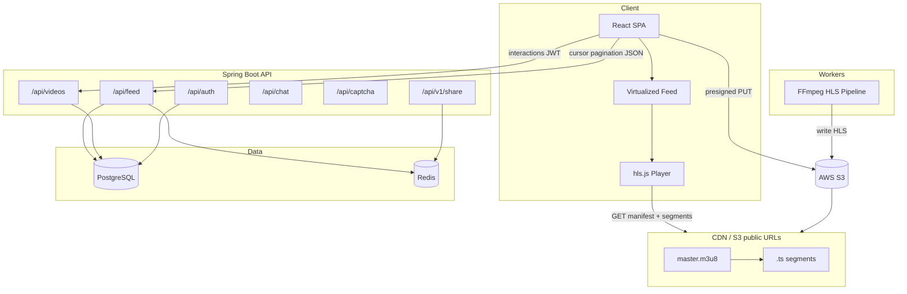
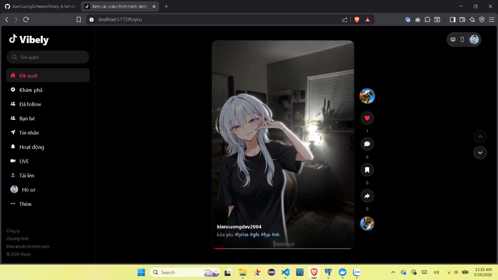
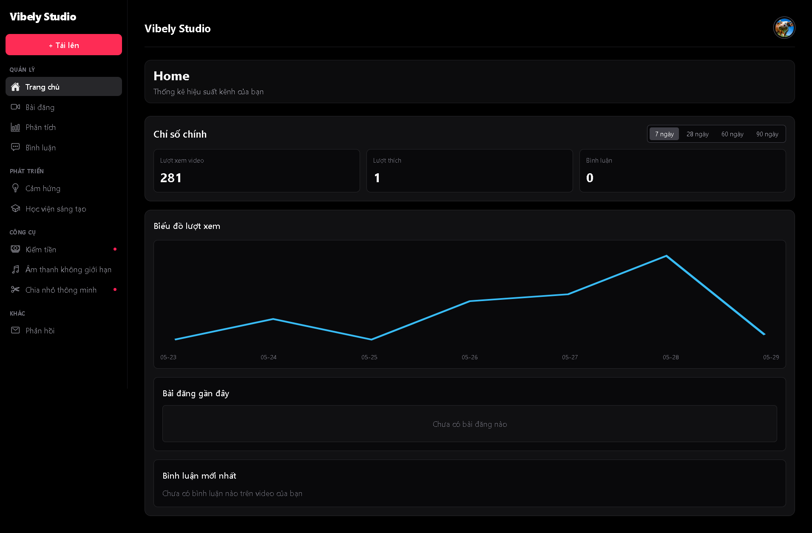

# Vibely

### A production-style, TikTok-inspired short-video social platform — Spring Boot, React, HLS streaming, Redis, and AWS S3.

[](https://openjdk.org/)
[](https://spring.io/projects/spring-boot)
[](https://react.dev/)
[](https://www.postgresql.org/)
[](https://redis.io/)
[](LICENSE)

Vibely is a full-stack short-video platform engineered like a modern consumer social product — not a CRUD demo. It combines **cursor-based feeds**, **virtualized rendering**, **HLS adaptive streaming**, **FFmpeg transcoding**, **Redis caching**, **JWT authentication with refresh tokens**, **adaptive anti-bot captcha**, **email OTP signup**, **WebSocket chat**, and a **UUIDv7 public identity layer** on top of a high-performance internal relational schema.

Built for engineers who care about **real pagination**, **media pipelines**, **mobile-first UX**, and **production-oriented backend design**.

---

## Highlights

| Area            | What Vibely does                                                                                      |
| --------------- | ----------------------------------------------------------------------------------------------------- |
| **Feed**        | TikTok-style infinite scroll with virtualization, media windowing, and HLS manifest prefetch          |
| **Streaming**   | FFmpeg → HLS segments → S3 → CDN-ready URLs → `hls.js` playback                                       |
| **Identity**    | Dual-key model: `BIGINT` internally, **UUIDv7 `publicId`** externally                                 |
| **Auth**        | JWT + refresh rotation, OAuth (Google / Facebook / LINE), email OTP signup, forgot-password flow      |
| **Anti-bot**    | Risk scoring, rotate/slider/checkbox captcha, behavior telemetry, auth hardening (`428` challenge)    |
| **Messaging**   | Direct chat with message requests, STOMP/WebSocket realtime, share-to-chat from videos                |
| **Performance** | Keyset pagination, batched feed queries, Redis share/redirect cache, aggressive client memory cleanup |
| **Studio**      | Upload, post editing, per-video analytics, comment moderation UI                                      |
| **Search**      | Global suggest + users/videos/hashtags, `/search` results page, watch-page suggest dropdown           |

---

## Features

### Feed & playback

- **Cursor-based infinite feed** with opaque keyset cursors (`FeedCursorCodec`)
- **Virtualized rendering** via TanStack Virtual — never mounts the full dataset
- **Media windowing** — typically **3–7 active `<video>` elements** at once
- **IntersectionObserver** visibility rules (play ≥ 70%, pause < 20%)
- **HLS-first playback** with tuned buffer limits and first-segment prefetch
- **Poster placeholders** for off-window slides (no hidden autoplay leaks)

### Backend & data

- **Spring Boot** REST API with consistent response envelope
- **PostgreSQL** + **Flyway** migrations, JPA/Hibernate
- **Keyset pagination** (`ORDER BY createdAt DESC, id DESC`) — no offset scanning on the hot feed path
- **Batched interaction counts** on feed pages (likes, comments, bookmarks, views)
- **Redis** for short-link cache, share counters, and rate-limit backing (optional but first-class)

### Media pipeline

- Presigned **S3 uploads** for raw video and thumbnails
- **FFmpeg** transcoding to multi-bitrate **HLS** (`.m3u8` + `.ts`)
- **Audio mastering** pipeline (loudness normalization, mobile-speaker optimization)
- Async **processing workers** with job state tracking
- Public paths organized by **`publicId`** — CDN-friendly, non-enumerable

### Security & identity

- **UUIDv7 public identifiers** for all video URLs and API routes
- Numeric-only IDs rejected at the API boundary
- **JWT + refresh token** rotation (captcha token consumed only after successful auth)
- **OAuth 2.0 / OIDC** login (Google, Facebook, LINE) with onboarding flow
- **Email OTP** for signup (`send-code` / `verify-code`) and **password reset** (`PASSWORD_RESET` purpose)
- **Adaptive captcha** on login, register, and sensitive OTP sends — see `frontend/src/security/`
- Share links, redirect analytics, and idempotent share writes

### Messaging

- **Direct messages** with conversation list and media preview
- **Message requests** — accept/reject before strangers can chat
- **STOMP over WebSocket** for realtime delivery (`/ws`)
- **Share video to chat** from the watch/feed UI

### Creator studio

- Upload flow with cover picker and preview
- Post editor, analytics dashboard, comment management
- View/playthrough tracking for retention insights

### Search & discovery

- **Global search API** — `GET /api/search/suggest`, `/users`, `/videos`, `/hashtags`, `/trending`; authenticated **search history** (GET/POST/DELETE `/api/search/history`)
- **Suggest while typing** — trending keywords filtered to match the query (not the full-site trending list)
- **Results page** — `/search?q=…` with Top / Users / Videos tabs (`SearchResultsPage`)
- **Watch page** — inline suggest dropdown (`WatchSearchDropdown`); no history rows on watch
- **Explore search** — separate cursor-paginated `GET /api/explore/search` for discovery grids

### Profile & watch UX

- Profile video grid with hover preview; **Vừa xem** marker and scroll-to-tile control (sessionStorage per username)
- Profile and explore-style pages use **hidden scrollbars** (`scrollbar-none`) inside a `h-dvh` shell
- Watch page: volume/PiP, creator queue navigation, **Video của nhà sáng tạo** sidebar tab with hover preview and “Hiện đang phát” indicator

---

## Tech stack

| Layer         | Technologies                                                                       |
| ------------- | ---------------------------------------------------------------------------------- |
| **Frontend**  | React 19, Vite 8, React Router 7, Tailwind CSS 4, TanStack Virtual, HLS.js, Vitest |
| **Backend**   | Spring Boot 3.5, Spring Security, Spring Data JPA, Flyway, PostgreSQL              |
| **Cache**     | Redis 7 (share cache, captcha sessions, rate limits)                               |
| **Messaging** | Spring WebSocket + STOMP                                                           |
| **Media**     | FFmpeg, FFprobe, HLS (adaptive streaming)                                          |
| **Storage**   | AWS S3 (presigned upload + CDN-ready public URLs)                                  |
| **Auth**      | JWT (HS256), refresh tokens, OAuth 2.0 / OIDC, SMTP OTP                            |
| **Anti-bot**  | Procedural captcha, HMAC verification tokens, optional Kafka telemetry             |
| **Tooling**   | Maven, ESLint, Docker Compose (Redis; Kafka optional profile)                      |

---

## System architecture



**Request paths**

```
Watch:  Client ──► CDN ──► HLS segments
Feed:   Client ──► API ──► PostgreSQL (+ Redis cache)
Upload: Client ──► S3 (presigned) ──► Worker ──► S3 HLS prefix ──► CDN
```

---

## Feed architecture

The feed is designed for **virtually infinite scrolling** without rendering or buffering the entire catalog.

```
┌─────────────────────────────────────────────┐
│  React state: lightweight video metadata    │
│  (cursor-appended, soft-capped ~120 items)  │
└─────────────────────┬───────────────────────┘
                      │
┌─────────────────────▼───────────────────────┐
│  VirtualizedFeed (@tanstack/react-virtual)    │
│  • snap scroll, overscan = 1                  │
│  • IntersectionObserver → active index        │
└─────────────────────┬───────────────────────┘
                      │
┌─────────────────────▼───────────────────────┐
│  Media window (radius ±2) → max ~5 players    │
│  • HLS attach only inside window              │
│  • poster placeholder outside window          │
└─────────────────────┬───────────────────────┘
                      │
┌─────────────────────▼───────────────────────┐
│  FeedPrefetchManager                          │
│  • prefetch next 2 HLS manifests only         │
│  • warm next poster                           │
└─────────────────────────────────────────────┘
```

**Backend pagination**

- `GET /api/feed?cursor=<opaque>&size=8&sort=latest`
- Cursor encodes `{ id, createdAt }` via `FeedCursorCodec` (Base64url JSON)
- Query uses **keyset** `(createdAt, id)` — stable under concurrent inserts
- **No `OFFSET`** on the primary latest feed path

**Client tuning** (`frontend/src/feed/feedConfig.js`)

| Constant                 | Value | Purpose                 |
| ------------------------ | ----- | ----------------------- |
| `MEDIA_WINDOW_RADIUS`    | 2     | Max ~5 HLS players      |
| `PLAY_VISIBILITY_RATIO`  | 0.70  | Autoplay threshold      |
| `PAUSE_VISIBILITY_RATIO` | 0.20  | Pause off-screen slides |
| `PREFETCH_AHEAD_COUNT`   | 2     | Manifest prefetch depth |

---

## UUIDv7 public identity

Vibely uses a **dual-key architecture** — internal performance, external opacity.

| Layer      | Identifier           | Used for                             |
| ---------- | -------------------- | ------------------------------------ |
| Database   | `BIGINT id`          | PK/FK, joins, feed cursors           |
| Public API | `UUID publicId` (v7) | URLs, share links, client cache keys |

**Example routes**

```
/watch/018fc2c7-f2e9-7a41-b9d7-0123456789ab
/@creator/video/018fc2c7-f2e9-7a41-b9d7-0123456789ab
GET /api/videos/018fc2c7-f2e9-7a41-b9d7-0123456789ab
```

**Why this matters**

- Prevents trivial **ID enumeration** (`/videos/1`, `/videos/2`, …)
- Keeps **B-tree index locality** and fast joins on `BIGINT`
- Feed cursors remain compact and index-friendly
- HLS objects stored under **`hls/{authorId}/{publicId}/`** — globally unique, CDN-safe paths

Legacy numeric routes are **rejected** — no silent fallback to internal IDs.

---

## Authentication

| Token                | TTL            | Storage                                            |
| -------------------- | -------------- | -------------------------------------------------- |
| Access (JWT)         | **15 minutes** | Memory / client state                              |
| Refresh              | **14 days**    | HttpOnly-style client contract via API             |
| Captcha verification | **~5 minutes** | `sessionStorage` (`X-Captcha-Verification` header) |
| Email OTP            | **10 minutes** | PostgreSQL `otp_verification_codes`                |

**Email signup** — birth date + password → `POST /api/auth/send-code` (purpose `REGISTER`, captcha when required) → verify OTP → `POST /api/auth/register`.

**Forgot password** — `POST /api/auth/send-code` (purpose `PASSWORD_RESET`) → `POST /api/auth/reset-password` with OTP + new password. See [docs/auth/PASSWORD_RESET.md](docs/auth/PASSWORD_RESET.md).

**Login** — may require captcha (`428 CAPTCHA_REQUIRED`); complete challenge via `GET /api/captcha/challenge` + `POST /api/captcha/verify`, then retry with `X-Captcha-Verification`. Failed attempts do not burn the captcha token until login succeeds.

OAuth providers (Google, Facebook, LINE) exchange through a dedicated security filter chain, then issue the same JWT session model after onboarding (birth date, Vibely ID).

**Deeper docs:** [docs/auth/](docs/auth/) · [docs/anti-bot/](docs/anti-bot/)

---

## Media pipeline

```
Upload (presigned S3 PUT)
        │
        ▼
Video record (status: RAW) + processing job enqueued
        │
        ▼
FFmpeg transcode ──► HLS renditions (multi-bitrate)
        │
        ├──► Audio analysis / loudness normalization
        │
        ▼
S3: hls/{authorId}/{publicId}/playlist.m3u8
        │
        ▼
CDN URL in API response (masterPlaylistUrl)
        │
        ▼
Client: hls.js adaptive playback
```

Raw uploads remain under `uploads/`; processed HLS lives under `hls/` — never mixed.

---

## Performance optimizations

| Layer        | Technique                                                                       |
| ------------ | ------------------------------------------------------------------------------- |
| **Feed API** | Keyset pagination, `JOIN FETCH author`, batched count queries (4/page vs 4×N)   |
| **Redis**    | Short-link cache, share counter mirror, redirect negative cache                 |
| **Frontend** | Virtualization, media windowing, `React.memo` on player, manifest-only prefetch |
| **HLS**      | `maxBufferLength: 12s`, `backBufferLength: 0`, first-segment prefetch           |
| **Memory**   | Destroy HLS instances off-window; trim metadata list after long sessions        |
| **Mobile**   | Touch scroll, snap slides, small concurrent prefetch pool                       |

---

## API design

All responses use a consistent envelope:

```json
{ "success": true, "data": { ... } }
```

```json
{ "success": false, "error": { "status": 400, "message": "..." } }
```

### Feed (cursor pagination)

```http
GET /api/feed?size=8&sort=latest
GET /api/feed?size=8&sort=latest&cursor=eyJpZCI6OTk...
```

```json
{
  "success": true,
  "data": {
    "items": [
      {
        "publicId": "018fc2c7-f2e9-7a41-b9d7-0123456789ab",
        "title": "Morning routine",
        "masterPlaylistUrl": "https://cdn.example.com/hls/42/018fc2c7-…/playlist.m3u8",
        "thumbnailUrl": "https://cdn.example.com/thumbnails/….jpg",
        "likeCount": 1284,
        "commentCount": 89,
        "shareCount": 42,
        "viewCount": 18500,
        "authorUsername": "creator",
        "durationSeconds": 34,
        "status": "READY"
      }
    ],
    "hasNext": true,
    "nextCursor": "eyJpZCI6OTgsInQiOiIyMDI2…",
    "sort": "latest"
  }
}
```

### Video by public ID

```http
GET /api/videos/018fc2c7-f2e9-7a41-b9d7-0123456789ab
```

Numeric paths like `/api/videos/123` return **400 Bad Request**.

### Interactions

```http
POST   /api/videos/{publicId}/likes
DELETE /api/videos/{publicId}/likes
POST   /api/videos/{publicId}/bookmarks
GET    /api/videos/{publicId}/comments
POST   /api/videos/{publicId}/views
POST   /api/v1/videos/{publicId}/share
```

### Auth

```http
POST /api/auth/register          # X-Captcha-Verification when required
POST /api/auth/login
POST /api/auth/refresh
POST /api/auth/logout
GET  /api/auth/me
POST /api/auth/send-code         # purpose: REGISTER | PASSWORD_RESET
POST /api/auth/verify-code
POST /api/auth/reset-password
POST /api/auth/oauth/exchange
POST /api/auth/complete-onboarding
```

### Anti-bot

```http
GET  /api/captcha/challenge?level=ROTATE
POST /api/captcha/verify
POST /api/risk/evaluate
POST /api/fingerprint/register
POST /api/behavior/track
```

### Search

```http
GET    /api/search/suggest?q=
GET    /api/search/users?q=
GET    /api/search/videos?q=
GET    /api/search/hashtags?q=
GET    /api/search/trending
GET    /api/search/history          # Bearer
POST   /api/search/history          # Bearer — { "query": "..." }
DELETE /api/search/history          # Bearer
```

Explore also exposes paginated video search: `GET /api/explore/search?q=&cursor=`. See [docs/search/](docs/search/).

### Chat

```http
GET  /api/chat/conversations
POST /api/chat/conversations/direct/{userId}
GET  /api/chat/conversations/{id}/messages
POST /api/chat/conversations/{id}/messages
POST /api/chat/conversations/{id}/accept
POST /api/chat/conversations/{id}/reject
```

### Health

```http
GET /api/health/readiness
```

---

## Project structure

```
Vibely/
├── backend/                    # Spring Boot API
│   └── src/main/java/com/vibely/backend/
│       ├── antibot/            # Captcha, risk engine, auth protection
│       ├── auth/               # JWT, OAuth, OTP, mail
│       ├── chat/               # Conversations, WebSocket publisher
│       ├── feed/               # FeedCursorCodec, feed controllers
│       ├── search/             # Suggest, entity search, trends, history
│       ├── interaction/        # Likes, comments, bookmarks, views
│       ├── processing/         # FFmpeg HLS pipeline, job workers
│       ├── share/              # Short links, analytics, Redis cache
│       ├── studio/             # Creator analytics API
│       └── video/              # Video domain, UUID public IDs
│   └── src/main/resources/db/migration/   # Flyway SQL + Java migrations
├── frontend/                   # React + Vite SPA
│   └── src/
│       ├── components/feed/    # VirtualizedFeed, FeedVideoPlayer
│       ├── feed/               # feedConfig, prefetch, trim helpers
│       ├── pages/              # Feed, Watch, Studio, Profile, Messages, Search
│       ├── components/search/  # SearchInput, WatchSearchDropdown, searchUtils
│       ├── security/           # Anti-bot SDK, captcha UI, fingerprint
│       └── api/                # API client
├── docs/                       # Engineering docs (auth, anti-bot, API, …)
├── infra/                      # Lambda audio extract (optional)
├── docker-compose.yml          # Redis (+ optional Kafka profile)
├── CONTRIBUTING.md
├── SECURITY.md
└── LICENSE
```

---

## Local development

### Prerequisites

| Tool             | Version                                 |
| ---------------- | --------------------------------------- |
| Java             | 17+                                     |
| Maven            | 3.9+                                    |
| Node.js          | 20+                                     |
| PostgreSQL       | 14+                                     |
| FFmpeg / FFprobe | 6+ (on `PATH` or via `FFMPEG_PATH`)     |
| Redis            | 7+ (optional; enabled in `dev` profile) |

### 1. Start Redis (and optional Kafka)

```bash
docker compose up -d redis
# Optional anti-bot telemetry:
# docker compose --profile kafka up -d
```

### 2. Database

Create a PostgreSQL database named `vibely` (or configure `DB_URL`).

### 3. Backend environment

| Variable                          | Description               | Default                               |
| --------------------------------- | ------------------------- | ------------------------------------- |
| `DB_PASSWORD`                     | PostgreSQL password       | _(required)_                          |
| `JWT_SECRET`                      | Signing key for JWT       | change in production                  |
| `DB_URL`                          | JDBC URL                  | local PostgreSQL                      |
| `DB_USERNAME`                     | DB user                   | `postgres`                            |
| `REDIS_HOST`                      | Redis host                | `localhost`                           |
| `APP_REDIS_ENABLED`               | Enable Redis features     | `true` in dev profile                 |
| `APP_S3_ENABLED`                  | Enable S3 uploads/HLS     | `true` in dev profile                 |
| `AWS_S3_BUCKET`                   | S3 bucket name            | —                                     |
| `AWS_ACCESS_KEY_ID`               | AWS credentials           | —                                     |
| `AWS_SECRET_ACCESS_KEY`           | AWS credentials           | —                                     |
| `FFMPEG_PATH`                     | FFmpeg binary             | `ffmpeg`                              |
| `FFPROBE_PATH`                    | FFprobe binary            | `ffprobe`                             |
| `APP_PROCESSING_WORKER_ENABLED`   | Run in-process HLS worker | `true` in dev                         |
| `CORS_ALLOWED_ORIGINS`            | Frontend origin           | `http://localhost:5173`               |
| `APP_MAIL_ENABLED`                | Send real OTP emails      | `false` (use `demoCode` in API)       |
| `SMTP_HOST` / `SMTP_PORT`         | SMTP server               | Gmail `587` when mail enabled         |
| `SMTP_USERNAME` / `SMTP_PASSWORD` | SMTP credentials          | —                                     |
| `ANTIBOT_HMAC_SECRET`             | Captcha/token signing     | dev default in `application-dev.yaml` |
| `OPENAI_API_KEY`                  | OpenAI key for discovery  | — (set in `application-local.yaml`)   |
| `DISCOVERY_OPENAI_ENABLED`        | Enable OpenAI indexing    | `true`                                |

Merge mail/OAuth/S3/discovery secrets into `backend/src/main/resources/application-local.yaml` (gitignored; see `application-dev.yaml` for keys).

```bash
# Discovery (content understanding on upload/edit)
OPENAI_API_KEY=sk-...
DISCOVERY_OPENAI_ENABLED=true
```

**Engineering docs:** [docs/README.md](docs/README.md)

```bash
cd backend
export DB_PASSWORD=your_password
export JWT_SECRET=your-local-secret-min-32-chars
mvn spring-boot:run
```

API: `http://localhost:8080`

### 4. Frontend

```bash
cd frontend
npm install
npm run dev
```

App: `http://localhost:5173` (proxies `/api` → backend)

### 5. Tests

```bash
# Backend
cd backend && mvn test

# Frontend
cd frontend && npm test
```

---

## Screenshots

### For You feed

<p align="center">
  
</p>

<p align="center"><sub>TikTok-style infinite scroll, HLS playback, likes / comments / share</sub></p>

### Creator studio

<p align="center">
  
</p>

<p align="center"><sub>Home dashboard, 7-day metrics, posts and comments</sub></p>

---

## Roadmap

- [ ] **Recommendation engine** — personalized ranking beyond chronological / trending-lite
- [ ] **Push notifications** — follows, likes, comments
- [x] **Direct messaging** — STOMP chat with message requests (see [docs/chat/](docs/chat/))
- [ ] **Real-time** — live comment counts and presence on watch feed
- [ ] **Mobile apps** — React Native client sharing the same API
- [ ] **Live streaming** — RTMP ingest → LL-HLS
- [ ] **AI moderation** — automated content safety pipeline
- [ ] **Distributed workers** — SQS/Kafka-driven transcoding fleet
- [ ] **First-page Redis cache** — hot feed edge cache with TTL invalidation
- [ ] **Following feed cursors** — keyset pagination for social graph feed

---

## Contributing

We welcome focused, production-quality contributions.

1. Read [CONTRIBUTING.md](CONTRIBUTING.md)
2. Fork and create a feature branch from `main`
3. Keep PRs scoped to a single concern
4. Run `mvn test` and `npm test` before opening
5. Follow existing code conventions (minimal diffs, no drive-by refactors)

Security issues: see [SECURITY.md](SECURITY.md) — please do not open public issues for vulnerabilities.

---

## License

This project is licensed under the **MIT License**. See [LICENSE](LICENSE) for details.

---

<p align="center">
  <sub>Built as a production-oriented portfolio platform — feeds, media pipelines, and real engineering trade-offs.</sub>
</p>
