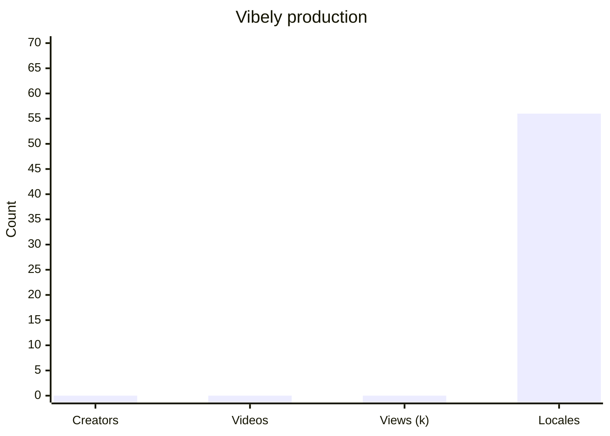
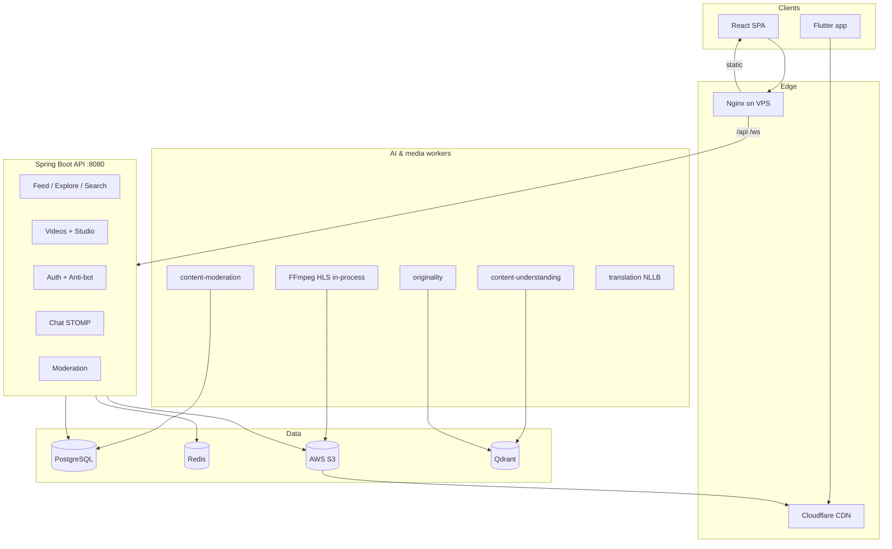
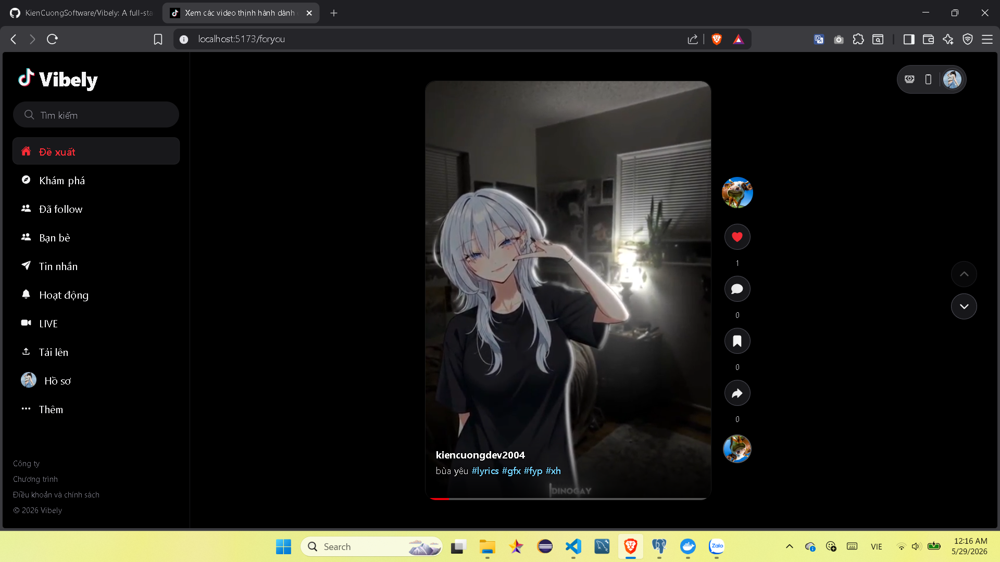
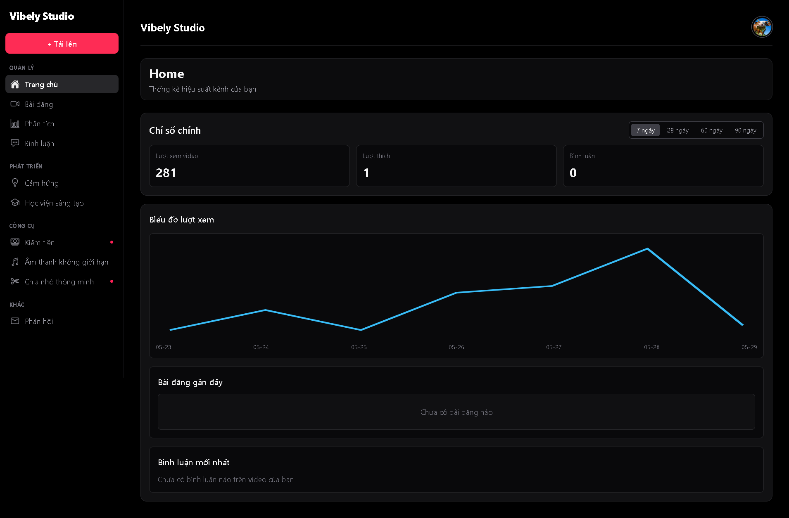

<h1 align="center">Vibely</h1>

<p align="center">
  <strong>A production-style short-video social platform</strong><br/>
  TikTok-inspired UX · Spring Boot · React · HLS · Redis · S3 · AI workers
</p>

<!-- LIVE-STATS:START -->
### Production metrics · [vibely.sbs](https://vibely.sbs)

| Metric | Count |
|--------|------:|
| Active creators | **0** |
| Published videos | **0** |
| Total views | **0** |
| UI locales | **56** |
| Status | **pending deploy** |

<sub>Updated 2026-09-01 13:52 UTC · <a href="https://vibely.sbs/api/public/stats">JSON</a> · daily GitHub Action</sub>


```mermaid
xychart-beta
    title "Vibely production"
    x-axis [Creators, Videos, "Views (k)", Locales]
    y-axis "Count" 0 --> 70
    bar [0, 0, 0, 56]
```
<!-- LIVE-STATS:END -->

<p align="center">
  <a href="https://vibely.sbs">🌐 Live demo</a> ·
  <a href="docs/README.md">📚 Docs</a> ·
  <a href="CONTRIBUTING.md">🤝 Contributing</a> ·
  <a href="LICENSE">MIT License</a>
</p>

<p align="center">
  
  
  
  
  
  
  
  
</p>

---

## At a glance

| | |
|---|---|
| 🎬 **Product** | For You feed, watch, explore, search, profiles, reposts, bookmarks, notifications |
| 🎛️ **Studio** | Upload, drafts, schedule, analytics, comments, inspiration — TikTok-style **review status** + privacy hold |
| 💬 **Social** | DMs, message requests, STOMP realtime, share-to-chat |
| 🔐 **Auth** | JWT + refresh, Google / Facebook / LINE OAuth, email OTP signup, password reset, adaptive captcha |
| 🤖 **AI** | Content understanding, originality, moderation workers, NLLB translation, optional AI enhance |
| 🌍 **i18n** | **56 locales** (Vietnamese-first product copy; English fallback) |
| 🚀 **Prod** | [vibely.sbs](https://vibely.sbs) — Docker on VPS, nginx static SPA, Cloudflare CDN |

---

## Why Vibely exists

Vibely is engineered like a **real consumer social product**, not a CRUD demo:

- **Cursor-based feeds** with virtualization — never mount the full catalog
- **HLS adaptive streaming** — FFmpeg ladder → S3 → CDN → `hls.js`
- **UUIDv7 public IDs** — opaque URLs, fast `BIGINT` joins internally
- **Publication moderation** — new posts show *pending review* in Studio; effective privacy stays private until clearance
- **Batched feed queries**, Redis caches, anti-bot risk engine, WebSocket chat

Built for engineers who care about **media pipelines**, **mobile-first UX**, and **production trade-offs**.

---

## Quick start

### Prerequisites

| Tool | Version |
|------|---------|
| Java | 17+ |
| Maven | 3.9+ |
| Node.js | **22.22+** |
| PostgreSQL | 14+ |
| FFmpeg / FFprobe | 6+ |
| Redis | 7+ (optional locally) |

### 1 · Infrastructure

```bash
docker compose up -d redis
# Optional anti-bot telemetry:
# docker compose --profile kafka up -d
```

### 2 · Database

Create PostgreSQL database `vibely`. Flyway runs on backend startup — tip migration **`V97`** (`intended_privacy` for Studio review hold). See [docs/database/](docs/database/).

### 3 · Backend

```bash
cd backend
export DB_PASSWORD=your_password
export JWT_SECRET=your-local-secret-min-32-chars
mvn spring-boot:run -Dspring-boot.run.profiles=dev
```

→ API at **http://localhost:8080**

Secrets (OAuth, S3, SMTP): gitignored `application-local.yaml` — keys listed in [docs/deployment/README.md](docs/deployment/README.md).

### 4 · Frontend

```bash
cd frontend
npm install
npm run dev
```

→ App at **http://localhost:5173** (Vite proxies `/api`, `/ws`, OAuth paths to `:8080`)

### 5 · Mobile (optional)

```powershell
cd mobile
flutter pub get
flutter run
```

Default API: `https://vibely.sbs` — see [mobile/README.md](mobile/README.md).

---

## Product map

```
┌─────────────────────────────────────────────────────────────────────────┐
│  For You / Following / Friends     Explore / Search / Hashtags          │
│  Watch + creator sidebar           Profile grid + reposts               │
├─────────────────────────────────────────────────────────────────────────┤
│  Vibely Studio                     Settings · Support · Legal           │
│  Upload · drafts · schedule        Account · privacy · data export      │
│  Posts · analytics · comments      Activity · notifications             │
│  Review modal (TikTok-style)       Admin · moderation queue               │
├─────────────────────────────────────────────────────────────────────────┤
│  Messages (STOMP)                  Share links · short URLs               │
└─────────────────────────────────────────────────────────────────────────┘
```

| Surface | Route examples |
|---------|----------------|
| Feed | `/foryou`, `/following`, `/friends` |
| Watch | `/watch/:publicId`, `/@user/video/:publicId` |
| Studio | `/vibelystudio/home`, `/posts`, `/upload` |
| Search | `/search?q=…` |
| Settings | `/settings` |
| Support | `/support` |
| Admin | `/admin/moderation` |

Full route table: [frontend/README.md](frontend/README.md).

---

## System architecture


```mermaid
flowchart TB
  subgraph Clients
    WEB[React SPA]
    MOB[Flutter app]
  end

  subgraph Edge
    CF[Cloudflare CDN]
    NGX[Nginx on VPS]
  end

  subgraph API["Spring Boot API :8080"]
    FEED[Feed / Explore / Search]
    VID[Videos + Studio]
    AUTH[Auth + Anti-bot]
    CHAT[Chat STOMP]
    MOD[Moderation]
  end

  subgraph Workers["AI & media workers"]
    FF[FFmpeg HLS in-process]
    CU[content-understanding]
    OR[originality]
    CM[content-moderation]
    TR[translation NLLB]
  end

  subgraph Data
    PG[(PostgreSQL)]
    RD[(Redis)]
    S3[(AWS S3)]
    QD[(Qdrant)]
  end

  WEB --> NGX
  MOB --> CF
  NGX -->|/api /ws| API
  NGX -->|static| WEB
  API --> PG
  API --> RD
  API --> S3
  FF --> S3
  CU --> QD
  OR --> QD
  CM --> PG
  S3 --> CF
```

**Typical paths**

| Flow | Path |
|------|------|
| Watch | Client → CDN → HLS segments |
| Feed | Client → API → PostgreSQL (+ Redis) |
| Upload | Client → S3 presigned PUT → FFmpeg → S3 `hls/` → CDN |
| Moderation | Upload → CU + originality → moderation worker → decision → Studio status |

Deep dives: [docs/architecture/](docs/architecture/).

---

## Tech stack

| Layer | Technologies |
|-------|----------------|
| **Frontend** | React 19, Vite 8, React Router 7, Tailwind 4, TanStack Virtual, hls.js, i18next, Vitest |
| **Backend** | Spring Boot 3.5, Security, JPA, Flyway, WebSocket/STOMP, Actuator |
| **Mobile** | Flutter, video_player, Google/Facebook native login |
| **AI workers** | Python: `content-understanding`, `originality`, `content-moderation`, `translation`, `ai-enhance` |
| **Data** | PostgreSQL, Redis, Qdrant, RabbitMQ (CU jobs when enabled) |
| **Media** | FFmpeg multi-bitrate HLS, presigned S3, optional AI-enhanced ladder |
| **Auth** | JWT HS256, refresh rotation, OAuth 2.0, SMTP OTP |
| **Deploy** | Docker Hub images, VPS Compose, nginx → `/var/www/vibely` |

---

## Feed & playback (high level)

```
 React metadata list (soft-capped)
        │
        ▼
 @tanstack/react-virtual  ← snap scroll, overscan 1
        │
        ▼
 Media window (±2 slides) ← max ~5 hls.js instances
        │
        ▼
 FeedPrefetchManager      ← prefetch next 2 manifests
```

Backend: keyset cursor `(createdAt, id)` — **no OFFSET** on hot paths. Tuning: `frontend/src/features/feed/utils/feedConfig.js`.

---

## Studio & moderation UX

When a creator publishes:

1. Post appears in **Bài đăng** with **「Đang chờ xét duyệt」**
2. Privacy column shows **「Chỉ mình tôi」** while review is pending (effective hold; restores creator choice after clearance)
3. Click status → **TikTok-style modal** (3-step stepper + FAQ), localized via i18n
4. Backend stores `intended_privacy` (Flyway **V97**) until moderation clears

Details: [docs/moderation/README.md](docs/moderation/README.md).

---

## UUIDv7 public identity

| Layer | ID | Used for |
|-------|-----|----------|
| Database | `BIGINT` | PK/FK, feed cursors |
| Public API | UUID v7 | URLs, share links, S3 `hls/{authorId}/{publicId}/` |

Numeric video IDs are **rejected** at the API boundary.

---

## Repository layout

```
Vibely/
├── backend/                 # Spring Boot modular monolith
│   └── src/main/java/com/vibely/backend/
│       ├── antibot/ auth/ chat/ feed/ search/ interaction/
│       ├── processing/ share/ studio/ admin/ video/
│       ├── moderation/      # AI + human review, publication hold
│       ├── contentunderstanding/ originality/ translation/
│       └── resources/db/migration/   # Flyway V1…V97
├── frontend/                # React + Vite SPA (feature-first)
│   └── src/features/        # auth feed post profile studio search chat …
│       └── i18n/            # 56 locale JSON files
├── mobile/                  # Flutter client
├── ai-workers/
│   ├── content-understanding/
│   ├── originality/
│   ├── content-moderation/
│   ├── translation/
│   └── ai-enhance/
├── docs/                    # Engineering docs index → docs/README.md
├── deploy/                  # VPS compose, nginx, sync script
├── infra/                   # Lambda audio extract (optional)
└── docker-compose.yml       # Local Redis (+ Kafka profile)
```

---

## Production deploy (vibely.sbs)

**Images:** `kiencuongsoftware/vibely-backend` · `kiencuongsoftware/vibely-frontend`

| Component | How it runs |
|-----------|-------------|
| Backend | Docker Compose, `network_mode: host` → `:8080` |
| Frontend | Static files in **`/var/www/vibely`** (host nginx) |
| Config | `/opt/vibely/vibely.env` + `config/application-local.yaml` |

> **Important:** `docker compose pull` alone does **not** update `/var/www/vibely`. After pushing a new frontend image, **sync static files** from the container.

```bash
# On VPS — manual sync (works even without repo checkout)
docker pull kiencuongsoftware/vibely-frontend:latest
TMP=vibely-fe-sync-$$
docker create --name $TMP kiencuongsoftware/vibely-frontend:latest
find /var/www/vibely -mindepth 1 -maxdepth 1 -exec rm -rf {} +
docker cp $TMP:/usr/share/nginx/html/. /var/www/vibely/
docker rm -f $TMP

# Verify new bundle
grep -o 'pendingReview' /var/www/vibely/assets/StudioPostsPage-*.js | head -1
```

Then **Cloudflare → Purge Everything** and hard-refresh the browser.

Full guide: [docs/deployment/README.md](docs/deployment/README.md) · Compose reference: [deploy/vps/docker-compose.yml](deploy/vps/docker-compose.yml).

---

## API snapshot

Envelope: `{ "success": true, "data": … }` or `{ "success": false, "error": { "status", "message" } }`.

```http
GET  /api/feed/for-you?size=8&cursor=…
GET  /api/videos/{uuid-v7-publicId}
POST /api/videos/{publicId}/likes
GET  /api/search/suggest?q=
GET  /api/chat/conversations
POST /api/auth/login
GET  /api/captcha/challenge
GET  /api/health/readiness
GET  /api/public/stats              # live platform counters (README chart)
GET  /api/public/stats/shield/{metric}   # optional shields.io JSON
```

Full reference: [docs/api/REST_REFERENCE.md](docs/api/REST_REFERENCE.md).

### Live README metrics

The hero **table + bar chart** are refreshed by [`.github/workflows/update-readme-stats.yml`](.github/workflows/update-readme-stats.yml) (every 6h + manual dispatch). Source: `GET /api/public/stats` (cached **5 min** on the server):

| Metric | Source |
|--------|--------|
| **creators** | `users` where `account_status = ACTIVE` |
| **videos** | `videos` where `status = READY` and not a studio draft |
| **views** | row count in `video_views` |
| **locales** | `56` (frontend i18n files) |
| **online** | API health (endpoint reachable) |

After deploying backend, verify then run the workflow (or `node scripts/update-readme-stats.mjs` locally):

```bash
curl -sL https://vibely.sbs/api/public/stats
node scripts/update-readme-stats.mjs
```

Until `/api/public/stats` is public on production, the chart shows **56 locales** and zeros for DB counters — deploy the latest backend image first.

---

## Screenshots

### For You feed

<p align="center">
  
</p>
<p align="center"><sub>Infinite scroll · HLS · likes / comments / share</sub></p>

### Creator Studio

<p align="center">
  
</p>
<p align="center"><sub>Dashboard · posts · analytics · moderation status</sub></p>

---

## Roadmap

| Status | Item |
|--------|------|
| ✅ | Direct messaging + message requests |
| ✅ | Flutter mobile client |
| ✅ | Content understanding + originality workers |
| ✅ | AI moderation pipeline + admin HITL queue |
| ✅ | Studio publication review UX (pending status + modal) |
| ✅ | 56-locale i18n |
| ✅ | Photo posts + scheduled publish |
| 🔲 | Personalized For You ranking beyond current signals |
| 🔲 | Push notifications |
| 🔲 | Live streaming (RTMP → LL-HLS) |
| 🔲 | Distributed transcoding fleet (SQS/Kafka) |

Details: [docs/roadmap/](docs/roadmap/).

---

## Documentation index

| Start here | Description |
|------------|-------------|
| [docs/README.md](docs/README.md) | Master index + “what to update when” |
| [docs/PROJECT_OVERVIEW.md](docs/PROJECT_OVERVIEW.md) | Code-aligned snapshot |
| [docs/deployment/README.md](docs/deployment/README.md) | Local, Docker, VPS |
| [docs/auth/](docs/auth/) | JWT, OAuth, OTP |
| [docs/anti-bot/](docs/anti-bot/) | Captcha, risk engine |
| [docs/moderation/](docs/moderation/) | Publication hold + admin |
| [docs/frontend/](docs/frontend/) | SPA architecture |
| [docs/database/](docs/database/) | Schema + Flyway |

---

## Contributing & security

- Contributions: [CONTRIBUTING.md](CONTRIBUTING.md)
- Security reports: [SECURITY.md](SECURITY.md) — please do not open public issues for vulnerabilities

```bash
cd backend && mvn test
cd frontend && npm test
```

---

## License

**MIT** — see [LICENSE](LICENSE).

<p align="center">
  <sub>Built as a production-oriented portfolio platform — feeds, media pipelines, moderation, and real engineering trade-offs.</sub>
</p>
