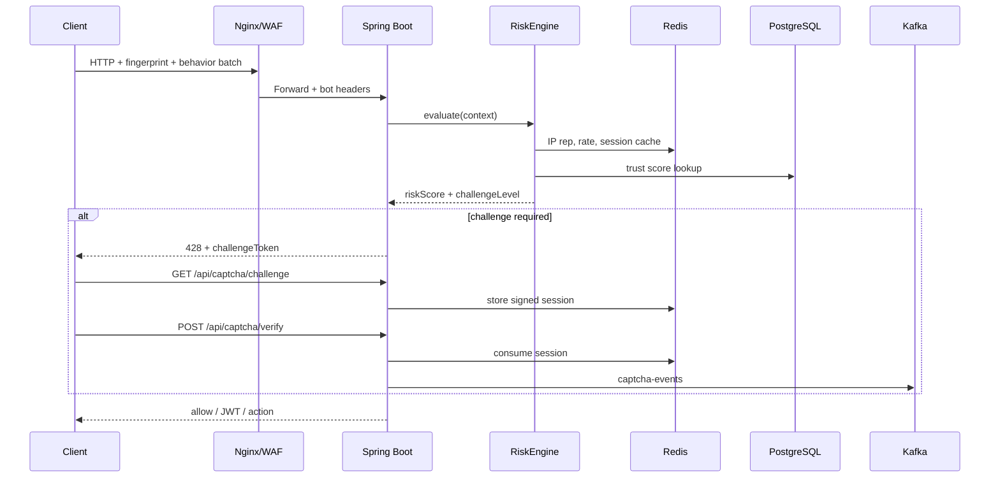

# Vibely Anti-Bot Platform Architecture

Enterprise-grade adaptive anti-abuse layer for Vibely (TikTok-scale patterns).

## Goals

- Real-time risk scoring (session, device, IP, user trust)
- Adaptive challenges (none → checkbox → rotate → slider → multi-step)
- Device fingerprinting + behavior entropy analysis
- Distributed rate limiting (Redis sliding window)
- Event-driven telemetry (Kafka when enabled)
- Signed, expiring, single-use challenge tokens (HMAC)

## Logical Services (modular monolith → microservices)

```
anti-bot-platform/
  risk-engine/          # RiskEngine, policy matrix
  captcha-service/      # Challenge lifecycle + verification
  fingerprint-engine/   # Device hash + trust cache
  behavior-analysis/      # Gesture entropy scoring
  trust-scoring/          # Persistent user/device trust
  rate-limit-engine/      # Redis token bucket + sliding window
  telemetry-pipeline/     # Kafka topics + async consumers
  abuse-detection/        # Rules on aggregated events
```

Phase 1 ships inside `com.vibely.backend.antibot` with clear package boundaries so each module can be extracted later.

## Request Flow



## Risk Policy Matrix

| Score | Level | Action |
|------:|-------|--------|
| 0–24 | LOW | Allow |
| 25–49 | MEDIUM | Checkbox attestation |
| 50–74 | HIGH | Rotate captcha |
| 75–89 | VERY_HIGH | Slider puzzle |
| 90–100 | EXTREME | Multi-step + hard throttle |

Signals: automation flags, velocity, failed auth, new device, datacenter IP heuristic, behavior entropy, fingerprint novelty.

## Redis Key Schema

| Key | TTL | Purpose |
|-----|-----|---------|
| `ab:rl:{scope}:{id}` | 60s | Sliding window counters |
| `ab:captcha:{id}` | 120s | Challenge session JSON |
| `ab:risk:session:{id}` | 300s | Cached session risk |
| `ab:trust:device:{hash}` | 7d | Device trust cache |
| `ab:trust:user:{id}` | 30d | User trust cache |
| `ab:ip:{hash}` | 1h | IP reputation score |

## PostgreSQL Tables (V28)

- `anti_bot_risk_events` — audit trail
- `anti_bot_captcha_sessions` — verification audit
- `anti_bot_device_fingerprints` — stable device hash
- `anti_bot_behavior_samples` — aggregated entropy metrics
- `anti_bot_trust_scores` — user/device trust
- `anti_bot_abuse_reports` — manual + automated flags

## Kafka Topics (optional)

- `login-events`
- `captcha-events`
- `abuse-events`
- `interaction-events`
- `risk-events`
- `behavior-events`

## Scaling

- **API**: horizontal pods behind Nginx; stateless except Redis/Kafka
- **Redis**: cluster mode for rate limit + captcha sessions
- **Kafka**: partition by `deviceHash` or `userId`
- **Risk**: in-memory policy cache; async trust updates

## Security Hardening (Phase 2)

- **Auth enforcement**: `X-Captcha-Verification` required on login/register when risk policy demands it
- **Replay prevention**: verification tokens consumed once via Redis `SETNX`
- **Adaptive escalation**: failed logins escalate challenge CHECKBOX → ROTATE → SLIDER → MULTI_STEP
- **Suspicious login lockout**: IP/email failure thresholds per hour
- HMAC-SHA256 challenge tokens (`verify:PURPOSE:challengeId.expires.signature`)
- WAF/IP reputation headers: `X-Bot-Score`, `CF-Bot-Score`, `X-Threat-Score`
- Kafka telemetry topics + inline `AbuseRulesEngine`
- Prometheus metrics at `/actuator/prometheus`

## Monitoring

- Metrics: `antibot_risk_score_histogram`, `captcha_fail_rate`, `rate_limit_hits`
- Dashboards: risk tier distribution, top blocked ASNs, automation flag rate
- Alerts: captcha fail spike, EXTREME tier > 5% of logins
