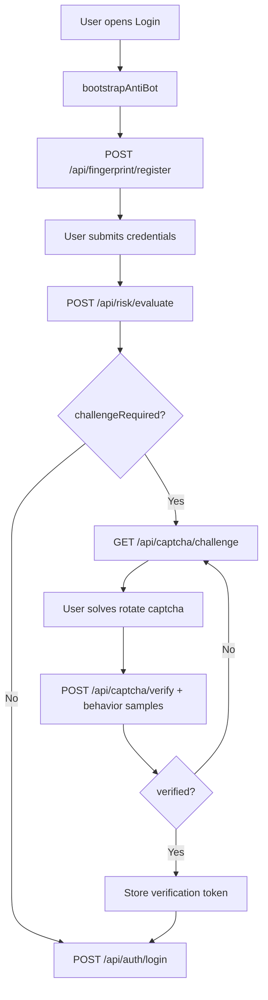

# Anti-Bot Event Flow

## Login with adaptive challenge

## Telemetry topics

| Topic | Producer | Payload |
|-------|----------|---------|
| `risk-events` | RiskEngine | score, level, session |
| `captcha-events` | CaptchaService | create/verify/fail |
| `behavior-events` | BehaviorAnalysisService | entropy, suspicious |
| `interaction-events` | FingerprintService | device hash |
| `login-events` | Auth (future) | success/fail |
| `abuse-events` | AbuseDetection (future) | coordinated signals |

Default dev mode logs events via `LoggingAntiBotTelemetryPublisher`. Enable Kafka with `app.antibot.kafka-enabled=true`.
