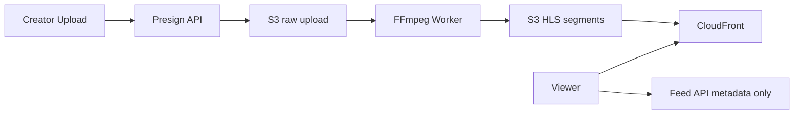

# CDN & Media Architecture

## 1. Overview

Video bytes live in **S3**; playback is delivered via **CloudFront** (or presigned URLs in dev). HLS adaptive streaming uses segment objects under `hls/{authorId}/{videoId}/`.

## 2. Purpose

Minimize origin load and achieve global low-latency playback for short video.

## 3. Architecture

## 4. System Design

- **Upload:** `POST /api/videos/upload/presign` → client PUT to S3
- **Transcode:** `FfmpegHlsPipelineRunner` — download source, multi-bitrate HLS, upload playlist + `.ts` segments
- **Playback:** `S3PresignedUploadService` / `S3ObjectUrlBuilder` — CloudFront URL or time-limited presign (`app.s3.playback-presign-expiry-hours`)

## 5. Data Flow

See [media/PIPELINE.md](../media/PIPELINE.md).

## 6. Sequence Flows

Upload → process → publish → feed index → client `resolvePlaybackUrl()` → hls.js `loadSource(master.m3u8)`.

## 7. Scaling Strategy

- CloudFront cache policies per segment TTL
- Separate S3 bucket per environment
- Lambda@Edge for token validation (roadmap)

## 8. Performance

- Segment duration ~2–6s typical for HLS
- Client prefetch next manifest in feed scroll

## 9. Security

- Presigned PUT short TTL
- Playback presign or signed cookies
- No public list on raw upload bucket

## 10–15.

- **Failures:** corrupt upload → processing FAILED status
- **Recovery:** re-enqueue job by video ID
- **Tradeoff:** presign vs public CDN path
- **Monitoring:** 4xx/5xx on CloudFront, processing queue depth
