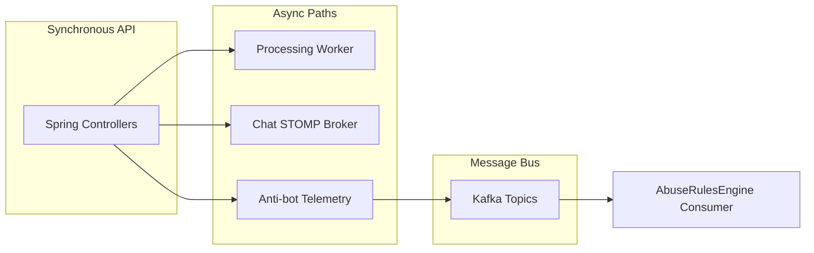

# Event-Driven Architecture

## 1. Overview

Vibely uses **selective event-driven patterns**: Kafka for anti-bot telemetry (optional), in-process processing jobs for media, and STOMP for realtime chat. Not all domains are event-sourced.

## 2. Purpose

Decouple high-volume security telemetry and future analytics from synchronous API latency.

## 3. Architecture



## 4. System Design

**Kafka topics (anti-bot, when `app.antibot.kafka-enabled=true`):**

| Topic | Producer | Consumer |
|-------|----------|----------|
| `login-events` | AuthProtectionService | AbuseRulesEngine |
| `captcha-events` | CaptchaService | AbuseRulesEngine |
| `risk-events` | RiskEngine | AbuseRulesEngine |
| `behavior-events` | BehaviorAnalysisService | AbuseRulesEngine |
| `abuse-events` | AbuseDetectionService | SIEM / future |

**Default dev:** Kafka auto-config excluded; `CompositeAntiBotTelemetryPublisher` runs rules inline + logs.

## 5. Data Flow

Event payload: JSON map with `event` key + domain fields (hashed PII where applicable).

## 6. Sequence Flows

```
Captcha verify success
→ CaptchaService.publish("captcha-events", {event: verify_success})
→ AbuseRulesEngine.process()
→ Composite → Logging + optional Kafka
→ AntiBotMetrics.increment
```

## 7. Scaling Strategy

- Kafka partitions by `deviceHash` or `ipHash` for ordering
- Separate consumer group per rules version
- Media: move to SQS + Lambda/ECS workers at scale

## 8. Performance Considerations

- Telemetry publish must not block HTTP thread — consider `@Async` for Kafka send
- Batch consumer commits for abuse aggregation

## 9. Security Considerations

- No raw emails in Kafka payloads — use `emailHash`
- Topic ACLs per environment

## 10. Failure Scenarios

- Kafka broker down: logging path still works; rules run inline
- Consumer lag: abuse detection delayed, not lost if retention sufficient

## 11. Recovery Strategy

- Replay from Kafka retention for forensic analysis
- Dead-letter topic for poison messages (roadmap)

## 12. Tradeoffs

Inline rules vs dedicated stream processor — inline chosen for MVP operational simplicity.

## 13. Future Improvements

- `video.events` (uploaded, processed, viewed) for analytics pipeline
- Outbox pattern for reliable publish from transactions

## 14. Production Hardening

- `docker compose --profile kafka up` for local parity
- MSK with encryption in AWS

## 15. Monitoring Strategy

- Consumer lag alerts
- `antibot.events` counter by topic/tag
