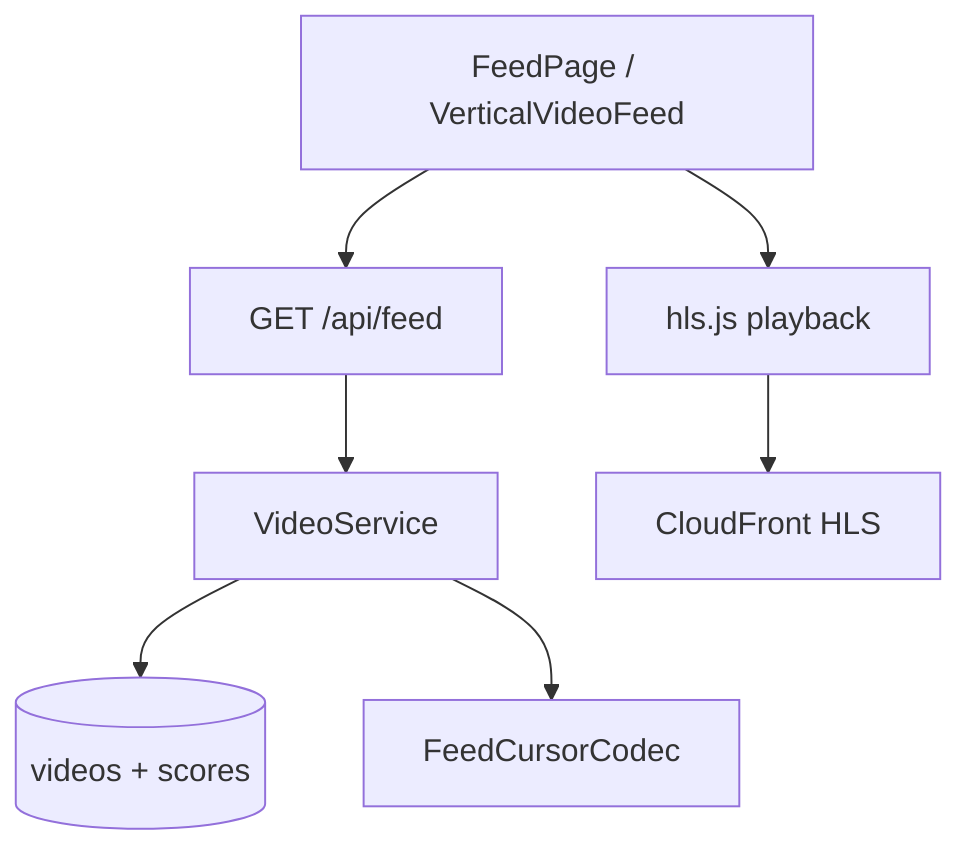

# Feed Platform Architecture

## 1. Overview

The For You and Following feeds are served via `/api/feed` with **keyset pagination** implemented in `VideoService`. The `feed` package provides cursor encoding and DTOs; ranking logic is embedded in SQL + configurable weights.

## 2. Purpose

Sustain infinite scroll at millions of videos without OFFSET degradation.

## 3. Architecture

## 4. System Design

- **Cursor:** opaque encoded tuple (timestamp, id) — see `FeedCursorCodec`
- **Guest access:** public feed routes without JWT
- **Prefetch:** `FeedPrefetchManager` loads next N manifests

## 5–15.

See [feed/ARCHITECTURE.md](../feed/ARCHITECTURE.md) for ranking hooks, Redis caching strategy, watch-time scoring, and failure modes.
