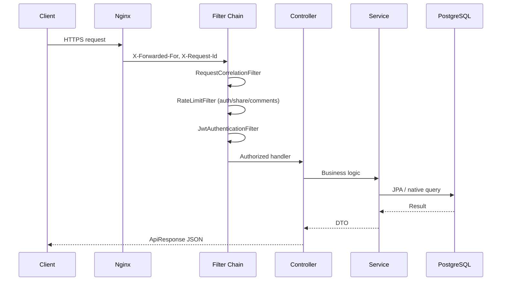

# Request Lifecycle

## 1. Overview

Every HTTP request passes through correlation, optional rate limiting, JWT authentication, and domain controllers before hitting PostgreSQL, Redis, or S3.

## 2. Purpose

Standardize observability, security enforcement, and latency budgets across all `/api/**` routes.

## 3. Architecture



## 4. System Design

**Filter order** (`SecurityConfig`):

1. `RequestCorrelationFilter` — MDC `requestId`
2. `RateLimitFilter` — sliding window for `/api/auth/*`, comment POSTs, share redirects
3. `JwtAuthenticationFilter` — Bearer token → `SecurityContext`
4. Controller method security (`@PreAuthorize` where used)

**Public routes:** feed GET, explore GET, video GET, health, anti-bot public endpoints, OAuth callbacks.

## 5. Data Flow

- **Read:** Controller → Service → Repository → DTO mapping → `ApiResponse.success(data)`
- **Write:** `@Transactional` service → entity persist → domain events (logging/Kafka for anti-bot)

## 6. Sequence Flows

**Authenticated feed read:**

```
GET /api/feed?cursor=...
→ JwtAuthenticationFilter (optional: guest allowed on some routes)
→ FeedController → VideoService.keysetFeed()
→ Encode next cursor (FeedCursorCodec)
```

**Login with anti-bot:**

```
POST /api/auth/login + X-Captcha-Verification
→ AuthProtectionService.guardLogin() → validateUnused(token)
→ AuthenticationManager
→ on success: consumeLoginVerification() → issueTokens()

POST /api/auth/send-code { purpose: PASSWORD_RESET }
→ validateUnused(token, PASSWORD_RESET)
→ email OTP → POST /api/auth/reset-password consumes OTP row
```

## 7. Scaling Strategy

- Filters are stateless; rate limit keys use IP + route hash
- Move rate limiting to Redis globally (partially done for share/anti-bot)
- Edge rate limit at Nginx for DDoS absorption

## 8. Performance Considerations

- Avoid N+1: feed queries use batch author resolution where implemented
- Pagination: keyset only, never unbounded lists
- JSON: `ApiResponse` envelope consistent for client parsing

## 9. Security Considerations

- CSRF disabled (SPA + JWT); rely on CORS + token
- `server.error.include-message: never` in production YAML
- Auth routes protected by adaptive captcha (428 CAPTCHA_REQUIRED)

## 10. Failure Scenarios

- **Invalid JWT:** 401 `AUTH_REQUIRED`
- **Expired captcha token:** 400 replay or missing 428
- **DB timeout:** 500, correlation ID in logs

## 11. Recovery Strategy

- Client refresh token rotation on 401
- Idempotent share writes via idempotency window (`app.share.idempotency-window-hours`)

## 12. Tradeoffs

Centralized filter chain vs per-route middleware — chosen for Spring Security consistency.

## 13. Future Improvements

- OpenTelemetry spans per filter
- mTLS service mesh between Nginx and API

## 14. Production Hardening

- Request size limits (`multipart` 50MB)
- Timeout headers from Nginx

## 15. Monitoring Strategy

- Log pattern: `%X{requestId}`
- Alert on 5xx rate > 1% per route group
