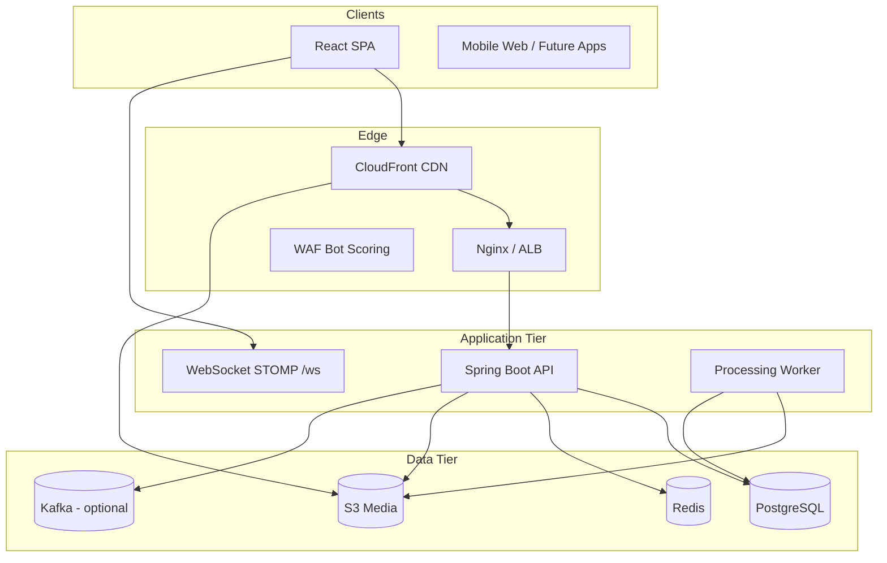

# Vibely System Overview

## 1. Overview

Vibely is a short-form video social platform: vertical feed consumption, creator upload/studio, explore/discovery, direct messaging, and shareable deep links. The current implementation is a **modular monolith** (Spring Boot API + React SPA) with clear extraction boundaries for feed, media, chat, and anti-abuse.

## 2. Purpose

Deliver TikTok-class UX (instant playback, infinite scroll, realtime chat) on an architecture that can scale to millions of DAU without rewriting core domains.

## 3. Architecture

## 4. System Design

| Layer | Responsibility | Technology |
|-------|----------------|------------|
| Presentation | Feed UI, upload, chat, explore | React 19, Vite, Tailwind, hls.js |
| API | REST, auth, business rules | Spring Boot 3.5, JWT |
| Realtime | Chat delivery | STOMP over WebSocket |
| Processing | Transcode HLS, audio | FFmpeg worker in-process |
| Storage | Relational truth, objects | PostgreSQL, S3 |
| Cache | Hot paths, anti-abuse, explore | Redis (optional in dev) |

## 5. Data Flow

**Watch path:** Client → `GET /api/feed` (keyset cursor) → PostgreSQL read model → presigned or CDN playback URL → hls.js segment fetch from CloudFront/S3.

**Upload path:** Client → presign → S3 PUT → `POST /api/videos` → processing job → FFmpeg → `hls/{authorId}/{videoId}/` on S3 → video status `READY`.

## 6. Sequence Flows

See [REQUEST_LIFECYCLE.md](REQUEST_LIFECYCLE.md) and [FEED_PLATFORM.md](FEED_PLATFORM.md).

## 7. Scaling Strategy

- **Stateless API** — horizontal pod autoscaling behind Nginx/ALB
- **Read replicas** — PostgreSQL for feed/explore read-heavy queries
- **Redis cluster** — explore pages, share counters, anti-bot sessions, rate limits
- **CDN** — 90%+ bytes served from CloudFront; API only metadata
- **Worker pool** — extract `processing` package to dedicated transcode fleet

## 8. Performance Considerations

- Keyset pagination avoids OFFSET on large feeds
- Explore responses cached in Redis (`app.explore.cache-ttl-seconds`)
- Feed prefetch on client (`FeedPrefetchManager`) warms HLS manifests
- `open-in-view: false` on JPA reduces connection hold time

## 9. Security Considerations

- JWT access tokens + hashed refresh tokens in PostgreSQL
- Anti-bot platform on auth (`X-Captcha-Verification`, replay-safe tokens)
- Rate limits on auth, comments, share redirects
- Presigned URLs time-boxed for upload and playback

## 10. Failure Scenarios

| Failure | Impact | Mitigation |
|---------|--------|------------|
| PostgreSQL primary down | All writes fail | Failover replica, readiness probe |
| Redis unavailable | Cache miss, in-memory fallbacks | Degraded explore latency; enable Redis in prod |
| S3 region outage | Playback/upload blocked | Multi-region replication (roadmap) |
| Worker stuck | Videos stay PROCESSING | Job timeout, DLQ, manual requeue |

## 11. Recovery Strategy

- Flyway migrations for schema recovery
- Refresh token revocation on compromise
- Processing dry-run flags (`app.processing.worker.enabled`)
- Chat: hide conversation per-user (`hidden_at`) without data loss

## 12. Tradeoffs

| Decision | Benefit | Cost |
|----------|---------|------|
| Modular monolith | Fast iteration, single deploy | Blast radius |
| In-process FFmpeg worker | Simplicity | CPU contention with API |
| Optional Redis in dev | Easier onboarding | Prod parity gap |
| STOMP vs raw WebSocket | Spring integration | Less flexible for mobile |

## 13. Future Improvements

- Extract media worker service
- Dedicated notification service
- Graph-based recommendation service
- Edge auth at CloudFront

## 14. Production Hardening

- WAF + bot score headers → `IpReputationService`
- Secrets in AWS Secrets Manager
- TLS 1.3 end-to-end
- S3 bucket policies least-privilege

## 15. Monitoring Strategy

- `/api/health/readiness` for orchestration
- Prometheus: JVM, HTTP, `antibot.*` metrics
- SLOs: feed p95 < 200ms, playback start < 2s
