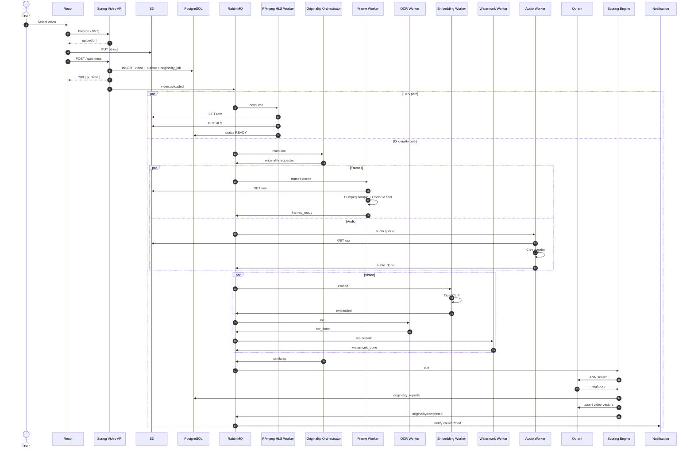
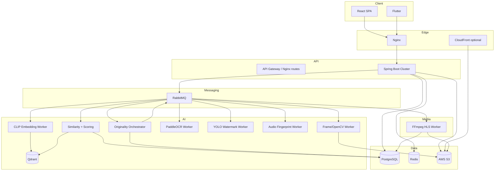
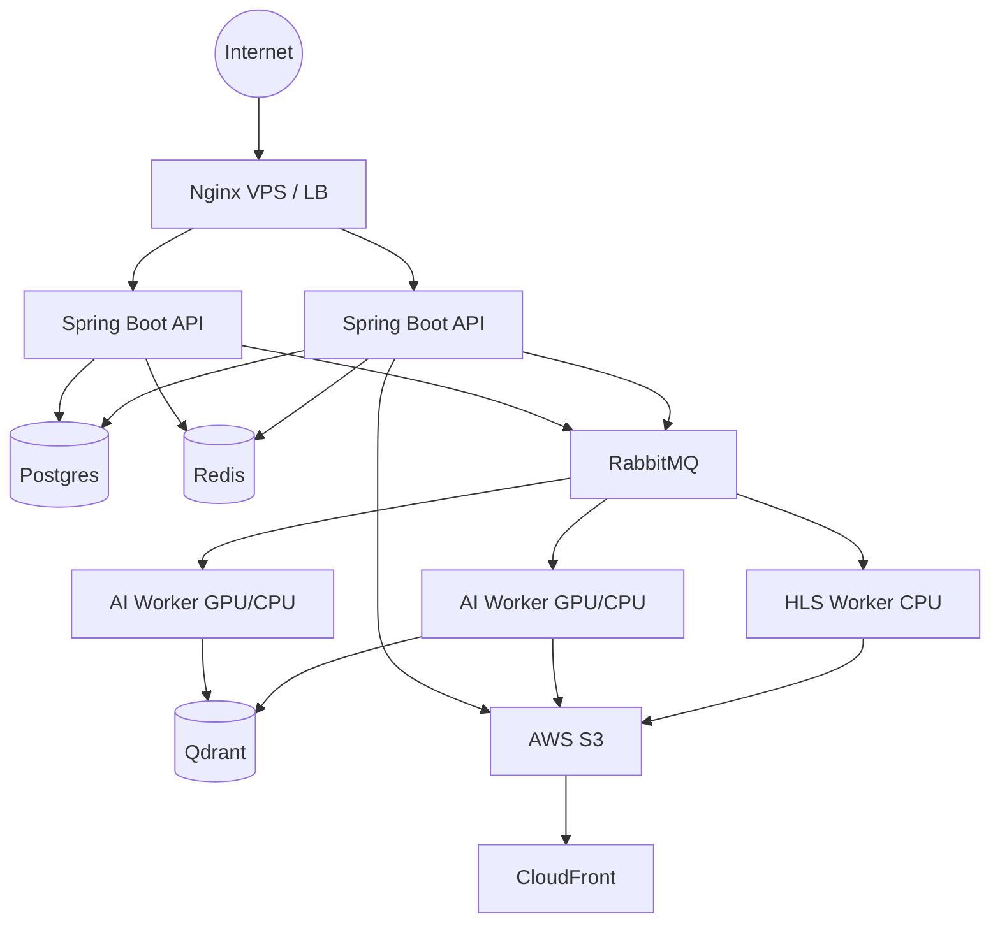

# Vibely Original Content Detection System
## Technical Design Document (TDD) — Parts 2 & 3

| Field | Value |
|-------|--------|
| Document ID | VIBELY-TDD-OCD-2026-07 |
| Version | 1.0 |
| Status | Proposed — Production-oriented |
| Audience | Engineering, AI/ML, SRE, Product Moderation |
| Related systems | Upload (S3 presign), HLS processing (`FfmpegHlsPipelineRunner`), Discovery embeddings |

---

## 0. Executive summary

Vibely must detect **near-duplicate / reuploaded** short-form video content under heavy transforms (crop, filter, subtitle, re-encode, screen-record). File hashes (MD5/SHA) are **insufficient** and must only be a weak signal.

**Design principles**

1. **Async-only AI** — never block upload HTTP path.
2. **Separate AI workers** (Python) — not inside Spring Boot request threads.
3. **Multi-signal ensemble** — visual + audio + OCR + watermark + metadata + scene/object.
4. **Explainable decisions** — moderation can see *which* video, *which* frames, *which* text/logo.
5. **Phased scale** — RabbitMQ + Qdrant on VPS first; Kafka + GPU fleet at millions of users.

**Current Vibely baseline (as of repo)**

- Upload: browser → S3 presign PUT → `POST /api/videos` → `video_processing_jobs` (Postgres poll) → FFmpeg HLS.
- Discovery AI (OpenAI Whisper/vision/embeddings) exists for **recommendation**, not originality.
- No originality job, no content-ID corpus, no watermark/audio fingerprint pipeline.

This TDD introduces an **Originality bounded context** that plugs in **after** `video.uploaded` (and preferably after media is downloadable from S3), without coupling to HLS completion (optional soft-gate on Explore).

---

## 1. Goals & non-goals

### Goals

- Detect reuploads from TikTok / FB / IG / YT Shorts / Douyin / CapCut exports under transforms listed in product requirements.
- Emit multi-metric report: Originality, Visual/Audio/OCR/Watermark/Metadata scores, Confidence, Risk, Decision.
- Sustain **thousands of concurrent analyses** via horizontal workers.
- Keep upload UX fast (create API returns immediately).
- Replace or upgrade individual models without rewriting Spring.

### Non-goals (v1)

- Full copyright legal judgment / DMCA automation.
- Perfect detection of AI-generated “style clones” with no visual overlap (gen-AI similarity is P3 research).
- Real-time synchronous scoring in the upload API.

---

## 2. System architecture (microservice-oriented)

### 2.1 Logical services

Even if initially deployed as **modular monolith workers** on Compose, boundaries must be service-shaped.

| Service | Responsibility | DB | Cache | Queue | Consumes | Publishes |
|---------|----------------|----|-------|-------|----------|-----------|
| **API Gateway / Nginx** | TLS, routing, static SPA | — | — | — | HTTP | — |
| **Auth Service** (existing Spring module) | JWT/OAuth | Postgres users | Redis sessions/rate | — | login | `user.authenticated` (optional) |
| **User Service** | Profiles, follow | Postgres | Redis | — | — | `user.updated` |
| **Video Service** | CRUD video metadata, ownership | Postgres `videos` | Redis feed snippets | — | create/update | `video.uploaded`, `video.updated`, `video.removed` |
| **Upload / Storage** | Presign, ownership checks | — | — | — | presign | — |
| **Streaming / Processing Worker** | FFmpeg HLS (existing) | `video_processing_jobs` | — | Poll → later RMQ | `video.uploaded` | `video.transcoded`, `video.processing.failed` |
| **Originality Orchestrator** | Saga/state machine for AI stages | `originality_jobs`, `originality_reports` | Redis job locks | RabbitMQ | `video.uploaded` / `video.transcoded` | `originality.stage.*`, `originality.completed` |
| **Frame Extractor Worker** | FFmpeg sample + quality filter | ephemeral disk | Redis frame tips | `originality.frames` | `originality.requested` | `originality.frames_ready` |
| **Embedding Worker** | OpenCLIP / DINOv2 vectors | — | model warmup | `originality.embed` | `originality.frames_ready` | `originality.embedded` |
| **OCR Worker** | PaddleOCR text/QR | — | — | `originality.ocr` | `originality.frames_ready` | `originality.ocr_done` |
| **Watermark Worker** | YOLO platform logos | — | — | `originality.watermark` | `originality.frames_ready` | `originality.watermark_done` |
| **Audio Fingerprint Worker** | Chromaprint (+ optional speech emb) | — | — | `originality.audio` | `originality.requested` | `originality.audio_done` |
| **Similarity Service** | ANN query Qdrant, fuse matches | Postgres matches | Redis query cache | `originality.similarity` | stage-done events | `originality.matched` |
| **Scoring / Moderation Policy** | Weighted score + decision | reports | config cache | — | `originality.matched` | `originality.completed` |
| **Notification Service** | Push to creator/mod | Postgres notif | — | notif queue | `originality.completed` | — |
| **Recommendation** | Consume originality as trust feature | embeddings | Redis | — | `originality.completed` | — |

**Why not “all AI in Spring Boot”**

- JVM garbage + native CUDA bindings are awkward; Python ecosystem owns CV/ML.
- Isolate GPU OOM / model upgrades from API availability.
- Scale AI workers independently of API replicas.

**Trade-off:** operational complexity (more processes). Mitigate with clear contracts (events + protobuf/JSON schemas) and shared `videoId` correlation IDs.

### 2.2 Data stores

| Store | Use | Why |
|-------|-----|-----|
| **PostgreSQL 16** | Source of truth: jobs, reports, match evidence, policy audit | ACID, Flyway, already core |
| **Qdrant** | Frame/scene/video embeddings + payload filters | HNSW, multi-vector, self-host on VPS |
| **Redis 7** | Idempotency keys, rate limits, short result cache, distributed locks | Already present |
| **S3** | Raw video, extracted frame packs (optional), reports JSON | Existing |
| **RabbitMQ** (P0) | Work queues + DLQ | Fits Compose; easier than Kafka ops at current scale |

### 2.3 Event-driven contracts (examples)

#### `video.uploaded`

- **Publisher:** Video Service after commit of `createVideo`
- **Payload:** `{ eventId, traceId, videoId, publicId, authorId, s3Key, contentType, durationSeconds, fileSizeBytes, createdAt }`
- **Subscribers:** HLS worker (existing path), Originality Orchestrator
- **Retry:** at-least-once; consumer idempotent on `eventId` / `videoId+version`
- **DLQ:** `video.uploaded.dlq` after N failed publishes from outbox

#### `originality.requested`

- **Publisher:** Orchestrator
- **Payload:** `{ jobId, videoId, s3Key, priority, policyVersion }`
- **Subscribers:** Frame + Audio workers (parallel)

#### `originality.frames_ready`

- **Payload:** `{ jobId, videoId, frameManifestUri, frameCount, sampleStrategy, sceneCuts[] }`
- **Subscribers:** Embed, OCR, Watermark (parallel)

#### `originality.embedded` / `ocr_done` / `watermark_done` / `audio_done`

- Stage results with checksums; Orchestrator waits on join (barrier).

#### `originality.completed`

- **Payload:** full report summary + `decision`, `risk`, `confidence`, `matchedVideoIds[]`
- **Subscribers:** Notification, Recommendation feature update, Admin moderation inbox

**Outbox pattern (Spring):** write event row in same TX as video insert; relay publishes to RabbitMQ. Prevents “DB committed, event lost”.

---

## 3. Upload flow (must stay fast)

```
User picks file (React)
  → Client validates size ≤30GB, duration ≤60m, mime
  → Presign (JWT) → PUT S3
  → POST /api/videos { videoUrl, durationSeconds, ... }
  → AuthN/AuthZ + ownership + duration gate
  → INSERT videos (RAW) + originality_jobs (PENDING) + outbox event
  → HTTP 200 immediately (publicId, status)
  → Async: HLS job + Originality job independently
```

**Hard rule:** No OCR/CLIP/YOLO on the request thread. No `CompletableFuture` blocking the API for AI.

**Optional product policy:** Video may become HLS `READY` for owner preview while Explore/For-You waits for `originality.decision ∈ {ALLOW, REVIEW}` — configure via feature flag.

---

## 4. AI processing flow (order & parallelism)

```
Download S3 object (CPU/network)
  → Probe (ffprobe) — sequential gate
  → PARALLEL:
       A) Adaptive frame sample + quality filter
       B) Audio extract + Chromaprint
  → When frames ready — PARALLEL:
       C) OpenCLIP embeddings
       D) PaddleOCR
       E) YOLO watermark
       F) Lightweight object/scene tags
  → Similarity ANN (needs C; boosted by D/E/F/B)
  → Scoring + explain pack
  → Persist + index new vectors into corpus (if ALLOW or always with tombstone)
  → Publish originality.completed
```

| Step | Sequential? | Resource | Cache |
|------|-------------|----------|-------|
| Download/probe | Yes (gate) | Network/CPU | — |
| Frame sample | After probe | CPU | Skip identical phash |
| Audio FP | Parallel with frames | CPU | — |
| Embed/OCR/YOLO | Parallel after frames | GPU preferred | Model weights loaded once |
| ANN search | After embed | CPU/RAM (Qdrant) | Cache topK by vector hash |
| Score | After all stages or partial timeout | CPU | Policy config |

**Why this order:** Frames unlock three expensive vision stages; audio does not need frames; ANN without embeddings is useless; scoring without evidence is non-explainable.

---

## 5. Sequence diagram (Mermaid)



---

## 6. Component diagram (Mermaid)



---

## 7. Deployment diagram



| Component | Role | HA notes |
|-----------|------|----------|
| Nginx | Terminate TLS, SPA, `/api` proxy | Active/passive or LB |
| Spring API | Stateless JWT | N≥2 behind LB |
| Postgres | SoT | Managed or primary/replica |
| Redis | Cache/locks | Redis Sentinel later |
| RabbitMQ | Queues/DLQ | Mirrored queues / quorum |
| HLS worker | CPU-heavy | Scale replicas; sticky not required |
| AI workers | GPU optional | Autoscale on queue depth |
| Qdrant | Vectors | Snapshot + replica |
| S3 + CDN | Objects | Multi-AZ by AWS |

---

## 8. Broker choice: RabbitMQ vs Kafka vs Redis Streams

| | RabbitMQ | Kafka | Redis Streams |
|--|----------|-------|---------------|
| Ops on single VPS | Easy | Heavy | Easy |
| Fan-out / replay | Moderate | Excellent | Limited |
| Throughput | High enough for early Vibely | Extreme | High |
| DLQ | Native patterns | App-level | App-level |
| Ordering | Per-queue | Per-partition | Per-stream |
| Fit now | **Recommended P0–P2** | P3 at 10M users | OK for tiny MVP |

**Recommendation:** RabbitMQ with quorum queues + DLQ per stage. Migrate hot paths to Kafka when sustained originality events ≫ 5–10k/s or multi-region replay is required.

---

## 9. Fault tolerance

| Failure | Behavior |
|---------|----------|
| AI worker crash | Message nack → requeue; idempotent `jobId+stage` |
| OCR/CLIP/YOLO error | Stage marked `FAILED_SOFT`; score with reduced confidence + missing-signal penalty |
| Redis down | Proceed without cache/locks using DB unique constraints; degrade rate limits |
| RabbitMQ down | Outbox retains events; API still accepts uploads |
| Postgres down | API fails closed for writes; workers pause |
| Corrupt / encrypted video | Terminal fail originality job; user-visible error code `MEDIA_UNREADABLE` |
| Too large / too short | Reject at API (existing duration/size) + worker double-check |
| Poison message | After max retries → DLQ + alert; do not block queue |

**Retry:** exponential backoff + jitter (e.g. 5s, 30s, 2m, 10m), max 5 for transient, 0 for policy rejects.

**Circuit breaker:** per model endpoint (if remote) via Resilience4j / custom Python breaker; open → skip stage.

**Idempotency:** `UNIQUE(video_id, policy_version)` for reports; Qdrant point IDs = `videoId:sceneIndex`.

**Timeouts:** download 10m; embed batch 3m; OCR 5m; overall job SLA 15–30m then `TIMEOUT` with partial report.

---

## 10. Logging & tracing

Every log line / span:

`traceId, requestId, userId, videoId, jobId, stage, status, errorCode, durationMs, workerId, host`

Stages: `UPLOAD_OK`, `ORIG_ENQUEUED`, `FRAMES_OK`, `OCR_OK`, `EMBED_OK`, `WM_OK`, `AUDIO_OK`, `SIM_OK`, `SCORE_OK`, `ORIG_FAILED`.

Propagate W3C `traceparent` from Spring → RabbitMQ headers → Python OpenTelemetry SDK.

---

## 11. Monitoring

| Metric | Why |
|--------|-----|
| Queue depth per stage | Backlog / need more workers |
| p50/p95 analysis latency | SLA / UX |
| Stage error rate | Model/regressions |
| GPU util / VRAM | Capacity planning |
| Qdrant QPS & recall proxy | Search health |
| Decision distribution | Policy drift |
| DLQ rate | Poison / bugs |
| Upload API latency | Ensure AI never coupled |

Stack: **OpenTelemetry → Prometheus + Grafana**; logs **Loki** or ELK; traces **Jaeger/Tempo**.

---

## 12. AI pipeline details (Part 3)

### 12.1 Frame sampling (recommendation)

**Primary: Adaptive hybrid**

1. Scene-change cuts (PySceneDetect content detector / FFmpeg `select='gt(scene,0.3)'`).
2. Within each scene: uniform 1–2 samples.
3. Global floor: ~1 FPS for ≤60s; for longer clips cap at **N≤120 frames** via temporal stride.
4. Drop frames with Laplacian variance &lt; threshold (blur).
5. Drop near-duplicate frames via perceptual hash distance.

| Strategy | Accuracy | Speed | Memory | Scale |
|----------|----------|-------|--------|-------|
| 1 FPS fixed | Good short | Fast | Low | Good |
| 5 FPS | Better | Slow | High | Poor |
| Keyframes only | Misses motion | Fast | Low | OK |
| Adaptive hybrid | **Best balance** | Medium | Medium | **Best** |

**Short &lt;10s:** denser sample (2–3 FPS), min 8 frames.  
**Long (up to 60m allowed by product):** hard cap frames; rely on scene cuts + audio.

### 12.2 OpenCV preprocess

**Required:** resize short-side 224/336, RGB convert, normalize for model.  
**Optional:** CLAHE for dark screen-records; denoise only if SNR poor (costly).  
**Blur/dup filters:** required for cost control.

### 12.3 OCR

| Engine | Accuracy (VI/EN UI) | Speed | GPU |
|--------|---------------------|-------|-----|
| Tesseract | Weak on stylized subs | CPU OK | No |
| EasyOCR | Medium | Medium | Optional |
| **PaddleOCR** | **Strong for VI** | Good | Optional |

**Use PaddleOCR.** Extract text, normalize (lowercase, strip diacritics variants), hash n-grams for Jaccard similarity vs corpus OCR profiles. QR via pyzbar/wechat QR.

### 12.4 Visual embedding

Embeddings map images to vectors so **cosine proximity ≈ semantic/visual sameness**, surviving re-encode/crop better than pixel MSE.

| Model | Dim | Accuracy | VRAM | Suggestion |
|-------|-----|----------|------|------------|
| OpenCLIP ViT-B/32 | 512 | Good | ~2GB | Laptop / CPU batch |
| OpenCLIP ViT-L/14 | 768 | Better | ~6–8GB | **RTX 3060/4060 default** |
| DINOv2-B/L | 768+ | Strong pure vision | Higher | Boost recall ensemble |
| SigLIP | 768+ | Strong | Mid | Alternative to CLIP |
| ImageBind | Multi | Heavy | High | P3 multimodal |

**Vibely default:** OpenCLIP ViT-L/14 on GPU workers; B/32 fallback CPU. Store **multi-vector**: global mean-pool + per-scene vectors in Qdrant.

### 12.5 Watermark detection

Train/fine-tune **YOLOv8s** (or YOLOv11s) on platform logos (TikTok, IG, YT, CapCut, Douyin, FB).  

| Detector | Acc | FPS | Notes |
|----------|-----|-----|-------|
| YOLOv8/11s | High w/ data | High | **Recommended** |
| RT-DETR | High | Mid | Heavier |
| GroundingDINO | Flexible zero-shot | Slow | Cold-start brands |

Watermark score: max confidence × temporal persistence (logo in ≥K frames).

### 12.6 Object / scene

Lightweight YOLO-nano COCO tags → bag-of-objects histogram. Used as **soft prior** to reduce false positives (e.g. two cooking videos ≠ same clip).

Scene detection: PySceneDetect for cuts; embeddings for cross-video scene match.

### 12.7 Audio

**Chromaprint (fpcalc)** segment fingerprints (e.g. 5–10s windows), compare with bit-error / match ratio.  

- Music replaced → visual/OCR dominate; audio weight down-weighted automatically if fingerprint energy low.  
- Voice kept → speech embedding optional (wav2vec) P2.  
- Whisper embeddings: useful but expensive; optional.

### 12.8 Metadata

**Use as weak signals only:** duration bucket, aspect ratio, encode ladder hints.  
**Never trust:** creation time, device, GPS, title (easily spoofed).

### 12.9 Similarity & ANN

- Metric: **cosine** on L2-normalized vectors (standard for CLIP).  
- Index: **HNSW** in Qdrant.  
- Query: topK=50 scenes → aggregate video-level score = max or top-M mean of scene matches.  
- Euclidean/Manhattan: not preferred for CLIP space.

### 12.10 Scoring engine (deterministic)

Let \( s_v, s_a, s_o, s_w, s_m, s_s \in [0,1] \) be visual, audio, OCR, watermark, metadata, scene/object similarities (watermark may be detection confidence).

\[
R = 100 \cdot (0.40 s_v + 0.20 s_a + 0.15 s_o + 0.15 s_w + 0.05 s_m + 0.05 s_s)
\]

\[
\text{Originality} = 100 - R
\]

**Confidence** increases when ≥2 modalities agree (e.g. visual≥0.85 and OCR Jaccard≥0.5).  
**Risk:** Low &lt;35, Medium 35–70, High ≥70.  
**Decision:** `ALLOW` | `REVIEW` | `LIMIT_DISTRIBUTION` | `BLOCK` (policy table, versioned).

Weights live in config (`policy_version`); change without redeploying models.

### 12.11 Explainability pack

Store JSON:

```json
{
  "matchedVideoPublicId": "...",
  "visual": [{"queryFrame": 12, "matchFrame": 8, "cosine": 0.93}],
  "ocr": {"overlapPhrases": ["@user", "tiktok"]},
  "watermark": {"label": "tiktok", "confidence": 0.91, "frames": [3,4,5]},
  "audio": {"segments": [{"t0": 2.0, "t1": 7.5, "score": 0.88}]}
}
```

Admin UI renders side-by-side frames + transcript highlights.

### 12.12 Performance

- Batch size 8–32 frames/GPU.  
- ONNX Runtime / TensorRT for CLIP & YOLO in prod.  
- Warmup models on worker start.  
- Quantization INT8 where recall drop &lt;1–2%.  
- Parallel stage queues; prefetch S3.  
- Cache embeddings of viral corpus winners in Redis.

---

## 13. Best practices & anti-patterns

### Best practices

- Outbox + idempotent consumers.  
- Multi-signal ensemble; never single CLIP threshold alone.  
- Version policies and models (`model_version`, `policy_version`).  
- Separate GPU pool from API.  
- Continuous evaluation set of known reupload pairs.  
- Human appeal path for `REVIEW`/`BLOCK`.

### Anti-patterns

- Sync AI in upload API.  
- MD5-only “originality”.  
- One giant Python script without queues.  
- Trusting metadata timestamps.  
- Indexing every micro-variation without dedup (index blow-up).  
- Auto-ban without explainability.

### Common TikTok-like failures

- Watermark cropped → need visual+audio.  
- Screen-record moiré/blur → quality filters + denser samples.  
- CapCut templates shared → high visual similarity with different audio; policy must allow templates carefully.  
- False positives on trending dances → require multi-scene match + duration alignment.

### At 10M users

- Kafka + partitioned by `videoId`.  
- Multi-region Qdrant / shard by time.  
- Dedicated inference cluster (Triton).  
- Two-phase: cheap pHash/Chromaprint prefilter → expensive CLIP.  
- Edge CDN for frame packs.  
- Online learning of weights from moderator labels.

---

## 14. Alignment with current codebase (implementation bridge)

| Existing | Extension |
|----------|-----------|
| `VideoCommandService.createVideo` | Outbox `video.uploaded` + insert `originality_jobs` |
| `VideoProcessingJobWorker` | Keep HLS separate; do **not** overload with CLIP |
| `discovery` OpenAI embeddings | Remain for recommend; **do not** reuse as sole originality signal |
| `FfmpegHlsPipelineRunner` duration reject | Keep; originality assumes media readable |
| Compose VPS | Add `rabbitmq`, `qdrant`, `originality-worker` services |

**P0 implementation slice**

1. Tables: `originality_jobs`, `originality_reports`, `originality_matches`.  
2. RabbitMQ + Spring outbox publisher.  
3. Python worker: frames + OpenCLIP + Qdrant + score stub.  
4. Studio/Admin UI: show decision + explain JSON.

---

## 15. Conclusion

Vibely’s originality system must be an **async, multi-model, event-driven pipeline** with **explainable multi-metric scoring**, built beside—not inside—the Spring upload path. Start with **RabbitMQ + Qdrant + OpenCLIP + PaddleOCR + YOLO + Chromaprint**, enforce **idempotency/DLQ/observability**, and phase toward Kafka/GPU fleet as load grows.

This document is the architectural source of truth for Parts 2–3 until superseded by an ADR series per component.
