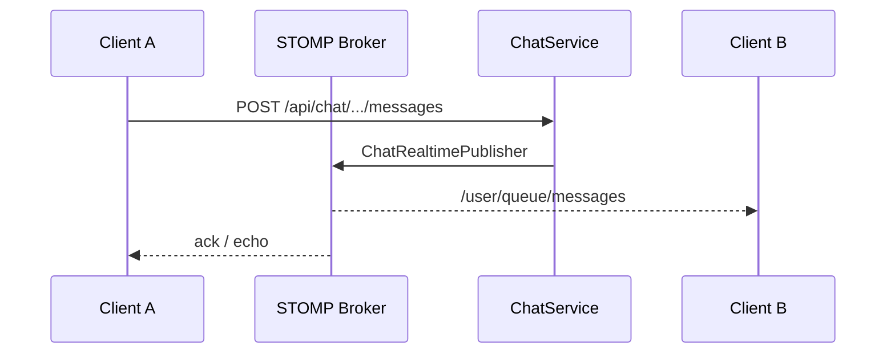

# WebSocket Realtime Architecture

## 1. Overview

Realtime messaging uses **STOMP over WebSocket** at `/ws` with Spring Messaging. Chat messages fan out to conversation participants; future notification channel can reuse the broker.

## 2. Purpose

Sub-second message delivery for DM without polling.

## 3. Architecture

## 4. System Design

- **Endpoint:** `/ws` (permitted in SecurityConfig)
- **Prefixes:** `/app` application, `/topic` broadcast, `/user` user-specific
- **Auth:** WebSocket handshake ties to JWT (see `WebSocket` config package)
- **Client:** `frontend/src/realtime/chatSocket.js`

## 5. Data Flow

Message persisted in PostgreSQL (`chat_messages`, `chat_conversations`) then pushed via STOMP. Read receipts and typing (roadmap) follow same path.

## 6–7. Scaling

- Sticky sessions on load balancer
- Redis pub/sub bridge for multi-node broker (Spring Redis relay — roadmap)
- Separate `chat-realtime` service at scale

## 8–15.

- **Performance:** payload minimal JSON
- **Security:** authorize subscription per conversation ID
- **Failures:** broker disconnect → client exponential reconnect
- **Monitoring:** active sessions, message publish latency

Full detail: [chat/REALTIME.md](../chat/REALTIME.md).
