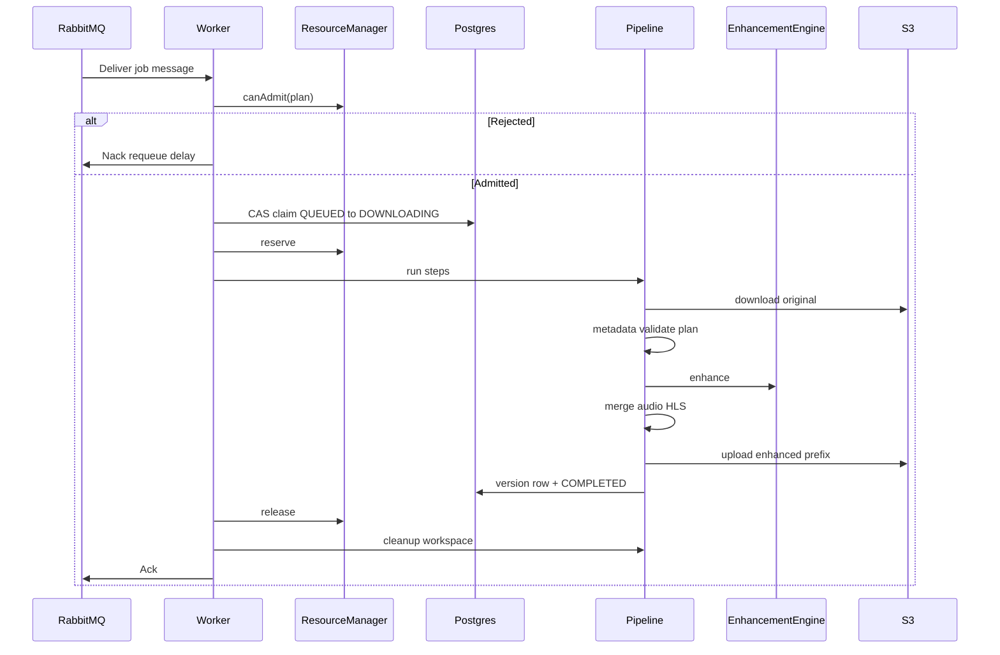

# 01 — AI Enhancement Service Architecture

## 1. Service boundary

```text
┌─────────────────────────────────────────────────────────────┐
│  vibely-backend (Spring Boot) — UNCHANGED upload/FFmpeg     │
│  - Enqueue enhancement_jobs (rule evaluator / admin API)    │
│  - Publish RabbitMQ message                                 │
│  - Serve video_versions to clients                          │
└──────────────────────────┬──────────────────────────────────┘
                           │ RabbitMQ: ai.enhance.work
                           ▼
┌─────────────────────────────────────────────────────────────┐
│  vibely-ai-enhance (THIS SERVICE — independent deployable)  │
│  - Consume jobs                                             │
│  - Resource gate → claim → pipeline steps → S3 → DB update  │
│  - Expose /health /metrics (Prometheus)                     │
└─────────────────────────────────────────────────────────────┘
```

**Deployment unit:** separate Docker image / K8s Deployment (`replicas=N` GPU nodes).  
**Language recommendation:** Python for GPU inference workers (Real-ESRGAN / BasicVSR++); thin adapters callable from a small orchestration process. Spring Boot must **not** load CUDA models in-process (same law as Content Understanding).

If a JVM orchestrator is preferred for DB/S3 consistency with the monorepo, keep **inference in a sidecar/subprocess** behind `EnhancementEngine` — business still only sees the port.

---

## 2. Clean Architecture layers

```text
ai-enhance/
├── apps/
│   └── worker/                 # composition root (DI, CLI, main loop)
├── domain/                     # pure: entities, enums, errors, ports (interfaces)
├── application/                # use cases: RunEnhancementJob, step orchestration
├── infrastructure/             # RabbitMQ, S3, Postgres, FFmpeg, engines, Prometheus
└── config/                     # levels, model registry, resource limits (YAML/env)
```

### Domain (no framework imports)

| Type | Responsibility |
|------|----------------|
| `EnhancementJob` | Aggregate: id, videoId, profile, level, state, attempts, lease |
| `VideoMetadata` | Value object: width, height, fps, codecs, bitrate, rotation, hdr, duration, frameCount, audioCodec |
| `EnhancementPlan` | Resolved: engineId, scaleFactor, maxHeight, denoise, tiling |
| `EnhancementError` | Typed error + `RetryClass` |
| Ports | `JobRepository`, `ObjectStorage`, `MessageBus`, `EnhancementEngine`, `MetadataProbe`, `HlsGenerator`, `Clock`, `MetricsPort` |

### Application

| Service | SRP |
|---------|-----|
| `JobConsumer` | Pull message, idempotent handoff to runner |
| `ResourceGate` | Admit/reject based on Resource Manager |
| `JobClaimService` | CAS claim in DB + lease renew |
| `EnhancementPipeline` | Ordered step execution (orchestrator only) |
| `Step` implementations | One class per step |
| `RetryPolicy` | Decide retry vs dead vs skip |
| `JobFinalizer` | Mark COMPLETED/FAILED/DEAD + publish events |

### Infrastructure

| Adapter | Implements |
|---------|------------|
| `PostgresJobRepository` | `JobRepository` |
| `S3ObjectStorage` | `ObjectStorage` |
| `RabbitJobConsumer` / `RabbitPublisher` | `MessageBus` |
| `FfprobeMetadataProbe` | `MetadataProbe` |
| `FfmpegHlsGenerator` | `HlsGenerator` (CPU encode after AI) |
| `RealEsrganEngine`, `BasicVsrEngine`, `CloudTopazEngine`, … | `EnhancementEngine` |
| `EnhancementEngineFactory` | Selects engine by plan / config |
| `PrometheusMetrics` | `MetricsPort` |
| `LocalWorkspaceManager` | Disk layout per job |

---

## 3. Proposed package / module tree (source layout)

Independent repo **or** monorepo folder `services/ai-enhance/` (preferred for Vibely monorepo without touching `backend/.../processing`):

```text
services/ai-enhance/
├── pyproject.toml / Dockerfile
├── config/
│   ├── default.yaml              # levels, models, retries, resources
│   └── models.registry.yaml      # engine id → impl + defaults
├── src/vibely_enhance/
│   ├── domain/
│   │   ├── job.py
│   │   ├── metadata.py
│   │   ├── plan.py
│   │   ├── errors.py
│   │   └── ports/
│   │       ├── engine.py         # EnhancementEngine protocol
│   │       ├── storage.py
│   │       ├── jobs.py
│   │       └── ...
│   ├── application/
│   │   ├── pipeline.py           # EnhancementPipeline
│   │   ├── steps/
│   │   │   ├── download.py
│   │   │   ├── extract_metadata.py
│   │   │   ├── validate_resolution.py
│   │   │   ├── extract_audio.py
│   │   │   ├── prepare_frames.py
│   │   │   ├── run_ai.py
│   │   │   ├── merge_frames.py
│   │   │   ├── merge_audio.py
│   │   │   ├── validate_output.py
│   │   │   ├── generate_thumbnail.py
│   │   │   ├── generate_hls.py
│   │   │   ├── upload_artifacts.py
│   │   │   ├── update_database.py
│   │   │   └── cleanup.py
│   │   ├── resource_manager.py
│   │   ├── workspace_manager.py
│   │   ├── retry_policy.py
│   │   └── job_runner.py         # Receive → … → Completed
│   ├── infrastructure/
│   │   ├── engines/
│   │   │   ├── factory.py
│   │   │   ├── real_esrgan.py
│   │   │   ├── basic_vsr.py
│   │   │   ├── video2x.py
│   │   │   └── noop_passthrough.py   # local/dev
│   │   ├── ffmpeg/
│   │   ├── s3/
│   │   ├── postgres/
│   │   ├── rabbitmq/
│   │   ├── logging/
│   │   └── metrics/
│   └── worker/
│       ├── main.py
│       └── health.py
└── tests/
    ├── unit/
    └── contract/                   # engine + step contracts
```

Spring Boot **only** owns enqueue/API (existing backend module later, e.g. `com.vibely.backend.enhancement` for jobs/rules) — **not** this worker’s inference loop.

---

## 4. Core interfaces (abstractions)

```text
EnhancementEngine
  + name() -> str
  + capabilities() -> EngineCapabilities   # needs_frames, temporal, max_scale, vram_hint_mb
  + enhance(request: EnhanceRequest) -> EnhanceResult
      # request: input_path | frames_dir, plan, workspace, progress_cb

EnhancementEngineFactory
  + resolve(plan: EnhancementPlan, metadata: VideoMetadata) -> EnhancementEngine

PipelineStep
  + name() -> str
  + run(ctx: PipelineContext) -> None
  + compensates()? optional

PipelineContext
  job, workspace, metadata, plan, paths, metrics, logger, engine

ResourceManager
  + snapshot() -> ResourceSnapshot
  + canAdmit(plan) -> AdmitDecision
  + reserve(jobId, plan) -> Reservation
  + release(jobId)

WorkspaceManager
  + create(jobId) -> Workspace
  + path(kind) -> Path
  + markForGc(jobId)
  + purge(jobId, keep_logs: bool)

JobRepository
  + claim / heartbeat / transition / attach_version

ObjectStorage
  + download / upload_dir / delete_prefix
```

Business (`JobRunner`, steps) depends **only** on these ports.

---

## 5. Main services and responsibilities

| Component | Responsibility | Must not do |
|-----------|----------------|-------------|
| `JobRunner` | Wire receive → gate → claim → pipeline → finalize | Know Real-ESRGAN APIs |
| `EnhancementPipeline` | Run steps in order; record step timings | Open S3 sockets directly |
| `DownloadStep` | Fetch original to `workspace/download/` | AI inference |
| `ExtractMetadataStep` | ffprobe → `VideoMetadata` | Mutate pixels |
| `ValidateResolutionStep` | Apply upscale rules → plan or SKIPPED | Download |
| `ExtractAudioStep` | Demux audio track | Upscale |
| `PrepareFramesStep` | Split frames **only if** engine.needs_frames | Always split |
| `RunAiStep` | Call `engine.enhance` | Hardcode model |
| `MergeFramesStep` | Encode frames → video (if framed) | Upload S3 |
| `MergeAudioStep` | Remux original audio onto enhanced video | Change audio mastering (use original) |
| `ValidateOutputStep` | Probe output; SSIM/basic sanity optional | Ignore corruption |
| `GenerateThumbnailStep` | Poster from enhanced | Replace user cover unless configured |
| `GenerateHlsStep` | ABR ladder from enhanced mp4 | Touch standard HLS |
| `UploadArtifactsStep` | Upload `enhanced/{profile}/` | Delete standard |
| `UpdateDatabaseStep` | Insert `video_versions`, job COMPLETED | Enqueue FFmpeg standard jobs |
| `CleanupStep` | Purge workspace per policy | Delete job logs on failure |
| `ResourceManager` | Admit/reject, VRAM accounting | Run pipeline |
| `WorkspaceManager` | Per-job dirs + crash GC | Shared global frames folder |
| `RetryPolicy` | Classify errors | Infinite retry |

---

## 6. End-to-end job flow (detailed)



State transitions remain as in the system design:  
`PENDING → QUEUED → DOWNLOADING → AI_PROCESSING → GENERATING_HLS → UPLOADING → COMPLETED`  
(+ `FAILED` / `RETRYING` / `DEAD` / `CANCELLED` / `SKIPPED`).

---

## 7. Horizontal scaling & Kubernetes

### Worker identity

Each pod:

```text
WORKER_ID = $(HOSTNAME)
GPU_INDEX = 0..N
WORKSPACE_ROOT = /var/lib/vibely-enhance/workspace   # emptyDir or local SSD
```

- **No shared NFS** for frames (too slow / locking hell).
- Claim in Postgres + RabbitMQ competing consumers → N replicas safe.
- HPA / KEDA on `ai.enhance.work` queue depth + GPU util.
- Separate Deployment for **CPU HLS** consumers on `ai.enhance.hls` (optional split) so GPU pods only run `RunAiStep`.

### What stays stable when scaling 1 → 100

| Stable | Changes with scale |
|--------|--------------------|
| Domain + steps + engine interface | Replica count, node GPU type |
| Job schema + S3 layout | Queue prefetch, VRAM profiles in config |
| Retry / metrics contracts | Prometheus scrape targets |

**Business logic never** embeds “number of GPUs”.

### Crash recovery

1. Lease expires → another worker claims (`RETRYING` → `QUEUED`).  
2. Node GC DaemonSet / startup hook: `WorkspaceManager.purgeOrphans(older_than)`.  
3. S3 lifecycle deletes `tmp/enhance/{jobId}/` after TTL.

---

## 8. Explicit non-goals for this service

- Do not call Upload APIs.
- Do not mutate `video_processing_jobs`.
- Do not replace `FfmpegHlsPipelineRunner`.
- Do not decide *whether* a video is eligible (that is Rule Evaluator in API plane) — worker may only re-check cancel/delete and resolution policy.
