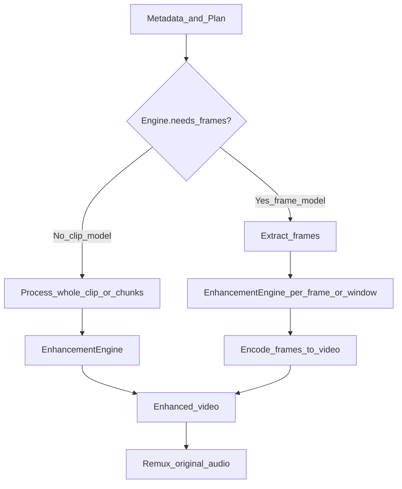

# 02 — Pipeline, Engines, Metadata & Validation

## 1. Pipeline steps (ordered)

| # | Step | Mode | Parallelizable? |
|---|------|------|-----------------|
| 1 | Download video | I/O | No (blocks rest) |
| 2 | Extract metadata | CPU probe | No |
| 3 | Validate resolution → build `EnhancementPlan` | CPU | No |
| 4 | Extract audio | FFmpeg | **Yes** with (5) if engine needs frames |
| 5 | Prepare frames / clip normalize | FFmpeg | **Yes** with (4) |
| 6 | Run AI | GPU | No (exclusive GPU reservation) |
| 7 | Merge frames → video | CPU/GPU encode | After (6) |
| 8 | Merge audio | FFmpeg remux | After (7); can overlap thumbnail prep |
| 9 | Validate output | Probe + optional metrics | After (8) |
| 10 | Generate thumbnail | FFmpeg | **Yes** with start of (11) |
| 11 | Generate HLS | FFmpeg multi-rung | After (9); rungs parallel |
| 12 | Upload artifacts | S3 | HLS rungs upload parallel |
| 13 | Update database | DB | After upload success |
| 14 | Cleanup | Disk | Always finally |

### Keep as video vs frame vs hybrid



| Approach | When | Pros | Cons |
|----------|------|------|------|
| **Whole-clip / chunked video** | BasicVSR++, Video2X video mode, cloud APIs | Temporal consistency, fewer files | Larger VRAM / long clips need chunking |
| **Per-frame** | Real-ESRGAN image mode | Simple, easy checkpoint | Flicker risk; needs temporal smooth optional |
| **Hybrid** | Long video: chunk N seconds with overlap | Bounded VRAM | Seam handling |

**Recommendation for Vibely short-form (≤3–10 min):**
- Default engines: **chunked clip** (2–8s windows, 0.25s overlap) when temporal model available.
- Real-ESRGAN path: frames **or** video wrapper (Video2X) behind same `EnhancementEngine`.
- Always **remux original audio** (do not re-encode unless codec unsupported).

**Safe parallelism:** (4∥5), (10∥11 early), multi-rung HLS encode, multi-part S3 upload.  
**Never parallel:** two AI jobs on same GPU without ResourceManager approval.

---

## 2. AI Model layer (Strategy + Factory)

```text
                    EnhancementEngine  «interface»
                              ▲
          ┌───────────────────┼───────────────────┐
          │                   │                   │
   RealEsrganEngine    BasicVsrPlusEngine   CloudTopazEngine
          │                   │                   │
   Video2XEngine        InternalModelEngine  NoopEngine(dev)
```

### `EnhancementEngine` contract

```text
EnhanceRequest:
  input_video_path | frames_dir
  workspace: Workspace
  plan: EnhancementPlan
  metadata: VideoMetadata
  on_progress(pct, message)

EnhanceResult:
  output_video_path
  frames_written? 
  metrics: { fps_processed, vram_peak_mb, model_version }

EngineCapabilities:
  needs_frames: bool
  supports_temporal: bool
  max_scale: float
  supports_hdr: bool
  preferred_pix_fmt: str
  estimated_vram_mb(width, height, scale, level) -> int
```

### Factory resolution (config-driven, not hardcoded)

```yaml
# config/models.registry.yaml (illustrative)
engines:
  real_esrgan:
    class: infrastructure.engines.real_esrgan.RealEsrganEngine
    max_scale: 4
  basic_vsr_pp:
    class: infrastructure.engines.basic_vsr.BasicVsrPlusEngine
    max_scale: 2
  video2x:
    class: infrastructure.engines.video2x.Video2XEngine
  topaz_cloud:
    class: infrastructure.engines.topaz_cloud.CloudTopazEngine

levels:
  LOW:
    engine: real_esrgan
    scale: 1.0          # enhance native
    denoise: light
  MEDIUM:
    engine: real_esrgan
    scale: 1.5
    denoise: medium
  HIGH:
    engine: basic_vsr_pp
    scale: 2.0
  ULTRA:
    engine: basic_vsr_pp
    scale: 2.0
    target_max_height: 2160
```

`EnhancementEngineFactory.resolve(plan, metadata)`:
1. Read `plan.engine_id` from level/profile config.
2. Instantiate via registry (import path / entrypoint).
3. If capability mismatch (HDR, scale) → fallback engine from `plan.fallback_engine_id` or fail `UNSUPPORTED` (non-retry).

Business code only calls `factory.resolve(...).enhance(...)`.

---

## 3. Video metadata (required before AI)

| Field | Source | Used for |
|-------|--------|----------|
| `width`, `height` | ffprobe | Upscale cap, VRAM estimate |
| `fps`, `avg_frame_rate` | ffprobe | Chunk size, engine settings |
| `duration_sec`, `nb_frames` | ffprobe | ETA, timeouts |
| `video_codec`, `pix_fmt` | ffprobe | Transcode-before-AI if needed |
| `bit_rate` | ffprobe | Quality expectations |
| `rotation` / `displaymatrix` | side data | Apply transpose before AI |
| `color_space`, `color_transfer`, `hdr` | ffprobe | HDR path or tone-map first |
| `audio_codec`, `audio_channels`, `sample_rate` | ffprobe | Remux strategy |
| `has_audio` | derived | Skip extract if false |

**Pre-AI normalize (optional step):** if rotation ≠ 0 or exotic codec → intermediate `download/normalized.mp4` (yuv420p, no upsample) **before** AI. This is FFmpeg prep, not enhancement.

---

## 4. Validation / upscale rules (complete policy)

Rules live in config (`validation.rules`), evaluated by `ValidateResolutionStep` → produce `EnhancementPlan` or `SKIPPED`.

### 4.1 Absolute bans

| Rule ID | Condition | Action |
|---------|-----------|--------|
| `BAN_UPSCALE_TO_8K` | `target_height > 2160` | Reject profile / clamp |
| `BAN_EXTREME_FACTOR` | `target_h / source_h > max_upscale_factor` | Clamp or SKIPPED |
| `BAN_TINY_TO_UHD` | `source_h ≤ 360` AND `target_h ≥ 1440` | Forbid; only `ENHANCE_NATIVE` or ≤720 |
| `BAN_4K_TO_8K` | `source_h ≥ 2160` AND upscale | Only native enhance / denoise |
| `BAN_CORRUPT` | probe fails / 0 frames | FAILED non-retry |
| `BAN_DURATION` | `duration > max_duration_sec` | SKIPPED or split policy |
| `BAN_FPS` | `fps > 60` without support | Downsample fps before AI or SKIPPED |

Default: `max_upscale_factor = 2.0` (configurable 2–3). Never advertise beyond AI Enhanced.

### 4.2 Source-height guidance

| Source height | Allowed targets | Default level |
|---------------|-----------------|---------------|
| ≤144 | `ENHANCE_NATIVE` only (light denoise) | LOW |
| 240–360 | Native or ≤720p AI | LOW–MEDIUM |
| 480–540 | Native, 720, 1080 (if factor ≤2) | MEDIUM |
| 720 | Native, 1080, 1440 if factor ≤2 | MEDIUM–HIGH |
| 1080 | Native, 1440, 2160 if factor ≤2 | HIGH |
| 1440 | Native, 2160 if factor ≤1.5–2 | HIGH |
| ≥2160 | `ENHANCE_NATIVE` only | MEDIUM denoise |

### 4.3 Profile mapping (from system design)

| Profile | Max out H | Typical level |
|---------|-----------|---------------|
| `ENHANCE_NATIVE` | = source | LOW/MEDIUM |
| `AI_1080` | 1080 | MEDIUM/HIGH |
| `AI_1440` | 1440 | HIGH |
| `AI_2160` | 2160 | ULTRA |

If requested profile violates rules → clamp to nearest legal or `SKIPPED` with reason code.

---

## 5. Enhancement levels (configurable)

| Level | Intent | Typical engine | Scale | VRAM | Latency |
|-------|--------|----------------|-------|------|---------|
| LOW | Light sharpen/denoise | real_esrgan | 1.0 | Low | Fast |
| MEDIUM | Mild SR | real_esrgan | 1.5 | Mid | Medium |
| HIGH | Temporal SR | basic_vsr_pp | 2.0 | High | Slow |
| ULTRA | Max quality / near cap height | basic_vsr_pp / cloud | ≤2.0 to target | Highest | Slowest |

Stored in config, overridable per `enhancement_rules.action_json` (e.g. Premium → ULTRA).

---

## 6. Audio & thumbnail policy

- **Audio:** extract → keep untouched → remux after AI (A/V sync from original timestamps).
- **Thumbnail:** generate from enhanced mid-frame into version-specific key optional; **do not** overwrite creator-chosen `videos.thumbnail_url` unless admin flag.
- **HLS:** generate ladder **≤ enhanced height** only (mirror standard ladder logic: never invent rungs above enhanced source).

---

## 7. Step failure mapping (preview)

| Step | Typical errors | Retry? |
|------|----------------|--------|
| Download | Timeout, 503, throttle | Yes |
| Metadata | Corrupt, unsupported | No |
| Validate | Policy skip | No (SKIPPED) |
| AI | OOM, CUDA reset | Yes (OOM may need level downgrade once) |
| AI | Model weights missing | No |
| HLS | FFmpeg crash mid-rung | Yes |
| Upload | Network | Yes |
| DB | Deadlock, failover | Yes |
| DB | Constraint / not found video | No |
