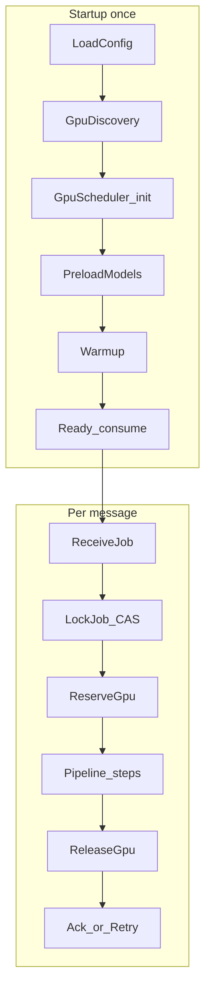

# 04 — GPU Worker (Event-Driven)

## 1. Role & boundaries

GPU Worker is an **independent long-running process** that:

- Consumes enhancement jobs **only from RabbitMQ** (`ai.enhance.work`)
- Talks to Postgres / S3 via infrastructure adapters
- **Must not** call Upload Service or any public REST API for business flow
- **Must not** import FFmpeg standard worker code

```text
RabbitMQ ──► GPU Worker ──► S3 (download original / upload enhanced)
                 │
                 ├── Postgres (claim, progress, checkpoint, complete)
                 └── Local workspace + preload models
```

Event-driven contract: message = intent; **Postgres row = source of truth** (lock, progress, checkpoint).

---

## 2. Architecture



### Internal modules (worker package)

```text
worker/
  bootstrap/
    config_loader.py
    gpu_discovery.py
    model_preloader.py
    warmup.py
  runtime/
    consumer_loop.py          # RabbitMQ competing consumer
    job_locker.py             # Postgres CAS + lease heartbeat
    gpu_scheduler.py          # multi-GPU pick
    pipeline_runner.py        # ordered steps (reuse application steps)
  processing/
    strategy/                 # Frame / Tile / Sequence strategies
    frame_engine.py
    tile_engine.py
    batch_engine.py
    checkpoint_store.py
  observe/
    progress_reporter.py
    metrics.py
  security/
    path_guard.py
    s3_allowlist.py
```

Business pipeline steps from Part 1–2 remain; this document details **GPU-specific** engines and lifecycle.

---

## 3. Job processing pipeline (worker view)

```text
Receive Job
  → Lock Job (Postgres CAS + lease)
  → Reserve GPU Resource (scheduler + ResourceManager)
  → Download Video
  → Validate (metadata + policy)
  → Prepare Workspace
  → Run AI (strategy: frame | tile | sequence)
  → Validate Output
  → Generate HLS
  → Upload
  → Update Database
  → Release GPU
  → Cleanup
  → Completed (Ack)
```

If the process dies mid-step: lease expires → another worker **reads checkpoint** → continues (see §10–11).

---

## 4. GPU Worker lifecycle (startup)

| Phase | Actions | Fail behavior |
|-------|---------|---------------|
| Load Config | levels, models registry, VRAM reserve, batch/tile defaults, S3/DB/RMQ | Exit non-zero |
| Detect GPU | Enumerate devices via NVML/CUDA | Exit if `require_gpu=true` and none |
| Read VRAM / CUDA / Driver | Persist `WorkerNodeInfo` locally + optional heartbeats to Redis | Log warn if mismatch vs config `min_capability` |
| Load AI Models | Load **all enabled** engines into VRAM/RAM once | Fail fast; do not serve jobs half-loaded |
| Warmup | 1–2 dummy tensors / tiny frame through each engine | Record `warmup_ms` metric |
| Ready | Start heartbeat thread + Rabbit consumer | Prefetch=1 per GPU slot |

**Rule:** Never load weights per job. Job only binds `engine_id` → already-resident module.

Optional: lazy-load secondary models after Ready if VRAM tight — still **not** per-job reload of the primary engine.

---

## 5. GPU Discovery

On boot (and periodic refresh every N minutes):

```text
GpuDevice:
  index: int
  name: str                    # e.g. "NVIDIA GeForce RTX 4090"
  uuid: str
  vram_total_mb: int
  vram_free_mb: int            # refreshed live
  compute_capability: (major, minor)
  has_tensor_cores: bool
  driver_version: str
  cuda_runtime_version: str
  multi_instance_mode: bool
  healthy: bool
```

Detection sources:

- `pynvml` / `nvidia-smi` — VRAM, driver, name, UUID
- `torch.cuda` or CUDA runtime — capability, Tensor Core heuristics (cc ≥ 7.0)
- Health probe — failed warmup marks `healthy=false`

Multi-GPU example log:

```text
GPU 0  RTX 4090  24GB  Ready
GPU 1  RTX 4090  24GB  Ready
GPU 2  —         —     Unhealthy (skipped)
```

---

## 6. Multi-GPU Scheduler

**Never** hardcode “always GPU 0”.

### Default algorithm: **Least Loaded (VRAM-aware) + soft affinity**

Score each healthy GPU:

```text
score(g) =
  w_vram * (vram_free_mb / vram_total_mb)
  - w_jobs * active_jobs(g)
  - w_temp * normalize(temperature)          # optional
  + w_affinity * (1 if last_engine_fits_cached else 0)
```

Pick `argmax(score)` among GPUs where:

```text
vram_free_mb - reserve_mb >= estimated_vram(plan)
active_jobs(g) < max_jobs_per_gpu          # usually 1
healthy == true
```

### Additional strategies (config `scheduler.mode`)

| Mode | Behavior | When |
|------|----------|------|
| `least_loaded` | Above (default) | General |
| `round_robin` | Next healthy GPU that fits | Homogeneous fleet, even wear |
| `priority` | Prefer GPUs in `priority_order: [1,0,2]` | Dedicated high-mem GPU for ULTRA |
| `weighted` | Capacity weight × free ratio | Mixed 4090 + 3090 |

**Tie-break:** lower `index`, then lower `active_jobs`.

If none fit → **reject admit** (delay requeue) — do not steal VRAM from running job.

---

## 7. AI processing strategy abstraction

```text
ProcessingStrategy «interface»
  prepare(ctx) -> WorkUnits
  run(unit, engine) -> UnitResult
  finalize(results) -> output_video_path
  supports_checkpoint: bool
```

| Strategy | Flow | Engines |
|----------|------|---------|
| `FrameStrategy` | Video → Decode → Frame queue → Batch GPU → Encode | Real-ESRGAN image path |
| `TileStrategy` | Frame → Tiles → AI → Merge tiles → (batch frames) | Large frames / 4K |
| `SequenceStrategy` | Video → temporal windows/sequences → AI → stitch | BasicVSR++, Video2X video |

`EnhancementEngine.capabilities()` declares:

```text
preferred_strategy: frame | tile | sequence
needs_frames: bool
supports_temporal: bool
recommended_tile: (w,h) | null
recommended_batch: int | "auto"
```

Factory picks strategy from engine + metadata (e.g. force `tile` if `width*height > tile_threshold` even for frame models).

---

## 8. Frame Processing Engine

Goal: long videos without loading entire film into RAM.

```text
Decode (FFmpeg/PyAV streaming)
  → FrameQueue (bounded, e.g. 64–256 frames)
  → BatchAssembler (dynamic batch size)
  → GPU Enhancement
  → EncodeWriter (streaming encode / image sequence → later mux)
```

### Backpressure

- If `FrameQueue` full → pause decode.
- If GPU slower than decode → drop to smaller batch, never unbounded RAM.
- Disk spill optional: write raw frames to `workspace/frames/in/` only if queue pressure > threshold (SSD).

### Long video

- Process in **segments** (e.g. 600–1800 frames) aligned with checkpoint boundaries.
- Encoder: append mode or per-segment files then concat demuxer.

---

## 9. Tile Processing Engine

For large frames (especially ≥1440p / 4K AI output path):

```text
Frame
  → pad to tile grid
  → Tile 1..N (with overlap, e.g. 16–64 px)
  → AI per tile (or batch tiles)
  → Blend overlap (Hann / linear)
  → Full frame
```

```text
TilePlan:
  tile_w, tile_h
  overlap_x, overlap_y
  grid: List[TileRect]
  blend_mode: linear | hann
```

Rules:

- Tile size from config + VRAM estimate (not hardcoded 512).
- Under memory pressure → shrink tile or increase overlap carefully.
- Sequence models that need full frame temporal context: tile **only spatial** within each frame of the window, keep temporal window intact.

---

## 10. Batch Processing Engine

```text
batch_size = min(
  config.max_batch,
  floor(usable_vram_mb / vram_per_sample_mb),
  queue_depth
)
```

- Start with `initial_batch`; on `AI_OOM` → halve batch, retry unit (same checkpoint).
- Prefer batching **independent frames** (Real-ESRGAN). Temporal models batch **sequences** of length `T` with batch `B` if VRAM allows (`B*T` tradeoff).

---

## 11. Dynamic scaling rules (enhance vs upscale)

Evaluated when building `EnhancementPlan` (also enforceable in worker re-check):

| Source height | Default scale | Notes |
|---------------|---------------|-------|
| ≤480 | up to **2.0×** (cap target ≤720–1080 by policy) | Tiny sources: prefer enhance-native if quality risk |
| 481–720 | **1.5×–2.0×** toward next profile | |
| 721–1080 | **1.0× enhance** or mild ≤1.5× if profile requires | Default: enhance-only for `ENHANCE_NATIVE` |
| 1081–1440 | **1.0×** or ≤1.5× toward 2160 if factor OK | |
| ≥2160 | **1.0× enhance only** | Never 4K→8K |

Hard caps: `max_upscale_factor` (default 2), `max_output_height` 2160, ban extreme jumps (see Part 2 validation).

---

## 12. Checkpoint & recovery

### Why

A 20-minute video must not restart from frame 0 after worker death.

### Checkpoint record (Postgres JSONB + optional S3 side file)

```text
Checkpoint:
  schema_version: 1
  strategy: frame|tile|sequence
  last_completed_frame: int        # exclusive end index
  last_completed_segment: int
  output_partial_path: str         # local or s3://tmp/enhance/{jobId}/partial/
  engine_id: str
  plan_hash: str                   # invalidate if plan changed
  batch_size: int
  tile_plan_hash: str?
  updated_at: ts
```

### When to save

- Every `checkpoint_every_n_frames` (e.g. 500–2000) **or** every segment.
- After successful segment encode flush to disk/S3 staging.
- Heartbeat lease renew includes `progress_pct`.

### Recovery

```text
New worker claims job (lease expired)
  → Load Checkpoint
  → If plan_hash mismatch → restart clean (rare)
  → Seek decode to last_completed_frame
  → Continue enhance/encode append
  → Resume HLS only after full enhanced mp4 ready
  → HLS/upload steps also checkpoint by rung name
```

**Idempotent upload:** write `enhanced/{profile}/.building/` then promote; checkpoint stores `upload_completed_keys[]`.

HLS step crash: resume missing rungs only.

---

## 13. Job recovery (worker death)

| Mechanism | Role |
|-----------|------|
| Postgres lease | Detect dead worker |
| Checkpoint | Skip recomputation |
| Staging S3 prefix | Survive local disk loss if flushed |
| RabbitMQ redelivery | Wake another consumer |
| Orphan workspace GC | Local cleanup on other nodes |

New worker **does not** need sticky session to the old machine if checkpoint + staging are in S3. Prefer **flush segment outputs to S3 staging** for jobs longer than threshold.

---

## 14. Progress tracking

Persist on `enhancement_jobs`:

| Field | Meaning |
|-------|---------|
| `progress_pct` | 0–100 integer |
| `progress_stage` | DOWNLOAD, VALIDATE, AI, HLS, UPLOAD, … |
| `progress_detail` | e.g. `frame 5200/18000` |
| `updated_at` | for UI polling |

### Suggested weighting

| Stage | Weight |
|-------|--------|
| Download + validate | 5% |
| AI enhance | 70% |
| HLS | 15% |
| Upload + DB | 10% |

Within AI: `70 * (frames_done / frames_total)`.

Frontend: poll admin/creator API (`GET enhancement status`) — **worker never called from browser**.

Throttle DB writes: every 1–2s or every N frames (not every frame).

---

## 15. Memory management

Continuous loop (sidecar thread):

```text
if vram_free < soft_limit: reduce batch / tile
if vram_free < hard_limit: pause admitting; finish current unit
if ram_used > threshold: spill frames to disk; shrink queue
if disk_free < threshold: stop admit; fail job if cannot continue
if cpu_load high: lower decode threads
```

Actions are **ordered:** reduce batch → shrink tile → pause new jobs → cancel only if corrupted/stuck.

---

## 16. Performance optimizations

| Technique | Benefit |
|-----------|---------|
| **GPU pipeline overlap** | Decode CPU ∥ AI GPU ∥ Encode CPU via queues → higher throughput |
| **CUDA streams** | Overlap H2D / compute / D2H |
| **Mixed precision / FP16** | ~2× throughput, less VRAM on Tensor Core GPUs; quality watch |
| **Tensor Cores** | Accelerate FP16/TF32 matmul on cc≥7.0 |
| **INT8** | Only if calibrated engine exists; optional ULTRA-off path |
| **Zero-copy / pinned memory** | Faster host↔device; reduce copies from decoder |
| **Streaming decode** | Constant memory for long videos |
| **Async S3 download/upload** | Hide network latency; multipart upload |
| **Model preload + warmup** | Remove cold-start from job latency |
| **Tile + batch autotune** | Maximize occupancy without OOM |

Default production: FP16 + streaming decode + prefetch=1 job/GPU + checkpoint flush.

---

## 17. Security

| Control | Design |
|---------|--------|
| S3 download | Only keys from job payload / DB (`uploads/{author}/…`); SigV4; no arbitrary URLs |
| S3 upload | Prefix allowlist `hls/{author}/{publicId}/enhanced/` + `tmp/enhance/{jobId}/` |
| Filesystem | All I/O under `WORKSPACE_ROOT/{jobId}`; `path_guard` rejects `..` |
| No user code exec | Never `exec` uploaded binaries; only ffmpeg/engine binaries from image |
| Secrets | IAM role / env from K8s secrets; not in job payload |
| Network | Egress allowlist: S3, Postgres, RabbitMQ, metrics |
| Multi-tenant | Job scoped by `video_id`/`author_id` checked before upload path build |

---

## 18. Scale model (thousands of videos)

```text
                    ┌── GPU Worker Pod (1 GPU) × N
RabbitMQ work queue ┤── GPU Worker Pod (1 GPU) × N
                    └── …
CPU HLS queue (optional split) × M

Postgres: leases + checkpoints + progress
S3: originals + staging + final enhanced
KEDA: scale N on queue depth + avg wait time
```

**Business logic unchanged** when N grows: only replicas + GPU node pool.

Throughput planning:

```text
capacity ≈ sum_over_gpus( effective_fps(engine,level,resolution) )
queue_lag_s ≈ queued_frames_or_seconds / capacity
```

For “thousands concurrent”: concurrency = number of GPU slots (usually 1 job/GPU); thousands **in flight** = queued + running, not thousands of models on one card.

---

## 19. Failure matrix (GPU-specific)

| Event | Handling |
|-------|----------|
| Process kill mid-AI | Lease expire → recover checkpoint |
| CUDA OOM | Halve batch/tile; one downgrade; else FAIL retryable |
| GPU XID / unhealthy | Mark device unhealthy; reschedule other GPUs; drain |
| Disk full mid-frame | FAIL retryable after cleanup attempt |
| Checkpoint corrupt | Restart from last good segment or from 0 with reason |

---

## 20. Implementation order (when coding starts)

1. Bootstrap: discovery + single-GPU + NoopEngine + consumer  
2. Lock/lease + progress  
3. FrameStrategy streaming + checkpoint  
4. TileEngine + batch autotune  
5. Multi-GPU least_loaded  
6. SequenceStrategy + real models  
7. KEDA / multi-node  

**Still forbidden:** coupling to Upload Service or public REST for the processing loop.
