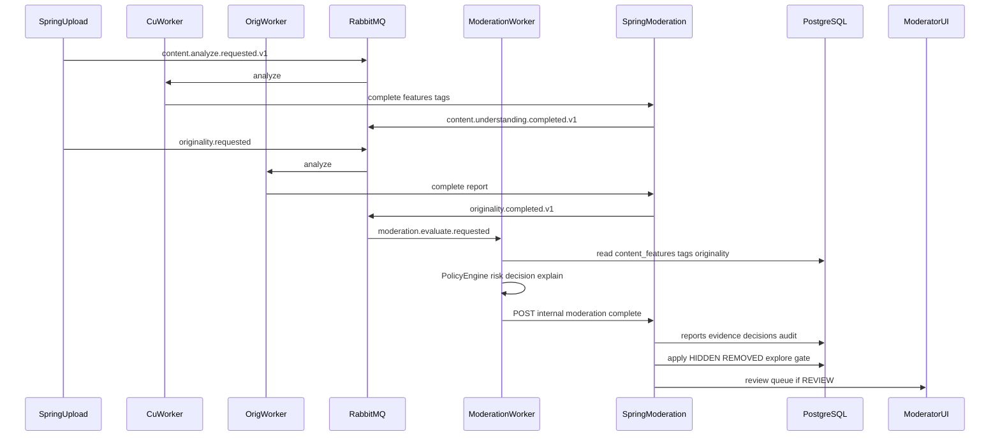

# Vibely Intelligent Content Moderation
## Technical Design Document — Index

| Field | Value |
|-------|--------|
| Document ID | VIBELY-TDD-ICM-2026-07 |
| Version | 1.1 |
| Status | **Phase 1–4 landed** — policy worker + Admin review + appeals / trust + detector plugins |
| Audience | Engineering, Moderation / Trust & Safety, AI/ML, SRE, Product |
| Related | CU ([content-understanding/00-INDEX.md](../content-understanding/00-INDEX.md)), Originality ([Vibely-Originality-Detection-TDD.md](../Vibely-Originality-Detection-TDD.md)), Explore ([docs/explore](../../explore/)) |

---

## Document map

| Part | File | Scope |
|------|------|--------|
| 1 | [01-VISION-AND-PLATFORM.md](./01-VISION-AND-PLATFORM.md) | Platform vs model; decision taxonomy; distribution levers; Creator Trust |
| 2 | [02-PIPELINE-AND-POLICY-ENGINE.md](./02-PIPELINE-AND-POLICY-ENGINE.md) | Events, feature inputs, risk aggregation, explain JSON, Mermaid |
| 3 | [03-DATA-API-DASHBOARD.md](./03-DATA-API-DASHBOARD.md) | Schema ER, REST, RabbitMQ, Compose overlay |
| 4 | [04-HITL-AND-LEARNING.md](./04-HITL-AND-LEARNING.md) | Human review, appeal, learning roadmap Phase 4–5+ |

---

## Reality baseline (repo today)

| Fact | Detail |
|------|--------|
| User report | `videos.report_*` + `REPORTED` (unchanged) |
| Moderation package | `com.vibely.backend.moderation` + Flyway `V67`–`V69` |
| Join triggers | CU `complete` → `onContentUnderstandingCompleted`; originality `complete` → `onOriginalityCompleted`; soft-timeout reconciler |
| Worker | Poll `/api/internal/moderation/claim` → Policy Engine → `.../complete` |
| Apply | Default **shadow** (`apply-decisions=false`): persist report/decision with `shadow=true`, no status mutate; Explore filter ignores shadow rows |
| Publication hold | When `apply-decisions=true`, published posts stay **HIDDEN** until AI ALLOW/LIMIT → READY (For You / public profile only after clearance) |
| Thin docs | [`docs/moderation/`](../../moderation/) points here |

---

## Non-negotiable design laws

1. **Moderation = platform / policy consumer**, not a second model pipeline.
2. **Never** re-run OCR / Whisper / CLIP / YOLO / scene extraction on the moderation path.
3. **Spring Boot:** authz, enqueue, persist decisions, apply distribution levers (`HIDDEN` / `REMOVED` / explore exclude), moderator REST — **never** hardcode policy rules in Java.
4. **Python** `ai-workers/content-moderation`: load feature snapshot → Policy Engine → risk / decision / explain JSON → callback internal API.
5. **Every decision** carries risk + confidence + evidence + `policy_version` + audit — no black box.
6. **Phased delivery**; Phase 1 ships on the current VPS stack (RabbitMQ + Postgres + Redis).

---

## Architecture at a glance

**Policy Engine:** Python worker; rules from claim payload (`moderation_rule_versions` / `policy_versions`). Spring never evaluates rules.

Phase 1 primary transport is **DB poll claim** (like originality). Rabbit outbox publishes when `app.moderation.rabbitmq-enabled=true`.

---

## Phased roadmap

| Phase | Status | Ship |
|-------|--------|------|
| **1** | **Landed** | Flyway `V67`, Spring join/claim/complete, Python policy worker, Explore `explore_eligible` gate (non-shadow). Default shadow apply. |
| **2** | **Landed** | Admin `/admin/moderation` queue + detail; REST claim/resolve; human override always applies levers |
| **3** | **Landed** | `V68` appeals; creator trust scores; author status/appeal Studio UI; Admin khiếu nại tab; audit on appeal/resolve |
| **4** | **Landed** | `V69` `detector_registry`; plugins `nsfw_cu_v1` / `violence_cu_v1` on stored CU visual/object JSON; `plugin_score` rules; claim enrich at job time |
| **4b** | **Landed** | `V70` spam/nsfw/violence → `BLOCK`; AI auto-ban author (`APP_MODERATION_AUTO_BAN_ON_BLOCK`, default true) when apply-decisions |
| **5+** | Sketch | Active learning / registry / drift / A/B — [04](./04-HITL-AND-LEARNING.md) |

---

## Key decisions (summary)

| Topic | Choice |
|-------|--------|
| Trigger | After CU complete **and** originality complete; soft timeout with `originality_pending` + confidence penalty |
| Fallback | Idempotent job key `(video_id, analysis_job_id, originality_report_id, policy_version)` |
| Risk | Hybrid weighted firings + hard overrides; soft `action_hint` floor |
| Detectors | Lexicon / tag / OCR / speech / originality + Phase 4 plugins on stored CU visual/object (no re-encode) |
| Explore | Gate via `moderation_decisions` only (originality is a policy input) |

---

## Key paths

| Piece | Location |
|-------|----------|
| Flyway | `V67` Phase 1, `V68` appeals, `V69` detector plugins |
| Spring | `com.vibely.backend.moderation` |
| Worker | `ai-workers/content-moderation` |
| Compose | `deploy/vps/docker-compose.content-moderation.yml` |
| Apply flag | `APP_MODERATION_APPLY_DECISIONS` / `app.moderation.apply-decisions` |

## Related docs

- [docs/moderation/README.md](../../moderation/README.md) — thin pointer to this TDD
- CU law 6: *one analysis, many consumers* — Moderation is a first-class consumer
