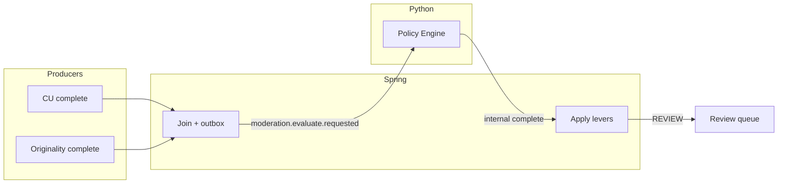
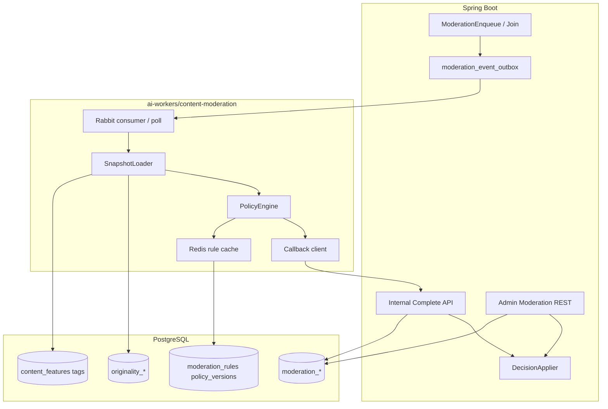

# Part 2 — Pipeline & Policy Engine

| Field | Value |
|-------|--------|
| Parent | [00-INDEX.md](./00-INDEX.md) |
| Status | Proposed |

---

## 1. End-to-end event flow

### 1.1 Happy path

1. Upload / publish path enqueues CU (`content.analyze.requested.v1`) and Originality (existing originality job path).
2. CU worker completes → Spring internal complete persists features/tags → **Spring emits** `content.understanding.completed.v1` (new vs today’s code which only emits analyze-requested).
3. Originality worker completes → Spring persists report → **Spring emits** `originality.completed.v1`.
4. Spring **join coordinator** (outbox or lightweight consumer) waits for both prerequisites (or soft deadline — §1.3) → emits `moderation.evaluate.requested` with snapshot refs.
5. Python moderation worker loads snapshot from Postgres (and Redis cache of rules) → Policy Engine → POST internal complete.
6. Spring persists report / evidence / decision → applies distribution → optional `moderation.review.required` → Admin queue.



### 1.2 Idempotency

Job key: `(video_id, analysis_job_id, originality_report_id, policy_version)`.

- Re-delivery of evaluate events must no-op if `moderation_jobs` already `COMPLETED` for that key.
- Policy version bump → new job allowed for same video (re-evaluate).
- CU re-analysis with new `analysis_job_id` → new moderation job.

### 1.3 Join strategy & soft timeout

| Case | Behavior |
|------|----------|
| Both CU + originality completed | Evaluate with full modalities |
| CU done, originality still pending past deadline (e.g. 15–30 min configurable) | Evaluate with `originality_pending=true`; apply **confidence penalty**; bias borderline cases to `REVIEW` |
| Originality done, CU failed permanently | Evaluate with thin metadata + originality only; heavy confidence penalty; prefer `REVIEW` over silent ALLOW for risky originality |
| Both failed | No auto ALLOW; leave for report-driven / manual path |

DB poll fallback (idempotent reconcilers) runs periodically so dropped Rabbit messages do not leave videos stuck.

---

## 2. Feature inputs (read-only)

Worker **reads**; never writes CU/Originality tables except via Spring callbacks for moderation tables.

| Source | Fields used (Phase 1) |
|--------|------------------------|
| `content_features` | `ocr_text`, `speech_text`, visual/object/scene JSON blobs, embeddings **refs** (Phase 4 plugins) |
| `video_semantic_tags` | tag codes + confidence + source |
| Topics / categories | projected labels for genre policy packs |
| `originality_reports` | scores, `decision`, `risk_level`, `explain_json` |
| `originality_matches` | modality + score + matched video |
| Video metadata | duration, visibility, author id, age of account |
| Creator trust | Phase 3 table; Phase 1 constant |
| User reports | open report count / reasons → priority boost |

**Snapshot:** `analysis_snapshots` (or JSONB column on `moderation_jobs`) stores pointers + content hashes (`content_features` SHA, report ids) — **not** a full duplicate of video bytes.

---

## 3. Policy Engine

### 3.1 Location

`ai-workers/content-moderation` (new package).

- Load active `policy_versions` + `moderation_rules` from Postgres at start / on version bump.
- Cache compiled rules in Redis (`moderation:policy:{version}` TTL e.g. 60s) to avoid stampeding DB.
- Spring Admin/API mutates rules; worker never “hot edits” without reload signal (invalidate Redis key on publish).

### 3.2 Rule model (logical)

Each rule (approx columns — exact schema in [03](./03-DATA-API-DASHBOARD.md)):

| Field | Role |
|-------|------|
| `id` / `code` | Stable id for audit |
| `version` | Tied to `policy_versions` |
| `priority` | Ordering; hard overrides first |
| `enabled` | Soft delete without losing history |
| `match` | Predicate over snapshot (lexicon regex, tag∈set, originality.decision∈…, object class score ≥ θ) |
| `label` | Policy label e.g. `hate_speech`, `sexual_content`, `spam`, `child_safety` |
| `severity` | contrib to risk weight |
| `action_hint` | `ALLOW` / `LIMIT` / `REVIEW` / `BLOCK` / `DELETE` |
| `override` | If true and match → short-circuit to `action_hint` |

### 3.3 Evaluation algorithm (Phase 1)

1. Run all enabled rules against snapshot; collect firings `{rule_id, label, severity, evidence}`.
2. If any **override** firing → decision = that action (highest severity wins if multiple).
3. Else **hybrid score:**
   - Map each firing to points via configurable weights table (per label / severity).
   - `risk = clamp(sum(points), 0, 100)`.
   - Map risk bands → provisional decision (config in `policy_versions.thresholds_json`).
4. Fold originality decision as an explicit rule pack (always present).
5. Apply confidence:
   - Start from modality coverage (OCR present? ASR? tags? originality?).
   - Penalize for `originality_pending`, failed CU stages, sparse tags.
   - Phase 1: naive product; Phase 5: calibrated.
6. If provisional ∈ {LIMIT, BLOCK} but confidence below floor → promote to `REVIEW`.
7. Emit explain report (§5).

### 3.4 Example hard overrides (seed data, not Java)

- Child-safety / CSAM keyword packs on OCR + speech → `BLOCK` or `REVIEW` (ops choice; default REVIEW until human for ambiguous, BLOCK for high-precision lists).
- Explicit terrorism threat lexicons → `BLOCK` / `REVIEW`.
- Originality `BLOCK` + high `overall_confidence` → `BLOCK`.

Exact word lists are ops-owned in DB — TDD does not bake lexicons into docs beyond categories.

### 3.5 What Spring must not do

No `if (tag.equals("nsfw")) hide()` in Java services. Spring may only:

- Translate **already decided** enum → status / flags
- Enforce authz on Admin overrides
- Emit events

---

## 4. Component view



---

## 5. Explain report JSON (contract sketch)

Posted on worker complete; stored as `moderation_reports.explain_json` and normalized into `moderation_evidence` / `moderation_policy_results`.

```json
{
  "policy_version": "2026.07.1",
  "risk": 72,
  "confidence": 0.61,
  "decision": "REVIEW",
  "override_applied": false,
  "originality_pending": false,
  "bands": { "allow_max": 24, "limit_max": 49, "review_max": 74 },
  "firings": [
    {
      "rule_code": "orig.limit_distribution",
      "label": "originality",
      "severity": "MEDIUM",
      "points": 20,
      "evidence_ref": { "type": "originality_report", "id": 123 }
    },
    {
      "rule_code": "lex.spam.vi.v1",
      "label": "spam",
      "severity": "LOW",
      "points": 8,
      "evidence_ref": { "type": "ocr_snippet", "text": "…", "frame_index": 3 }
    }
  ],
  "inputs": {
    "analysis_job_id": 99,
    "content_features_sha": "…",
    "originality_report_id": 123,
    "tag_count": 12
  }
}
```

Evidence rows are also inserted as first-class SQL for filtering (“all OCR spam hits”).

---

## 6. RabbitMQ topology (logical)

| Exchange | Type | Purpose |
|----------|------|---------|
| `vibely.moderation` | topic | Moderation domain |

| Routing key | Producer | Consumer |
|-------------|----------|----------|
| `moderation.evaluate.requested` | Spring join/outbox | Python worker |
| `moderation.completed` | Spring after persist | Optional analytics / cache bust |
| `moderation.review.required` | Spring when decision=REVIEW | Admin notifiers / Phase 2 UI poll fallback |
| `moderation.human.overridden` | Spring Admin action | Audit fans / trust updater (Phase 3) |

Retry + DLQ: mirror CU worker pattern (attempts, backoff, dead-letter queue `moderation.evaluate.dlq`).

CU/Originality completed events may live on existing CU / originality exchanges; moderation join listens or Spring emits evaluate after handling complete callbacks — implementer’s choice as long as contract in [03](./03-DATA-API-DASHBOARD.md) is met.

---

## 7. Failure modes

| Failure | Mitigation |
|---------|------------|
| Worker crash mid-evaluate | Job stays PROCESSING with claim TTL; reclaim |
| Callback 5xx | Retry with backoff; do not publish completed |
| Rule cache stale | Short TTL + explicit invalidate on policy publish |
| Poison message | DLQ + Admin alert; never silent ALLOW |
| Partial CU features | Confidence penalty; prefer REVIEW |

---

## 8. Phase boundary for detectors

| Phase | Detectors |
|-------|-----------|
| **1** | Lexicon on OCR/speech, semantic tag sets, object/scene JSON thresholds, originality pack, metadata, stub trust |
| **4** | **Landed:** `nsfw_cu_v1` / `violence_cu_v1` heuristics on stored `visual` / `object_features` + tags/text; `match.type=plugin_score`; ONNX heads can swap in via `detector_registry` later — **no** re-pipeline |

Next: [03-DATA-API-DASHBOARD.md](./03-DATA-API-DASHBOARD.md)
