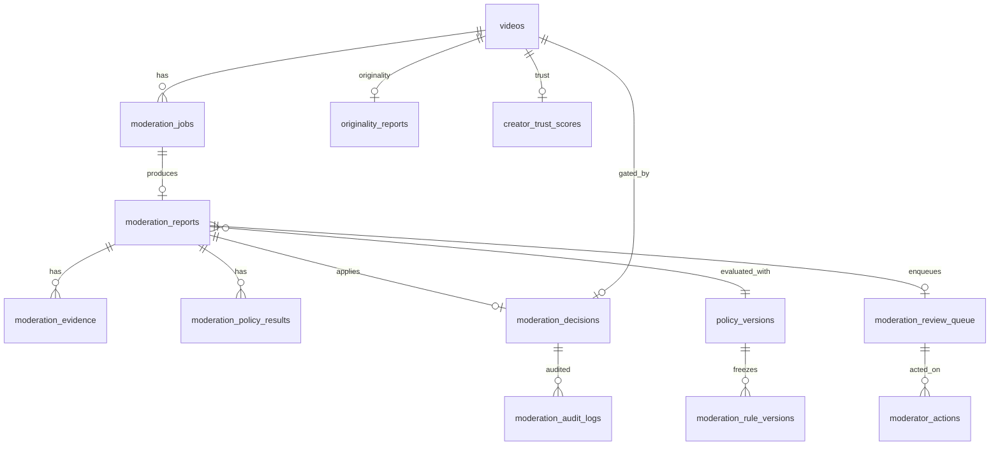

# Part 3 — Data, API & Dashboard

| Field | Value |
|-------|--------|
| Parent | [00-INDEX.md](./00-INDEX.md) |
| Status | Proposed |

---

## 1. Schema (normalized)

Flyway will land in Phase 1 (e.g. `V67+` — exact number assigned at implementation). Tables below are the **target model**.

### 1.1 Core job & report

| Table | Purpose |
|-------|---------|
| `moderation_jobs` | Idempotent work unit per `(video_id, analysis_job_id, originality_report_id, policy_version)` |
| `moderation_reports` | One outcome per successful job: risk, confidence, decision, status, versions, `explain_json` |
| `moderation_evidence` | Many rows per report (modality, reason, frame/ts, snippet, refs) |
| `moderation_policy_results` | Per-policy label outcomes for a report |
| `moderation_decisions` | **Effective** decision + distribution flags applied to the video |
| `analysis_snapshots` | JSONB pointers + hashes into CU/Originality (optional separate table or column on jobs) |

**`moderation_jobs` (sketch):**

| Column | Notes |
|--------|-------|
| `id` | BIGSERIAL |
| `video_id` | FK `videos` |
| `analysis_job_id` | FK CU job (nullable if CU failed path) |
| `originality_report_id` | FK nullable if pending/failed |
| `policy_version` | VARCHAR |
| `job_state` | `PENDING` / `PROCESSING` / `COMPLETED` / `FAILED` |
| `originality_pending` | BOOL |
| `attempts`, `claimed_at`, `last_error` | Worker claim pattern like originality |
| `snapshot_json` | Pointers + hashes |
| Unique | `(video_id, analysis_job_id, originality_report_id, policy_version)` with NULLS NOT DISTINCT or equivalent |

**`moderation_reports`:** `risk` INT 0–100, `confidence` DOUBLE, `decision` ∈ ALLOW/LIMIT/REVIEW/BLOCK/DELETE, `status` ∈ OPEN/APPLIED/SUPERSEDED, `explain_json`, `model_or_engine_version`, timestamps.

**`moderation_evidence`:** `report_id`, `source_modality` (OCR/SPEECH/TAG/OBJECT/SCENE/ORIGINALITY/METADATA/USER_REPORT/PLUGIN), `reason_code`, `snippet`, `frame_index`, `time_ms`, `ref_json`, `weight`.

**`moderation_policy_results`:** `report_id`, `label`, `outcome`, `score`, `rule_codes[]` or JSON.

**`moderation_decisions`:** `video_id`, `report_id`, `effective_decision`, `explore_eligible` BOOL, `status_applied` (e.g. HIDDEN/REMOVED/READY), `applied_at`, `applied_by` (`SYSTEM` / user id).

### 1.2 Policy config

| Table | Purpose |
|-------|---------|
| `policy_versions` | Immutable published version row: `code`, `thresholds_json`, `weights_json`, `published_at`, `is_active` |
| `moderation_rules` | Current editable rules (or only via versions) |
| `moderation_rule_versions` | Immutable rule snapshot rows tied to `policy_versions` |

Publishing a policy version: copy rules → freeze → set `is_active` → invalidate Redis.

### 1.3 HITL / audit / trust

| Table | Purpose |
|-------|---------|
| `moderation_review_queue` | Items needing human: priority, claim, SLA |
| `moderator_actions` | Claim / approve / override / dismiss |
| `moderation_audit_logs` | Append-only: who, what, before/after, request id |
| `creator_trust_scores` | Phase 3 |
| `creator_policy_history` | Phase 3 |
| `detector_registry` | Phase 4 — plugin codes / artifact refs (`nsfw_cu_v1`, `violence_cu_v1`) |
| `moderation_event_outbox` | Mirror `cu_event_outbox` pattern |

User reports may keep living on `videos.report_*` initially; Phase 2 can normalize `content_reports` if needed — not required to start.

---

## 2. ER diagram



---

## 3. Distribution flag convention (Phase 1 pick)

Recommended single approach for implementation:

| Flag | Storage |
|------|---------|
| Explore / For-You / Trending eligibility | `moderation_decisions.explore_eligible` + feed queries join/filter |
| Soft hold for REVIEW | `videos.status = HIDDEN` **or** keep `READY` with `explore_eligible=false` + `review_required=true` |

**Recommendation:** Keep playable via direct link for LIMIT; use `HIDDEN` only for REVIEW/BLOCK pending resolve when product wants non-playable. Document the chosen mapping in the Phase 1 PR and Explore repository filters.

Wire originality outcomes **through** moderation decisions — do not add a second silent filter in Explore that bypasses `moderation_decisions`.

---

## 4. REST API

### 4.1 Internal (worker → Spring)

Auth: existing internal token / network pattern used by CU complete.

| Method | Path | Purpose |
|--------|------|---------|
| `POST` | `/api/internal/moderation/jobs/{jobId}/complete` | Persist report, evidence, policy results; apply decision |
| `POST` | `/api/internal/moderation/jobs/{jobId}/fail` | Mark FAILED + error |
| `GET` | `/api/internal/moderation/jobs/next` | Optional DB-poll fallback (like originality) |

Complete body: aligns with explain JSON in [02](./02-PIPELINE-AND-POLICY-ENGINE.md) §5 + explicit evidence array.

### 4.2 Admin (Phase 2 UI; stub Phase 1)

Base: `/api/admin/moderation/**` — ROLE_ADMIN (or dedicated MODERATOR role if introduced).

| Method | Path | Purpose |
|--------|------|---------|
| `GET` | `/api/admin/moderation/queue` | List review queue (filters, priority) |
| `POST` | `/api/admin/moderation/queue/{id}/claim` | Claim item |
| `POST` | `/api/admin/moderation/queue/{id}/resolve` | Override decision + reason |
| `GET` | `/api/admin/moderation/videos/{videoId}` | Latest report + evidence + CU/originality links |
| `GET` | `/api/admin/moderation/policies` | List policy versions |
| `POST` | `/api/admin/moderation/policies` | Create draft / publish (Phase 2+) |
| `GET` | `/api/admin/moderation/rules` | List rules for active/draft version |

### 4.3 Public / author (Phase 3 appeal)

| Method | Path | Purpose |
|--------|------|---------|
| `GET` | `/api/videos/{id}/moderation-status` | Limited view: decision class + whether appealable (no full rule dump) |
| `POST` | `/api/videos/{id}/moderation-appeals` | Phase 3 |

### 4.4 Trigger helpers (Spring internal)

On CU complete & originality complete handlers: upsert join state → enqueue evaluate when ready.

Emit:

- `content.understanding.completed.v1` (CU package change)
- `originality.completed.v1` (originality package change)

---

## 5. RabbitMQ (Vibely-shaped)

| Resource | Name |
|----------|------|
| Exchange | `vibely.moderation` (topic) |
| Queue | `moderation.evaluate` |
| Routing keys | `moderation.evaluate.requested`, `moderation.completed`, `moderation.review.required`, `moderation.human.overridden` |
| DLQ | `moderation.evaluate.dlq` |
| Retry | Same semantics as CU (headers / delay queue or attempts column) |

Config keys under Spring `vibely.moderation.*` and worker env `MODERATION_*`, paralleling CU.

---

## 6. Compose overlay

New file: `deploy/vps/docker-compose.content-moderation.yml`

```yaml
# Sketch — parity with content-understanding overlay
services:
  content-moderation-worker:
    build: ../../ai-workers/content-moderation
    environment:
      DATABASE_URL: ...
      REDIS_URL: ...
      RABBITMQ_URL: ...
      VIBELY_INTERNAL_BASE_URL: ...
      VIBELY_INTERNAL_TOKEN: ...
    depends_on:
      - rabbitmq
      - redis
```

Share Postgres/Redis/Rabbit with existing VPS stack; CPU-only for Phase 1 (no GPU). Phase 4 plugin heads may later need GPU sidecar — out of Phase 1 compose.

---

## 7. Spring module layout (target)

```
com.vibely.backend.moderation/
  ModerationProperties
  ModerationEnqueueService / JoinService
  ModerationInternalController
  ModerationAdminController
  DecisionApplier
  entities + repositories
  outbox publisher
```

No policy DSL evaluation in this package.

---

## 8. Admin Dashboard (Phase 2)

Reuse existing Admin shell (same pattern as posts / CU panel):

| View | Content |
|------|---------|
| Queue | Claimable REVIEW items, priority, age, report reasons |
| Detail | Player + explain timeline + evidence list + originality matches + semantic tags |
| Actions | Confirm AI decision / override to ALLOW|LIMIT|BLOCK|DELETE + mandatory reason |
| Policies (later) | Version list, freeze/publish, rule editor |

Phase 1 may ship API-only with SQL/admin curl for dogfood.

---

## 9. Observability

| Signal | Use |
|--------|------|
| `moderation_jobs` lag by state | Backlog |
| Decision histogram | ALLOW/LIMIT/REVIEW/BLOCK |
| Override rate | HITL disagreement |
| DLQ depth | Poison / bugs |
| p95 evaluate latency | Worker health |

Next: [04-HITL-AND-LEARNING.md](./04-HITL-AND-LEARNING.md)
