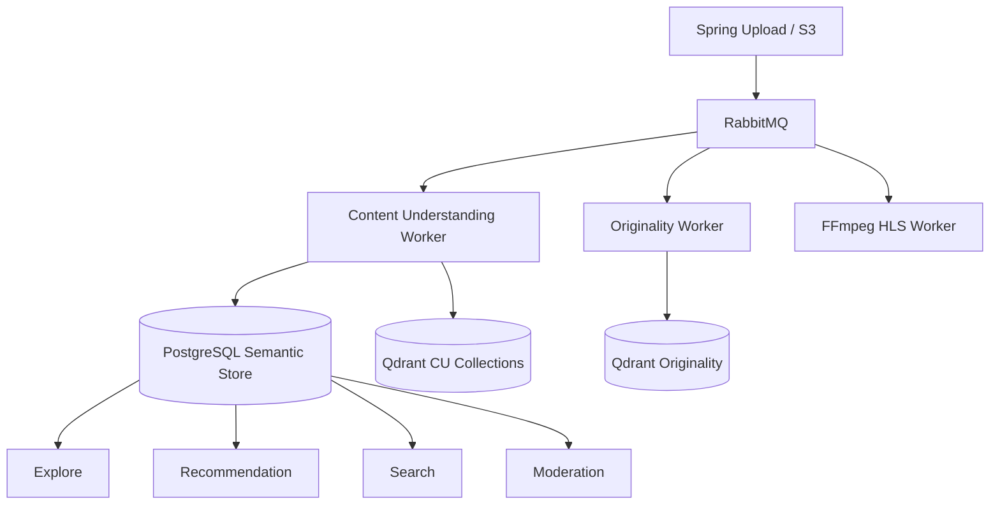

# Part 1 — Vision, Principles & Product Contract

## 1. Problem statement

Explore today classifies via **title → description → hashtag → regex → category**.

Failures:

| Failure mode | Example |
|--------------|---------|
| No hashtag, clear visual genre | Anime edit with empty caption |
| Misleading metadata | Title “vlog” but horror visuals |
| On-screen text only | Lyrics / meme / `#tutorial` burned into frames |
| Speech only | Coding lecture with no hashtags |
| Multi-intent | Anime + music + aesthetics simultaneously |

Rule-based cannot recover signal that lives **inside pixels / audio**.

---

## 2. Product goal

Build **Content Understanding System (CUS)** — a shared AI foundation that produces a durable **Semantic Knowledge** artifact per video.

CUS is **not**:

- Recommendation itself  
- Originality / copyright detection (sibling system; share extractors)  
- Explore-only service  

CUS **is** the producer of:

```
SemanticTags (+confidence, source, reason)
  → Topics (open vocabulary / clustered)
    → Categories (mapping engine, multi-label + confidence)
      → Downstream consumers
```

Consumers (non-exhaustive): Explore, Recommendation, Search, Similar/Related, Trending, Moderation, Auto-tag/hashtag, AI/Semantic Search, Analytics, Ads (future).

---

## 3. Design philosophy (mandatory)

### 3.1 Semantic Tag = ground truth

Categories are **presentation**. Adding “K-Pop” as an Explore chip must **not** require model retraining — only new rows in `category_tag_mapping` (+ optional topic bridges).

### 3.2 Multi-label with calibrated confidence

A video may score:

| Layer | Example | Confidence |
|-------|---------|------------|
| Tag | `anime` | 0.95 |
| Tag | `rain` | 0.88 |
| Tag | `lofi` | 0.81 |
| Topic | Anime Night Edit | 0.90 |
| Category | Anime | 0.95 |
| Category | Music | 0.91 |

No random assignment. Scores must be **calibrated** (Part 4) and **attributable** to modalities.

### 3.3 Explainability contract

Every persisted tag row must answer:

1. **What** — tag slug  
2. **How sure** — calibrated confidence ∈ [0,1]  
3. **From where** — `ocr | speech | visual | object | scene | metadata | fusion | human`  
4. **Why** — short reason + optional evidence pointers (frame_id, timestamp_ms, bbox)

Moderation and developers debug the same structure.

---

## 4. Success metrics (production KPIs)

| KPI | Target (12 months) | Measurement |
|-----|--------------------|-------------|
| Tag coverage | ≥ 95% READY public videos have ≥ 5 tags | `video_semantic_tags` |
| Cold-start Explore recall | Category tab recall ≥ rule-based + Δ≥15% on annotated set | Offline eval |
| p95 understanding latency | ≤ 120s after `video.media_ready` (CPU fleet) / ≤ 45s (GPU) | Jobs table |
| Explainability completeness | 100% tags have source+reason | Constraint + audit |
| Human agreement | Moderator agree ≥ 80% on high-conf tags | Feedback loop |
| Cost / video | Trackable USD + GPU-sec | Metrics |

---

## 5. Boundaries vs sibling systems



| System | Owns | Shares |
|--------|------|--------|
| CUS | Semantic tags, topics, category mapping from tags, content embeddings for search/related | Frame sampling utilities, OCR stack, S3 download |
| Originality | Duplicate risk / fingerprints | Frames, OCR crops (do not mix collections) |
| HLS | Playback assets | Duration / resolution metadata → CUS inputs |

**Do not** merge CUS and Originality into one model. Share infra libraries only.

---

## 6. Data contract (canonical output)

Published event `content.understanding.completed.v1`:

```json
{
  "eventVersion": 1,
  "videoPublicId": "uuid",
  "jobId": "uuid",
  "modelBundleVersion": "cu-bundle-2026.07.1",
  "semanticTags": [
    {
      "slug": "anime",
      "confidence": 0.95,
      "source": "fusion",
      "reason": "visual clip match + no speech conflict",
      "evidence": [{ "type": "frame", "index": 12, "tMs": 4200 }]
    }
  ],
  "topics": [{ "slug": "anime-night-edit", "label": "Anime Night Edit", "confidence": 0.9 }],
  "categories": [{ "slug": "anime", "confidence": 0.95, "mappedFrom": ["anime", "waifu", "2d"] }],
  "languages": ["vi", "ja"],
  "embeddingRefs": { "videoMean": "qdrant://vibely_cu_video/uuid" }
}
```

Spring persists and fans out to caches / Explore reindex — **not** re-running AI.

---

## 7. Explicit non-goals (v1)

- Real-time synchronous understanding in upload API  
- Perfect brand recognition at ads-grade legal certainty  
- Face identity / celebrity recognition (privacy defer to Phase 4+)  
- Replacing moderation policy engines (CUS only supplies signals)  
- Training foundation models from scratch on Vibely data in Phase 1

---

## 8. Open decisions (record + own)

| Decision | Recommendation | Why |
|----------|-----------------|-----|
| Bus | **RabbitMQ first** on VPS; Kafka when >~5k msg/s sustained | Matches phased Originality TDD; ops simplicity |
| Graph DB | **Postgres-first knowledge graph**; Neo4j only if multi-hop query latency fails SLO | Cost + ops |
| Primary vision | **SigLIP / OpenCLIP ViT-L/14** | Prod maturity + speed |
| ASR | **Whisper Small** default; Medium on GPU | Accuracy/latency for VI/EN short video |
| OCR | **PaddleOCR** (VI+EN) | Better VI than EasyOCR/Tesseract |
| Category | **Deterministic weighted mapping** from tags | Extensible without train |

→ Continue **Part 2** for pipeline detail.
