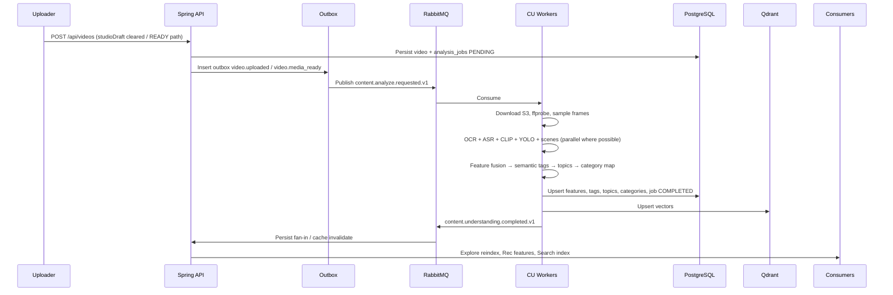

# Part 2 — AI Pipeline Architecture

## 1. Service topology

| Component | Role |
|-----------|------|
| **Spring Boot** | Auth, upload metadata, outbox events, persist CU results, public/admin APIs, Explore/Rec consumers |
| **RabbitMQ** | Task fan-out, retries, DLQ, priority queues |
| **Python CU Workers** | Download → extract → understand → fuse → tag → topic → category map → embed |
| **PostgreSQL** | System of record for tags/topics/categories/jobs/features |
| **Redis** | Job locks, inference cache, rate limits, feature hot cache |
| **Qdrant** | Multi-level embeddings (frame / scene / video) |
| **S3** | Source media + optional evidence crops |

### Component diagram

```mermaid
flowchart LR
  subgraph spring [Spring Boot]
    API[REST Controllers]
    Outbox[Outbox Publisher]
    Persist[CU Persist Service]
    Consumers[Explore / Rec / Search Adapters]
  end

  subgraph bus [RabbitMQ]
    EX[content.exchange]
    Q1[frame.q]
    Q2[ocr.q]
    Q3[asr.q]
    Q4[vision.q]
    Q5[fusion.q]
    Q6[semantic.q]
    DLQ[cu.dlq]
  end

  subgraph py [Python CU Workers]
    FrameW[Frame Worker]
    OcrW[OCR Worker]
    AsrW[ASR Worker]
    VisW[Vision / Det / Scene]
    FusW[Fusion + Semantic]
  end

  subgraph data [Data]
    PG[(PostgreSQL)]
    RD[(Redis)]
    QD[(Qdrant)]
    S3[(S3)]
  end

  API --> Outbox --> EX
  EX --> Q1 & Q2 & Q3 & Q4
  Q1 --> FrameW
  FrameW --> Q2 & Q4
  Q2 --> OcrW
  Q3 --> AsrW
  Q4 --> VisW
  OcrW & AsrW & VisW --> Q5 --> FusW --> Q6
  FusW --> PG & QD & RD
  Persist --> PG
  Consum ers --> PG
  FrameW --> S3
```

---

## 2. End-to-end event flow



**Trigger policy (production):**

1. Prefer `video.media_ready` when original object exists on S3 (even before HLS).  
2. Re-run on `video.metadata_updated` (title/desc change) with **partial** pipeline (metadata + fusion only if media features cached).  
3. Admin `POST /api/admin/reanalyze`.  
4. Do **not** block HTTP; use transactional outbox.

---

## 3. Pipeline stages (mandatory)

### 3.1 Download & probe

- Presigned GET or internal S3 SDK from worker role.  
- `ffprobe`: duration, fps, width/height, audio streams, codec.  
- Reject / soft-fail corrupted media → job `FAILED_RETRYABLE` vs `FAILED_TERMINAL`.

### 3.2 Frame extraction strategy (decision)

| Strategy | Accuracy | CPU | Memory | Throughput | Verdict |
|----------|----------|-----|--------|------------|---------|
| All frames | Highest | Extremely high | Extreme | Unusable | **Reject** |
| Uniform FPS (e.g. 1–2 fps) | Good | High | High | Medium | Optional long-form |
| Keyframes only (I-frames) | Misses text mid-GOP | Low | Low | High | Incomplete |
| Scene-change + caps | Strong narrative | Medium | Medium | Good | **Primary** |
| Adaptive (more frames if OCR text density / motion high) | Best trade-off | Medium | Medium | Good | **Recommended** |

**Production default (short video ≤ 60s):**

1. Detect scene cuts (PySceneDetect content-detect OR ffmpeg `select='gt(scene,0.3)'`).  
2. Take **1 midpoint frame per scene**.  
3. Enforce **min 4 / max 24** frames; if scenes < 4, pad with uniform sampling.  
4. Cap longest side **640–768px** for OCR/CLIP; keep full-res crop evidence optional.

Accuracy: sufficient for tags. Cost: ~5–15× cheaper than dense sampling.

### 3.3 OCR pipeline

**Candidates:**

| Engine | VI accuracy | EN | GPU | CPU speed | Prod note |
|--------|-------------|----|-----|-----------|-----------|
| **PaddleOCR** | Strong | Strong | Optional | Good | **Default** |
| EasyOCR | Medium | Good | Optional | Slower | Fallback |
| Tesseract | Weak VI | OK | No | Fastish | Watermark-only weak signal |

**Pipeline:**

1. Preprocess: denoise, contrast CLAHE, deskew light.  
2. Detect text regions → recognize.  
3. Filter: confidence ≥ τ, remove near-duplicate overlays, track usernames/watermarks separately (feed Originality + Moderation).  
4. Normalize: lowercase, strip accents for tag lexicon match; keep raw Unicode for search.  
5. Emit `ocr_features` JSON: `{texts:[{t, conf, bbox, frameIdx, tMs}]}`.

### 3.4 Speech recognition

| Model | Acc (EN) | VI | Latency | VRAM | Recommendation |
|-------|----------|----|---------|------|----------------|
| Tiny | Low | Low | Fast | ~1GB | Dev only |
| Base | Medium | Weak–Med | Fast | ~1GB | Edge CPU |
| **Small** | Good | Acceptable | Medium | ~2GB | **Default prod** |
| Medium | Better | Better | Slow | ~5GB | GPU fleet |
| Large | Best | Best | Slowest | ≥10GB | Offline / premium |

**Policy:** Whisper **Small** + `vad_filter`; language auto; store transcript + word timestamps when available. Empty speech → skip without failing job.

### 3.5 Visual understanding

| Model | Role | Speed | Accuracy | Prod |
|-------|------|-------|----------|------|
| **OpenCLIP / SigLIP ViT-L/14** | Zero-shot tag priors + embeddings | Medium | High | **Yes — primary** |
| DINOv2 | Dense local features / scene | Medium | High | Phase 2+ similar frames |
| ImageBind | Cross-modal | Heavier | High | Later |
| BLIP/Captioner | Natural language captions | Medium | High | Topic phrasing assist |

**Use CLIP/SigLIP:** cosine similarity vs curated prompt bank (`a photo of anime art`, `a photo of street food Vietnam`, …) → candidate tags with raw scores → calibrate later.

### 3.6 Object detection

**YOLO11 / YOLOv8 medium** on sampled frames (batch). Classes → object tags (`cat`, `car`, `laptop`, …) + counts + dwell.

Helps:

- **Search:** “video có mèo”  
- **Explore/Rec:** object affinity  
- **Moderation:** weapon/alcohol proxies (policy later)

### 3.7 Scene detection

- Temporal segmentation from motion/color histogram + CLIP scene prompts (`indoors`, `outdoors`, `night`, `rain`, `beach`).  
- Persist scenes with `t_start`, `t_end`, labels, confidence.

### 3.8 Feature fusion (critical)

**Definition:** Combine heterogeneous modality scores into a single semantic posterior over candidate tags — **not** OR of winners.

**Methods:**

| Method | Pros | Cons |
|--------|------|------|
| Early concat + MLP | Learnable | Needs labeled data |
| Late average | Simple | Ignores reliability |
| **Late weighted evidence** | Interpretable, shippable | Weights tuned |
| Attention fusion | Strong | Complex |

**Phase 1–2 proposal — Late weighted evidential fusion:**

For each candidate tag \(t\):

\[
s(t) = \sigma\Big(\sum_m w_m \cdot z_m(t) + b\Big)
\]

Where \(z_m\) = calibrated logit from modality \(m\) ∈ {ocr, speech, visual, object, scene, metadata}, \(w_m\) from Model Registry config (e.g. OCR 1.2 for text-heavy tags, visual 1.4 for style tags).

Rules:

- Metadata/hashtag boost ≤ 0.25 to avoid old rule-based dominance.  
- Contradictions: e.g. speech “tutorial” vs visual “horror” → keep both tags if independent; suppress category monopoly.  
- Max tags soft-cap for UI (e.g. top 50) but **store all ≥ τ_store (0.35)**.

### 3.9 Semantic Tag Generator

Inputs: fused scores + lexicon/aliases + open vocab from CLIP prompts + OCR/ASR noun phrases.

Output rows: slug, confidence, source=`fusion` (and child evidence sources), reason, model_version.

**Open vocabulary:** LLM optional **second pass** only on ambiguous set (conf ∈ [0.35, 0.55]) to propose tag labels mapped via alias table — **not** required for happy path.

### 3.10 Topic Detection

Topics are **clusters of tag co-occurrence**, not hardcoded enums.

Phase 1: template synthesis  
`"{top_visual_tag} {top_mood} {top_format}"` → normalize via `topic_aliases` (existing discovery pattern).  

Phase 2+: embedding cluster centroids in Qdrant topic space; assign nearest topic or create if distance > δ.

### 3.11 Category Engine (non-ML mapping)

Pseudo:

```
for each category C:
  score = Σ weight(tag∈mapping(C)) * tag.confidence * priority
  if score >= threshold(C): emit multi-label category
```

Adding “K-Pop” = insert mapping weights; **zero model retrain**.

---

## 4. Best practices

1. Idempotent consumers (`job_id` + stage unique).  
2. Cache media features by `content_sha256` so re-title doesn’t re-OCR.  
3. Separate GPU queues from CPU OCR/download.  
4. DLQ + replay tooling.  
5. Evidence retention TTL (e.g. 30 days) for GDPR.  
6. Share frame tooling with originality **without** shared vector space.

## 5. Anti-patterns

1. Calling OpenAI from upload HTTP thread.  
2. Mapping straight CLIP → single Explore category.  
3. Storing tags without source/reason.  
4. Dense frame sampling for all videos.  
5. One mega-worker process owning GPU contention.  
6. Hardcoding category lists in Python.  
7. Mixing Originality collections into CU embeddings.

---

## 6. AI flow (condensed)

```
media_ready
  → download + probe
  → adaptive frame sample + scene cuts
  → parallel: OCR | ASR | CLIP | YOLO | scene labels
  → feature store write
  → fusion → semantic tags
  → topics
  → category engine
  → Qdrant upsert (frame/scene/video)
  → completed event → Spring persist → consumers
```

→ Continue **Part 3** for schema, workers, APIs, Compose, phases.
