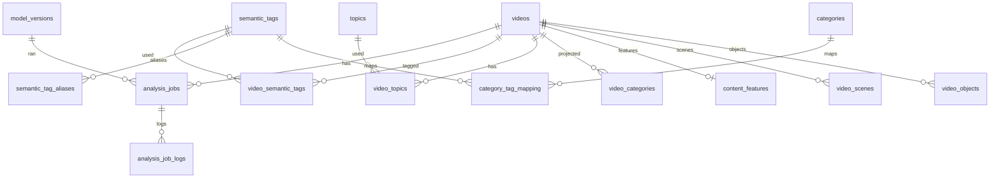

# Part 3 — Database, Workers, APIs, Compose

## 1. PostgreSQL schema (production)

> Align with existing discovery tables (`topics`, `video_topics`, `topic_category_mapping`, `video_category_scores`, `video_content_understanding`) — **extend, do not fork parallel truth**. New semantic-tag tables become canonical; legacy category links remain projection.

### 1.1 ER overview



### 1.2 Core tables

#### `semantic_tags`

| Column | Type | Notes |
|--------|------|-------|
| id | BIGSERIAL PK | |
| slug | VARCHAR(64) UNIQUE NOT NULL | canonical, lowercase ascii/hyphen |
| name | VARCHAR(128) NOT NULL | display |
| description | TEXT | |
| language | VARCHAR(8) DEFAULT 'und' | primary lexicon language |
| parent_id | BIGINT NULL FK → semantic_tags | optional hierarchy (vehicle→car) |
| status | VARCHAR(16) NOT NULL DEFAULT 'active' | active/deprecated |
| created_at / updated_at | TIMESTAMPTZ | |

**Indexes:** `(status)`, `(parent_id)`, GIN optional on `to_tsvector(name || description)` for admin search.

**Hierarchy:** Soft hierarchy for aggregation analytics; fusion still emits leaf tags preferentially.  
**i18n:** Prefer **aliases** table over duplicate tag rows.

#### `semantic_tag_aliases`

| Column | Type |
|--------|------|
| id | BIGSERIAL PK |
| tag_id | FK semantic_tags |
| alias | VARCHAR(128) NOT NULL |
| language | VARCHAR(8) |
| UNIQUE(alias, language) |

Maps `ô tô`, `xe hơi`, `automobile` → `car`.

#### `video_semantic_tags`

| Column | Type | Why |
|--------|------|-----|
| video_id | BIGINT FK | |
| tag_id | BIGINT FK | |
| confidence | REAL NOT NULL CHECK (0..1) | calibrated |
| source | VARCHAR(32) NOT NULL | modality/fusion/human |
| model_version | VARCHAR(64) NOT NULL | lineage |
| reason | TEXT NOT NULL | explainability |
| evidence | JSONB | frames/bboxes/text spans |
| created_at | TIMESTAMPTZ | |
| PRIMARY KEY (video_id, tag_id, source) | | allow multi-source rows OR collapse to fusion-only + evidence array — **recommend fusion primary + evidence JSON** with unique `(video_id, tag_id)` |

**Indexes:** `(tag_id, confidence DESC)`, `(video_id)`, GIN `(evidence)`.

#### `topics` / `video_topics`

Reuse discovery: topics open-ended; `video_topics(video_id, topic_id, score, model_version)`.  
Topics ≠ tags (composition) ≠ categories (product UI).

#### `categories` / `category_tag_mapping` / `video_categories`

Existing Explore `categories` remain UI catalog.

**New/extended `category_tag_mapping`:**

| Column | Type |
|--------|------|
| category_id | FK |
| tag_id | FK |
| weight | REAL NOT NULL DEFAULT 1.0 |
| priority | INT DEFAULT 100 |
| rule | VARCHAR(32) DEFAULT 'weighted_sum' |
| min_tag_confidence | REAL DEFAULT 0.4 |
| UNIQUE(category_id, tag_id) |

`video_categories` / `video_category_scores` = **projection** from Category Engine (multi-label).

#### `content_features` (feature store row per video)

| Column | Type |
|--------|------|
| video_id | PK FK |
| content_sha256 | CHAR(64) | reuse key |
| feature_version | VARCHAR(64) | |
| visual | JSONB | clip scores / stats |
| ocr | JSONB | |
| speech | JSONB | transcript + lang |
| scene | JSONB | |
| object | JSONB | |
| metadata | JSONB | title/desc/hashtags |
| emotion | JSONB | nullable phase2 |
| audio | JSONB | nullable |
| expires_at | TIMESTAMPTZ | optional TTL |
| updated_at | TIMESTAMPTZ | |

**Why store:** Re-title reuses OCR/vision; A/B compares fusion only; training exports.

#### `video_scenes` / `video_objects`

Normalized optional tables for queryable analytics (or keep inside JSONB until volume demands).

#### `analysis_jobs`

| Column | Type |
|--------|------|
| id | UUID PK |
| video_id | FK |
| status | VARCHAR(32) | PENDING/RUNNING/COMPLETED/FAILED_* |
| priority | INT | |
| trigger | VARCHAR(32) | upload/metadata/admin/backfill |
| model_bundle_version | VARCHAR(64) | |
| attempts | INT | |
| locked_by | VARCHAR(64) | worker id |
| locked_at | TIMESTAMPTZ | |
| started_at / finished_at | TIMESTAMPTZ | |
| error_code / error_message | | |
| metrics | JSONB | stage latencies |

**Indexes:** `(status, priority DESC, created_at)`, `(video_id, created_at DESC)`.

#### `analysis_job_logs` / `processing_errors`

Append-only stage logs; partition by month if volume high.

#### `model_versions`

| Column | Type |
|--------|------|
| id | BIGSERIAL |
| name | VARCHAR(64) | openclip, whisper, paddleocr, fusion |
| version | VARCHAR(64) | |
| artifact_uri | TEXT | S3/registry |
| metrics | JSONB | |
| status | VARCHAR(16) | staged/prod/retired |
| UNIQUE(name, version) |

#### `event_outbox`

Transactional outbox for Spring → RabbitMQ (`aggregate_type`, `event_type`, `payload`, `published_at`).

#### `workers` / `worker_heartbeats`

Ops: last_seen, gpu_uuid, queue, version.

### 1.3 Partitioning guidance

- `analysis_job_logs`: monthly RANGE on `created_at` when >50M rows.  
- `video_semantic_tags`: no partition initially; BRIN on created_at if needed.

---

## 2. Qdrant design

| Collection | Dim | Distance | Points | Payload |
|------------|-----|----------|--------|---------|
| `vibely_cu_frame` | 768 (SigLIP/CLIP) | Cosine | 1 per sampled frame | videoId, frameIdx, tMs, modelVersion, sceneId |
| `vibely_cu_scene` | 768 | Cosine | 1 per scene (mean pool) | videoId, sceneId, labels |
| `vibely_cu_video` | 768 | Cosine | **1 mean embedding / video** | videoId, topTags[], topicSlugs[], lang |

**Settings:** HNSW `m=16`, `ef_construct=128`; product quantization after 5M points; replication factor 1 on single VPS, 2 in HA.

**Why multi-level:** Related video uses video-mean; “exact scene moment” / evidence uses frames; admin debug uses scenes.

---

## 3. RabbitMQ topology

**Exchange:** `content.topic` (topic) + `content.dlx` (fanout to DLQ).

| Queue | Routing key | Consumer | Runtime |
|-------|-------------|----------|---------|
| `cu.download` | `cu.download` | downloader | CPU |
| `cu.frame` | `cu.frame` | frame | CPU |
| `cu.ocr` | `cu.ocr` | ocr | CPU/GPU |
| `cu.asr` | `cu.asr` | asr | GPU preferred |
| `cu.vision` | `cu.vision` | clip+yolo+scene | GPU |
| `cu.fusion` | `cu.fusion` | fusion/semantic | CPU |
| `cu.persist` | `cu.persist` | optional writer | CPU |
| `cu.completed` | `cu.completed` | Spring | CPU |
| `cu.retry` | TTL → requeue | | |
| `cu.dlq` | DLX | | |

**Retry:** 5 attempts exponential (15s → 10m). Poison → DLQ + alert.

**Event versions:** `content.analyze.requested.v1`, `cu.stage.completed.v1`, `content.understanding.completed.v1`.

---

## 4. Worker architecture (Python)

```
ai-workers/content-understanding/
  app/
    main.py                 # consumer bootstrap
    config.py
    events/
    stages/
      download.py
      frames.py
      ocr.py
      asr.py
      vision.py
      detect.py
      scene.py
      fusion.py
      semantic.py
      topics.py
      categories.py
      embed_qdrant.py
    models/                 # loaders via registry config
    storage/                # s3, redis, pg
    utils/
  Dockerfile
  requirements.txt
```

| Worker | CPU/GPU | Stateless | Scale |
|--------|---------|-----------|-------|
| download/frame | CPU | Yes | Horizontal |
| ocr | CPU (GPU opt) | Yes | Horizontal |
| asr | GPU | Yes | Separate GPU pool |
| vision/detect | GPU | Yes | Separate GPU pool |
| fusion/semantic | CPU | Yes | Horizontal |

Reuse patterns from `ai-workers/originality/` (download, frames, ocr) as shared library package when practical.

---

## 5. REST API (Spring)

| Method | Path | Auth | Purpose |
|--------|------|------|---------|
| GET | `/api/videos/{publicId}/analysis` | public or owner | Job status + summary |
| GET | `/api/videos/{publicId}/semantic-tags` | public* | Tags sorted by confidence |
| GET | `/api/videos/{publicId}/topics` | public* | |
| GET | `/api/videos/{publicId}/categories` | public* | Multi-label projection |
| GET | `/api/search/semantic?q=` | public | Embedding + graph re-rank |
| POST | `/api/admin/reanalyze` | ADMIN | `{publicId, forceFull}` |
| POST | `/api/admin/reindex` | ADMIN | Qdrant rebuild |
| GET | `/api/admin/workers` | ADMIN | Heartbeats |
| GET | `/api/admin/jobs` | ADMIN | Paginated jobs |

\* Respect video privacy (reuse `VideoPrivacyAccessService`).

**Response example (tags):**

```json
{
  "videoPublicId": "...",
  "modelBundleVersion": "cu-bundle-2026.07.1",
  "items": [
    {
      "slug": "anime",
      "name": "Anime",
      "confidence": 0.95,
      "source": "fusion",
      "reason": "visual similarity to anime prompts; OCR kana overlay",
      "evidence": [{"type": "frame", "index": 3, "tMs": 2100}]
    }
  ],
  "page": 0,
  "size": 50,
  "total": 24
}
```

**Status codes:** 200, 202 (job queued), 403 privacy, 404, 409 job already running, 422 invalid body.

---

## 6. Spring package layout

```
com.vibely.backend.contentunderstanding/
  api/          # controllers
  application/  # services, orchestrators
  domain/       # entities
  infrastructure/
    persistence/
    messaging/  # outbox, listeners
  config/
```

Keep Explore/Rec as **adapters** reading repositories — do not put fusion logic in ExploreService.

---

## 7. Docker Compose (target)

Services: `backend`, `frontend`, `postgres`, `redis`, `rabbitmq`, `qdrant`, `cu-worker-cpu`, `cu-worker-gpu` (profile `gpu`), `prometheus`, `grafana`, `loki`, `otel-collector`, `nginx`.

- **Depends_on** healthchecks: postgres, rabbitmq, qdrant, redis before workers.  
- **Volumes:** model cache, rabbitmq data, qdrant storage.  
- **GPU:** Compose device reservation `capabilities: [gpu]` for asr/vision workers.  
- Network: `vibely_net`.

---

## 8. Phased rollout

| Phase | Deliverable | Why first | Risk |
|-------|-------------|-----------|------|
| **1** | RabbitMQ, job table, worker skeleton, feature store, PaddleOCR, metadata fusion, tags persist, Explore still hybrid legacy | Prove async path | Queue ops |
| **2** | Whisper-small, OpenCLIP/SigLIP, Qdrant video vectors, YOLO lite, fusion weights | True multimodal | GPU cost |
| **3** | Topic engine, Category mapping admin UI, backfill jobs | Product value | Mapping quality |
| **4** | Explainable dashboard, Rec/Search integration, related-by-embedding | Consumer ROI | Ranking regressions |
| **5** | Analytics, trending-by-tag-growth, auto-hashtag, NL semantic search polish | Growth | Abuse / spam tags |

**Rollback:** Feature flag `app.content-understanding.enabled`; Explore falls back to rule-based + existing discovery OpenAI path.

---

## 9. Best practices / anti-patterns

**Do:** transactional outbox; idempotent upserts; privacy gated APIs; cost budgets per day.  
**Don’t:** dual-write conflicting category truth without projection version; unbounded tag growth without confidence floor; store raw user video in Qdrant payload.

→ Continue **Part 4** (MLOps) and **Part 5** (Knowledge Graph).
