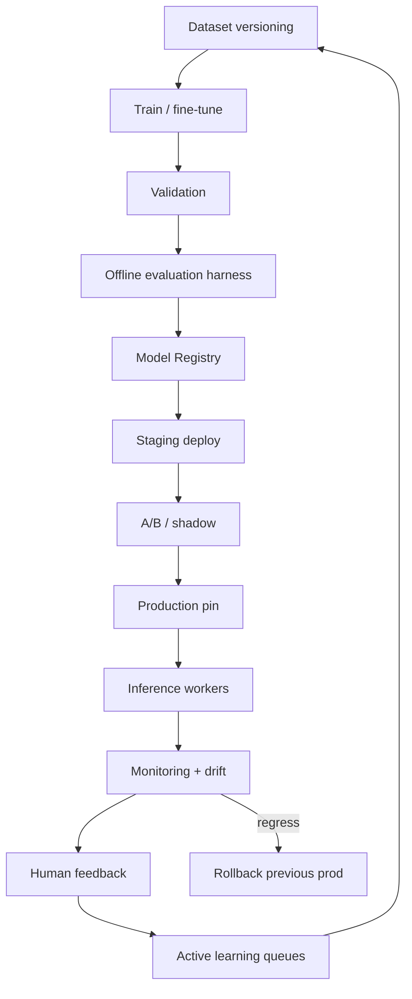
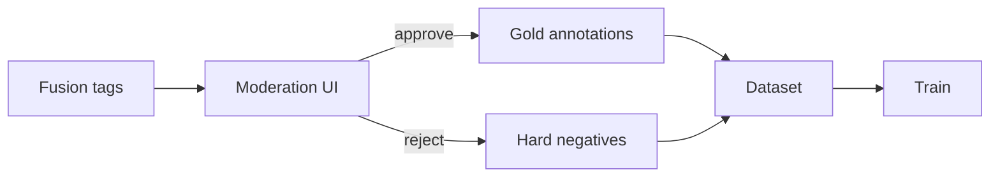

# Part 4 — AI Lifecycle, Continuous Learning & MLOps

## 1. Lifecycle



| Stage | Owner | Artifact |
|-------|-------|----------|
| Dataset | ML + Moderation | `datasets` table + object store |
| Train | ML | checkpoints |
| Validation | ML | metrics JSON |
| Registry | MLOps | `model_versions` |
| Deploy | SRE | worker image tag + registry pin |
| Inference | Workers | predictions |
| Monitoring | SRE/ML | Prometheus/Grafana |
| Feedback | Moderation | annotation events |
| Retrain | ML | scheduled / threshold-triggered |

---

## 2. Model Registry

Every inference component loads **only** via registry pin (env `CU_MODEL_BUNDLE`):

| name | examples | tracked metrics |
|------|----------|-----------------|
| clip | siglip-so400m-v1, openclip-vit-l14-v2 | recall@tag, latency_ms, vram |
| whisper | whisper-small-v1 | WER(EN/VI), latency |
| paddleocr | paddle-v4-vi-en | CER, fps |
| yolo | yolo11m-v1 | mAP, latency |
| fusion | fusion-weights-v3 | calibration ECE, F1 |
| topic | topic-synth-v2 | human agreement |

Fields: version, created_at, dataset_version, precision/recall/F1, latency_p95, gpu_req, owner, status(`staged|prod|retired`), artifact_uri, checksum.

**Hardcoding model names inside Explore/Rec is forbidden.**

---

## 3. Dataset versioning

| Field | Purpose |
|-------|---------|
| version | `ds-2026.07.1` |
| description | scope / languages |
| video_count / frame_count / annotation_count | scale |
| label_schema_version | tag ontology version |
| source | human / weak / synthetic |
| license | internal use |

Snapshots are **immutable**. Retrain always cites dataset version for audit.

---

## 4. Annotation & human feedback

Moderator capabilities:

- Add/remove/rename tag (alias)  
- Override category projection  
- Mark AI correct / incorrect / toxic tag  
- Flag special videos (seed gold set)

Store `annotation_events` (who, what, before/after, ts).  
Approved corrections → export jobs into next dataset slice.



---

## 5. Active learning

| Confidence band | Action |
|-----------------|--------|
| ≥ 0.85 | Auto-accept; sample 1% audit |
| 0.45–0.85 | Queue for optional review |
| < 0.45 | Mandatory review OR drop from Explore projection |

Uncertainty sampling: prioritize high-engagement videos (views) where tags disagree across modalities.

---

## 6. Confidence calibration

Raw CLIP/YOLO/OCR scores are **not** probabilities.

Ship:

1. **Temperature scaling** per modality (cheap).  
2. **Isotonic regression** for fusion output on validation set.  
3. Monitor **ECE** (Expected Calibration Error); recalibrate when ECE > 0.05.

---

## 7. Drift detection

Signals:

- Tag prior distribution KL(current week ∥ baseline)  
- Moderator disagreement rate ↑  
- OCR language mix shift  
- Embedding centroid drift (MVD)  
- Downstream Explore CTR drop correlating with model pin change

Actions: alert → shadow newer model → promote or rollback.

---

## 8. Feature store (ops)

| Property | Policy |
|----------|--------|
| Versioning | `feature_version` on `content_features` |
| Reuse | Same `content_sha256` skips OCR/vision |
| Invalidate | On model major bump or admin force |
| TTL | Optional 180d for evidence blobs |
| Compression | JSONB + gzip large transcripts in object store if >256KB |

---

## 9. Model serving

```
Worker → torch/ONNX → (TensorRT optional) → GPU
                 ↘ Redis embedding cache (key: sha256+modelVer+frameIdx)
```

Batch size 4–16 frames depending on VRAM. Prefer ONNX Runtime for CLIP on mixed CPU/GPU VPS.

---

## 10. GPU scheduling

| Pool | Queues | Notes |
|------|--------|-------|
| GPU-A | asr, vision | Exclusive processes; avoid simultaneous Whisper+CLIP on 8GB cards |
| CPU | download, frame, fusion, ocr(cpu) | Cheap scale-out |

Priority: live uploads > backfill. Batch backfill off-peak.

**Trade-off:** larger batches ↑ throughput ↓ latency; target p95 job time SLO.

---

## 11. A/B testing

- Sticky assignment by `video_id` hash % 100.  
- Metrics: tag F1 vs gold, moderator agree, Explore CTR, job latency, $/video.  
- Winner auto-staged after significance + SRE approval gate (not fully autonomous first year).

---

## 12. Explainable dashboard

Show per video:

- Timeline of scenes  
- Frames contributing to each top tag  
- OCR snippets / ASR quotes  
- Objects + boxes  
- Fusion weight contributions (modalities)  
- Model bundle version  

---

## 13. Monitoring stack

| Tool | Use |
|------|-----|
| Prometheus | latency, queue depth, GPU mem, job rates |
| Grafana | CU dashboards |
| Loki | worker logs |
| Jaeger/OTel | stage spans |
| Alerts | DLQ>0, p95>SLO, GPU OOM, drift KL |

---

## 14. Governance

- Dual approval to promote `prod` model  
- Audit log immutable  
- PII: no face gallery in v1; redact phone/email from OCR before search index  
- Rollback runbook: pin previous bundle + requeue failed jobs optional  

---

## 15. Future expansion (architecture-stable)

Auto caption, NL search, NSFW/violence heads, originality (sibling), highlight/clip, translation — **new consumers / stages**, same job+feature+tag bus.

---

## 16. 3-year roadmap

| Year | Focus |
|------|-------|
| Y1 | Multimodal CU live; Explore+Search+Related consume tags; calibration+feedback |
| Y2 | Learned fusion MLP; topic clustering; creator analytics; ads targeting hooks |
| Y3 | Multi-language excellence; on-device lite tags; automated clip tools; stronger graph reasoning |

## Anti-patterns

- Retrain from prod traffic without gold review  
- Ship uncalibrated softmax as “95% confidence”  
- One GPU multiplexed without memory caps  
- Silent model file overwrite on disk without registry entry
