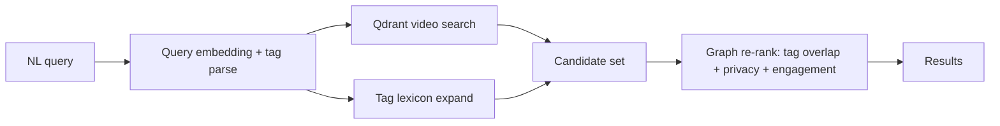

# Part 5 — Knowledge Graph & Semantic Intelligence Platform

## 1. Philosophy

```
Video → Semantic Knowledge → Graph → Consumers
```

Explore / Rec / Search / Ads are **readers**, never writers of AI truth (except moderated corrections).

---

## 2. Storage strategy (decision)

| Option | Pros | Cons | Verdict |
|--------|------|------|---------|
| Neo4j-only | Native graph queries | Ops cost, new skill, dual sync | Later |
| Postgres-only edges | One DB, migrations, joins | Multi-hop slower | **Phase 1–2** |
| Hybrid PG + Qdrant | Vectors + relational | Two systems (already have) | **Adopted** |
| Full Neo4j Y2+ | Deep path queries for ads | Cost | Optional |

**Postgres edge tables + Qdrant similarity + Redis ego caches** is production-correct for Vibely scale on VPS→fleet.

### Graph physicalization (Postgres)

```sql
-- conceptual
knowledge_edges(
  id BIGSERIAL PRIMARY KEY,
  src_type VARCHAR(32),  -- video|tag|topic|category|creator|scene|object|brand|...
  src_id  BIGINT,
  rel_type VARCHAR(48),  -- VIDEO_HAS_TAG, TAG_RELATED, VIDEO_SIMILAR, ...
  dst_type VARCHAR(32),
  dst_id BIGINT,
  weight REAL,
  confidence REAL,
  source VARCHAR(32),
  model_version VARCHAR(64),
  created_at TIMESTAMPTZ,
  meta JSONB
);
CREATE INDEX ON knowledge_edges (src_type, src_id, rel_type);
CREATE INDEX ON knowledge_edges (dst_type, dst_id, rel_type);
CREATE INDEX ON knowledge_edges (rel_type, created_at DESC);
```

Materialized convenience: keep `video_semantic_tags` as **first-class** (query speed); sync edges asynchronously for graph walks.

---

## 3. Entities (nodes)

| Node | Meaning |
|------|---------|
| Video | Content unit |
| Creator | Author user |
| SemanticTag | Atomic concept |
| Topic | Compositional theme |
| Category | Explore presentation |
| Scene / Object / Emotion / SpeechSegment / OcrSpan | Evidence nodes |
| Brand / Music / Location / Language / Hashtag | Optional enrichment |
| Trend / Challenge / Community | Growth entities |
| Advertisement | Future demand node |

---

## 4. Relationships

| Rel | From → To | Weight meaning |
|-----|-----------|----------------|
| VIDEO_HAS_TAG | Video→Tag | tag confidence |
| VIDEO_HAS_TOPIC | Video→Topic | topic score |
| VIDEO_HAS_CATEGORY | Video→Category | mapped confidence |
| VIDEO_HAS_SCENE / OBJECT / TEXT / SPEECH | evidence | |
| VIDEO_SIMILAR | Video→Video | embedding cosine |
| VIDEO_RELATED | Video→Video | hybrid score |
| TAG_RELATED | Tag→Tag | co-occur / ontology |
| TOPIC_RELATED | Topic→Topic | |
| CATEGORY_CONTAINS | Category→Tag | mapping weight |
| CREATOR_CREATED | Creator→Video | 1.0 |
| VIDEO_DUPLICATE | → Originality system id | risk |

Every edge: weight, confidence, source, created_at, version.

---

## 5. Multi-level representation

| Level | Content | Consumer |
|-------|---------|----------|
| 1 Raw metadata | title, desc, hashtags | bootstrap |
| 2 OCR | text spans | search, mod |
| 3 Speech | transcript | search, topic |
| 4 Objects | detections | search |
| 5 Scenes | temporal labels | related |
| 6 Semantic tags | **canonical** | all |
| 7 Topics | composition | Explore tabs, Rec |
| 8 Knowledge edges | graph | AI search, ads |
| 9 Rec features | vectors + affinities | feed |
| 10 Business | ads eligibility, brand safety | monetization |

---

## 6. Semantic / AI Search



Example: “video anime buồn” → tags `{anime, sad}` + embedding neighborhood → rank by fused score. Hashtags optional, not required.

---

## 7. Related / Similar

Do **not** rely on shared hashtags alone.

Score:

```
α·cos(video_emb)
+ β·jaccard(tags)
+ γ·topic_overlap
+ δ·scene/object soft match
+ ε·creator affinity
− privacy/penalty terms
```

Persist top-K `VIDEO_RELATED` edges nightly + on-demand refresh.

---

## 8. Recommendation foundation

User interest graph:

- Aggregate watch/like/follow into `user_tag_interests` / existing `user_topic_interests`  
- Candidate gen: follow graph ∪ tag affinity ∪ trending tags ∪ embedding ANN  
- Rank with engagement + knowledge match + diversity  

CUS supplies **content side**; behavior models remain Rec domain.

---

## 9. Trending engine

Trend ≠ view count.

```
growth(tag|topic) = velocity(mentions, watches, creators)
```

Detect breakouts; expose Explore “Đang hot” topics. Store `trend_snapshots` daily.

---

## 10. Auto hashtag

From top semantic tags (conf ≥ 0.7), suggest `#slug` to creator Studio — never auto-overwrite description without consent.

---

## 11. Creator analytics

Dashboard: top tags/topics, audience interest overlap, search queries that hit their videos, trend attachment. Sourced from graph aggregations — **no re-AI**.

---

## 12. Advertisement (future)

Ads matcher: campaign interest tags ∩ video tags ∩ user tags, plus brand-safety categories from CU signals — **no architecture rewrite**.

---

## 13. Cross-feature reuse

One CU job fills OCR/ASR/embeddings/tags → Search index, Rec features, Moderation cues, Auto-caption drafts, Graph edges. **Forbidden:** each product team re-downloading video for private pipelines (except Originality fingerprints with shared extract cache).

---

## 14. Governance & privacy

- Lineage: model_version on edges  
- Rollback: edge batch `version`  
- GDPR: delete edges + Qdrant points on account erasure  
- Explainability: walk VIDEO_HAS_TAG → evidence  

---

## 15. API (graph-facing)

| Endpoint | Purpose |
|----------|---------|
| `GET /api/videos/{id}/knowledge` | Collapsed node neighborhood |
| `GET /api/search/semantic` | NL search |
| `GET /api/videos/{id}/related` | Related via graph+emb |
| `GET /api/trends/tags` | Trending tags |

---

## 16. Knowledge flow

```
CU completed
  → upsert tags/topics/categories
  → upsert knowledge_edges
  → upsert Qdrant points
  → invalidate Redis keys
  → emit knowledge.updated.v1
  → Search indexer / Rec feature builder / Explore hybrid refresh
```

---

## 17. Best practices

1. Single writer (CU + moderator corrections) for semantic truth.  
2. Projection caches for hot paths.  
3. Privacy filter **before** returning graph neighbors.  
4. Version ontology of tags separately from models.

## Anti-patterns

1. Embedding Explore category id as the only video vector label.  
2. Neo4j premature at <1M videos.  
3. Recomputing OCR per product.  
4. Related = same hashtag exclusively.

---

## 18. 5-year roadmap

| Year | Milestone |
|------|-----------|
| Y1 | PG graph edges + Qdrant + semantic search MVP |
| Y2 | Rich related/trending; creator analytics; ads hooks |
| Y3 | Optional Neo4j for multi-hop campaigns; chat-with-video RAG |
| Y4 | Multimodal assistants; auto-highlights at scale |
| Y5 | Cross-surface knowledge (live, shop, education verticals) |

---

## Appendix — Implementation order (engineering kickoff)

1. Flyway: `semantic_tags`, `video_semantic_tags`, `category_tag_mapping` extensions, `analysis_jobs`, `content_features`, `event_outbox`.  
2. Compose: RabbitMQ + `cu-worker` skeleton (mirror originality worker).  
3. Wire `video.media_ready` outbox.  
4. Phase-1 OCR+metadata fusion → tags → Explore projection.  
5. Phase-2 Whisper+CLIP+Qdrant.  
6. Replace reliance on rule-based **as default**, keep as fallback.  
7. Moderator feedback UI.  
8. Semantic search + related.

**Document set complete:** start coding from Part 3 schema + Part 2 pipeline Phase 1.
