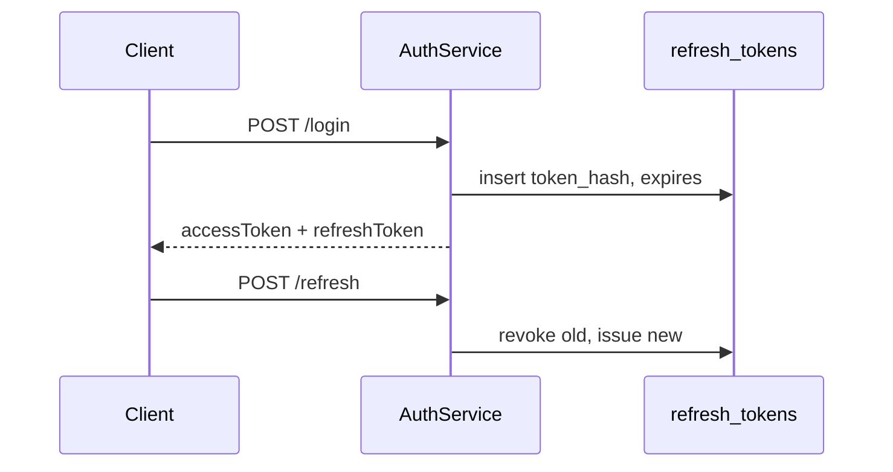

# JWT & Session Management

## 1. Overview

**Access tokens** (JWT) are short-lived. **Refresh tokens** are opaque, stored hashed in `refresh_tokens` table.

## 2. Purpose

Stateless API auth with revocable long-lived sessions.

## 3. Architecture

## 4. System Design

- `JwtService.generateToken(email)` — claims minimal
- `JwtAuthenticationFilter` — parses Bearer header
- Logout: revoke refresh row
- Password: BCrypt via `DaoAuthenticationProvider`

## 5. Data Flow

Access token in `Authorization: Bearer`. Refresh in body to `/api/auth/refresh`.

## 6–7.

Multi-device: multiple refresh rows per user allowed. Scaling: JWT verify is CPU-cheap; refresh hits DB.

## 8. Performance

- No server session store for API (OAuth2 may use session for handshake only)

## 9. Security

- Hash refresh tokens SHA-256 at rest
- Rotate on refresh (old revoked)
- Anti-bot headers on login/register; captcha token consumed only after successful auth (see [anti-bot/AUTH_INTEGRATION.md](../anti-bot/AUTH_INTEGRATION.md))
- Password reset via OTP does not issue JWT until user logs in again ([PASSWORD_RESET.md](PASSWORD_RESET.md))

## 10. Failure

- Stolen refresh → revoke all sessions endpoint (roadmap)
- Clock skew → JWT leeway config

## 11–15.

Hardening: short access TTL, HTTPS only, httpOnly cookie option for refresh (roadmap). Monitor: failed login rate, token refresh anomalies.
