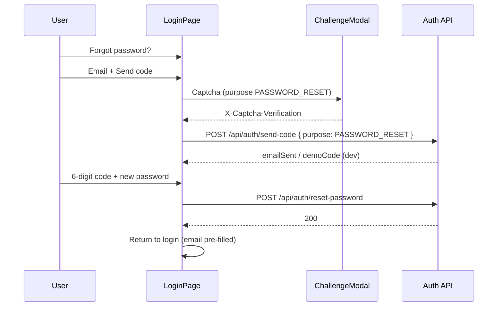

# Password Reset

## Overview

Password reset uses **email + 6-digit OTP**, with a TikTok-style UI on `LoginPage` (`view: forgot`). OTP codes are scoped by `PASSWORD_RESET` purpose — separate from registration OTPs.

## Flow



## API

### Send code

`POST /api/auth/send-code`

```json
{
  "email": "user@example.com",
  "purpose": "PASSWORD_RESET"
}
```

Headers (when anti-bot is enabled): `X-Captcha-Verification`, `X-Session-Id`, `X-Device-Hash`.

| `purpose` | Use case |
|-----------|----------|
| `REGISTER` (default) | Email signup |
| `PASSWORD_RESET` | Forgot password |

The captcha token must use purpose **`PASSWORD_RESET`** (do not reuse `REGISTER` or `LOGIN` tokens).

**Security:** If the email is not registered, the API still returns success (cooldown applies) but **does not send email** — avoids email enumeration.

### Reset password

`POST /api/auth/reset-password`

```json
{
  "email": "user@example.com",
  "code": "123456",
  "newPassword": "Abcdef1!"
}
```

Password rules: 8–20 characters, at least one letter, one digit, and one special character (same as signup UI).

The `PASSWORD_RESET` OTP row is **consumed** on successful reset.

### Verify code (optional)

`POST /api/auth/verify-code` with `purpose: "PASSWORD_RESET"` — for clients that verify in a separate step; the current UI verifies inside `reset-password`.

## Email

Dedicated HTML template (`OtpVerificationEmailSender.sendPasswordResetCode`). Subject format: `{code} is your verification code` (Vietnamese copy in the email body for end users).

SMTP setup: see [OAUTH_AND_ONBOARDING.md](OAUTH_AND_ONBOARDING.md#otp-email).

## Frontend

| File | Role |
|------|------|
| `frontend/src/pages/LoginPage.jsx` | `forgot` view, send code, reset |
| `frontend/src/security/captcha/ChallengeModal.jsx` | `purpose="PASSWORD_RESET"` when sending code |
| `frontend/src/api/client.js` | `resetPassword()` |

## Database

Migration `V29__otp_verification_purpose.sql` — `purpose` column on `otp_verification_codes` (`REGISTER` | `PASSWORD_RESET`).

## Related

- [anti-bot/AUTH_INTEGRATION.md](../anti-bot/AUTH_INTEGRATION.md) — captcha token lifecycle
- [api/REST_REFERENCE.md](../api/REST_REFERENCE.md) — endpoint summary
