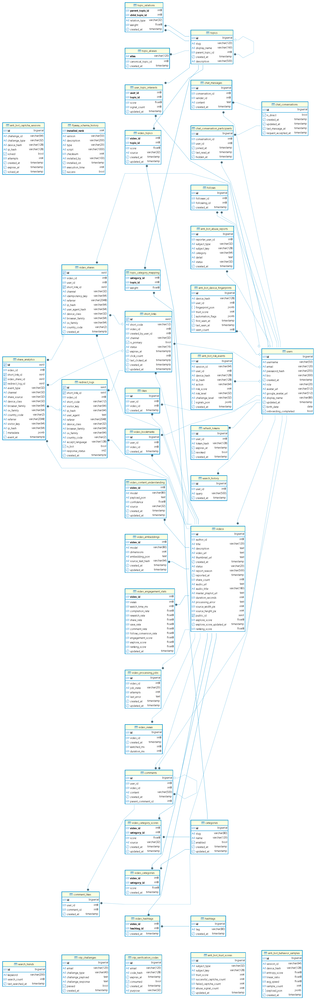
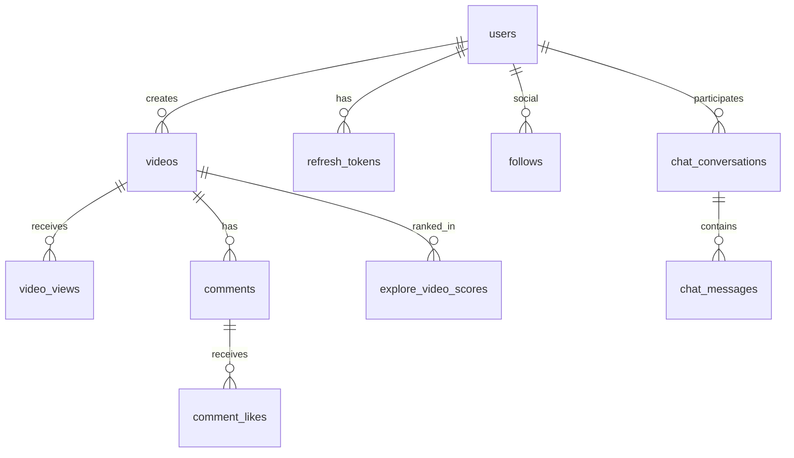

# PostgreSQL Schema Design

## 1. Overview

Single PostgreSQL database, multi-domain tables, Flyway versioned migrations **V1–V36** (~**42 tables**).

**Canonical source:** SQL under `backend/src/main/resources/db/migration/`.

## 2. Full ERD

High-resolution diagram: [docs/erd/vibely-erd-full.png](../erd/vibely-erd-full.png)

The diagram above is the complete schema. Section 3 below is a simplified relationship view for onboarding; section 4 lists tables by domain.

## 3. Core relationships (simplified)

## 4. Domains & key tables

| Domain | Tables (representative) |
|--------|-------------------------|
| **Auth & identity** | `users`, `refresh_tokens`, `otp_verification_codes`, `otp_challenges` |
| **Video catalog** | `videos`, `video_processing_jobs`, `video_bookmarks` |
| **Engagement** | `likes`, `comments`, `comment_likes`, `follows`, `video_views` |
| **Sharing** | `video_shares`, `share_events`, `share_redirects`, `share_idempotency_keys`, … |
| **Explore** | `explore_categories`, `explore_video_scores`, `explore_trending_snapshots`, … |
| **Discovery / AI** | `discovery_content_nodes`, `discovery_embeddings`, `discovery_topics`, `topic_canonical_registry`, … |
| **Search** | `search_query_logs`, `search_suggest_cache` (see V35) |
| **Chat** | `chat_conversations`, `chat_messages`, `chat_participants`, `chat_message_requests` |
| **Anti-bot** | `anti_bot_risk_events`, `anti_bot_device_fingerprints`, `anti_bot_captcha_challenges`, … |
| **Moderation** | `video_reports`, columns on `videos` / `users` |

## 5. Public vs internal IDs

| Layer | Type | Usage |
|-------|------|--------|
| API / URLs | `public_id` (UUID) on videos, usernames on users | External references |
| Database | `BIGINT` / `BIGSERIAL` PKs | Joins, feed cursors, FKs |

## 6. Indexing strategy

- PK on all tables (`BIGSERIAL` or equivalent)
- Unique: `users.username`, `users.email`, `videos.public_id`
- Composite keyset: `(created_at DESC, id DESC)` on feed-driving tables
- FK indexes on foreign keys used in joins and cascades

## 7. JSONB columns

- `anti_bot_risk_events.signals_json`
- `anti_bot_device_fingerprints.fingerprint_json`
- Discovery / explore payloads where schema evolves faster than columns

## 8. Partitioning (roadmap)

- `video_views` by month
- `chat_messages` by conversation hash (optional at scale)

## 9. Operations

Retention: archive old views. Scaling: read replicas, PgBouncer per service. Backups: PITR on managed PostgreSQL. Security: application-level auth today; row-level security if multi-tenant extraction later.
