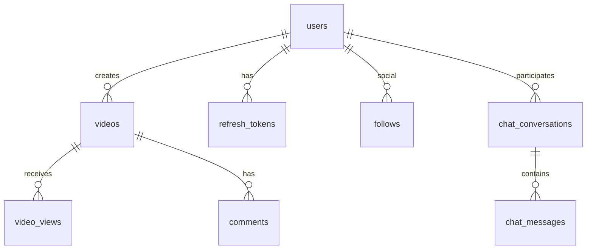

# PostgreSQL Schema Design

## 1. Overview

Single PostgreSQL database, multi-domain tables, Flyway versioned migrations V1–V29.

## 2. Core domains

## 3. Key tables

| Table | Domain |
|-------|--------|
| `users` | Auth/profile |
| `videos` | Catalog + processing status |
| `video_views` | Analytics |
| `comments`, `likes`, `follows` | Interaction |
| `chat_*` | Messaging |
| `explore_*` | Discovery |
| `anti_bot_*` | Security |
| `refresh_tokens` | Auth |
| `otp_verification_codes` | Email OTP (`purpose`: REGISTER, PASSWORD_RESET) |
| `otp_challenges` | Legacy anti-spam audit log |

## 4. Indexing strategy

- PK on all tables (BIGSERIAL)
- Unique: `users.username`, `users.email`, `videos.public_uuid`
- Composite keyset: `(created_at DESC, id DESC)` on videos
- FK indexes on all foreign keys

## 5. Partitioning (roadmap)

- `video_views` by month
- `chat_messages` by conversation hash

## 6. JSONB

- `anti_bot_risk_events.signals_json`
- `anti_bot_device_fingerprints.fingerprint_json`

## 7–15.

Retention: archive old views. Scaling: read replicas, connection pool per service. Security: row-level security for multi-tenant (future). Backups: PITR on RDS.
