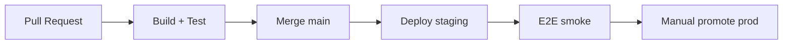

# CI/CD Pipeline

## 1. Overview (target)

## 2. CI steps

1. `mvn -B test` (backend)
2. `npm run build` (frontend)
3. Flyway migrate against Testcontainers PG
4. Lint / security scan (roadmap)

## 3. Artifacts

- `vibely-backend-*.jar`
- `frontend/dist/` static bundle

## 4. Deploy

- Container image to ECR
- Rolling update on ECS/k8s
- Run Flyway as init job

## 5. Rollback

- Revert task definition to previous image
- Forward-only DB — no down migrations

## 6–15.

Blue/green: alternate target group. Secrets: injected at runtime. SBOM generation (roadmap).
