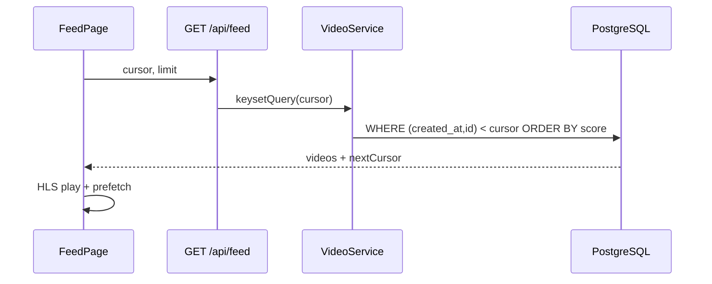

# Feed Architecture

## 1. Overview

For You feed serves a **keyset-paginated** list of ready videos ranked by engagement signals. Following feed filters by social graph.

## 2. Purpose

Core consumption loop — must be fast, fresh, and stable under scroll.

## 3. Architecture

## 4. System Design

- **Cursor codec:** `FeedCursorCodec` — opaque base64 JSON `{createdAt, id}`
- **Status filter:** only `READY` / public videos
- **Guest:** anonymous feed allowed (no personalization)

## 5. Data Flow

Metadata only over API; bytes from CDN. View counts via `POST /api/videos/{id}/views` (async-friendly).

## 6. Sequence Flows

Scroll end → decode cursor → fetch next page → merge state array → virtualization window update.

## 7. Scaling Strategy

- Precomputed trending table (explore overlap)
- Redis feed cache per user segment (roadmap)
- Shard videos by id for write scale

## 8. Performance

- Keyset vs OFFSET: O(1) page depth
- Limit 10–20 per request
- Cover image CDN URLs in DTO

## 9. Security

- No private videos in public feed query
- Rate limit view spam per IP

## 10. Failure Scenarios

- Invalid cursor → 400 or reset to head
- Empty feed → seed / fallback trending

## 11. Recovery

- Cursor reset on client error
- Server-side cursor max age (roadmap)

## 12. Tradeoffs

Simple SQL ranking vs dedicated rank service — SQL for MVP.

## 13. Future

- Real-time rank features from Kafka
- Per-user feature store

## 14. Production Hardening

- Query plan reviews on feed SQL
- Read replica routing

## 15. Monitoring

- p95 latency `/api/feed`
- Empty rate, scroll depth metrics
