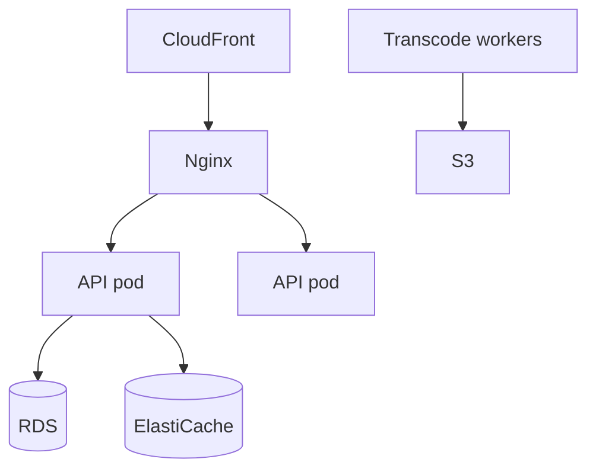

# Infrastructure Topology

## 1. Overview

| Component | Deployment |
|-----------|------------|
| PostgreSQL | Managed/local |
| Redis | Docker / ElastiCache |
| Kafka | Docker profile `kafka` / MSK |
| API | JAR / container |
| Frontend | S3 + CloudFront static |
| Nginx | Reverse proxy TLS |

## 2. Docker Compose (dev)

- `redis:6379`
- `kafka:9092` + zookeeper (profile)

## 3. Nginx

- TLS termination
- `/api` → upstream Spring
- `/ws` → WebSocket upgrade
- Static → Vite build or CDN

## 4. Scaling topology

## 5–15.

Multi-AZ RDS, Redis cluster mode, autoscaling on CPU and p95 latency. Secrets: AWS Secrets Manager. DR: cross-region S3 replication (roadmap).
