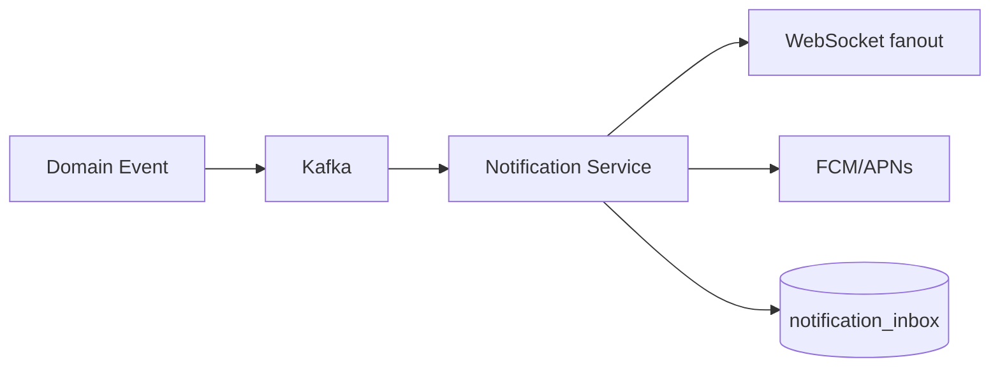

# Notification Architecture

## 1. Overview

Realtime delivery today is **chat STOMP**. Product notifications (likes, follows, mentions) are roadmap.

## 2. Purpose

Timely engagement loops without polling.

## 3. Target architecture

## 4. Design

- User preferences per channel
- Idempotent notification IDs
- Batch digest for low-priority

## 5–15.

Reuse `/ws` broker with `/user/queue/notifications`. Scale: Redis pub/sub bridge. Security: user can only subscribe to self. Monitor: delivery latency, push token invalidation.
