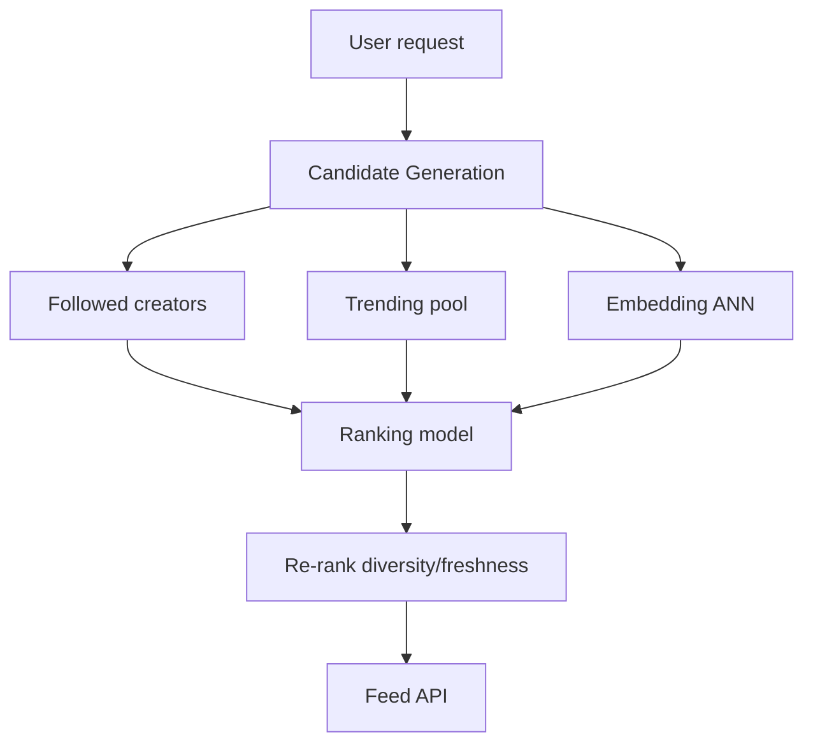

# Recommendation Architecture (Target State)

## 1. Overview

Production TikTok-class recommendation uses **candidate generation → ranking → re-ranking** with real-time features. Vibely MVP uses SQL ranking; this doc defines the target architecture.

## 2. Purpose

Maximize meaningful watch-time and creator fairness at scale.

## 3. Architecture

## 4. System Design

**Features:**

- User: watch history, likes, follows, device, locale
- Video: embeddings, completion rate, report rate, age

**Models:**

- Two-tower retrieval (user · video embedding)
- GBDT / deep ranker on cross features

## 5. Current state

- `video_views.playback_ms` collected
- Feed SQL uses engagement aggregates
- Explore trending tables

## 6–15.

**Tradeoff:** batch vs stream features. **Infra:** Flink + Redis feature store + GPU inference. **Monitoring:** holdout experiments, interleaving. See [roadmap/RECOMMENDATION.md](../roadmap/RECOMMENDATION.md).
